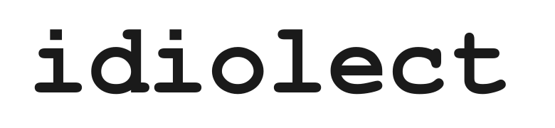
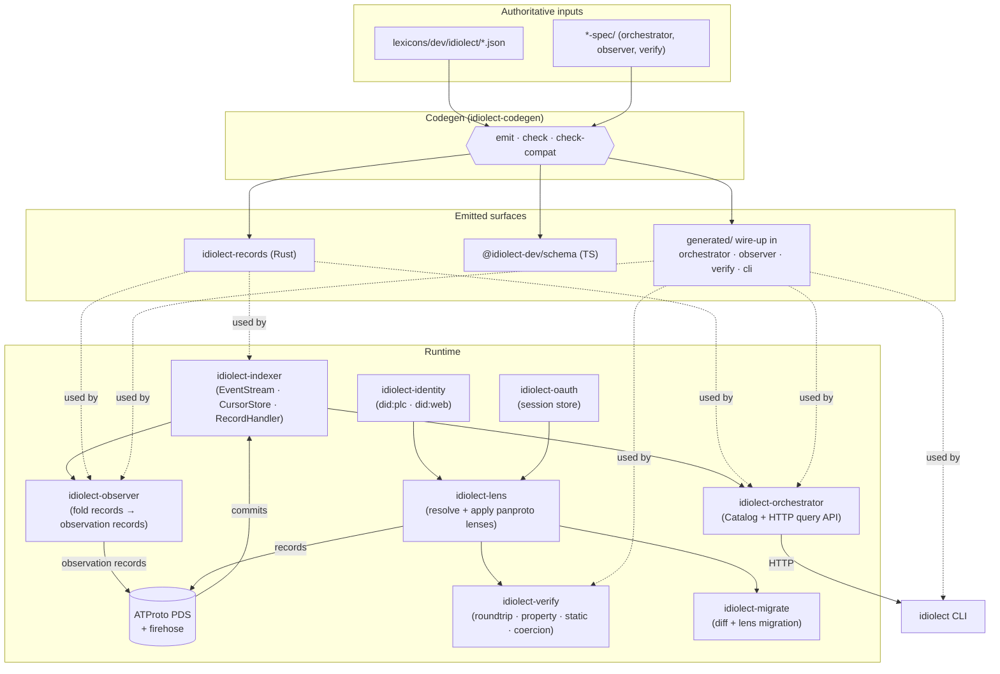

<div align="center">

<picture>
  <source media="(prefers-color-scheme: dark)" srcset=".github/assets/wordmark-dark.svg">
  
</picture>

<p><strong>Mutual intelligibility for schema idiolects.</strong></p>

<p>
  <a href="https://github.com/idiolect-dev/idiolect/actions/workflows/ci.yml"></a>
  <a href="https://github.com/idiolect-dev/idiolect/actions/workflows/release.yml"></a>
  <a href="https://crates.io/crates/idiolect-records"></a>
  <a href="https://www.npmjs.com/package/@idiolect-dev/schema"></a>
  <a href="https://github.com/idiolect-dev/idiolect/blob/main/LICENSE"></a>
  
</p>

</div>

---

Idiolect treats the linguistic distinction between *idiolects*, *dialects*,
and *languages* as a three-level operating model:

1. An idiolect is one party's choice of schemas, lenses, and
conventions.
2. A dialect is the bundle of idiolects a community treats as
canonical.
3. A language is the federated substrate over which idiolects and
   dialects meet, disagree, and may slowly converge without a central arbiter.

Architectural primitives are signed, content-addressed records on
[ATProto](https://atproto.com). Schemas and translations between
schemas are [panproto](https://github.com/panproto/panproto) artifacts. The
repository contains a CLI, orchestrator and observer daemons, a verification
runtime, and a migration library built over a small family of
`dev.idiolect.*` lexicons.

## Architecture


```mermaid
flowchart TB
    subgraph sources["Authoritative inputs"]
        LEX["lexicons/dev/idiolect/*.json"]
        SPEC["*-spec/ (orchestrator, observer, verify)"]
    end

    subgraph codegen["Codegen (idiolect-codegen)"]
        CG{{"emit · check · check-compat"}}
    end

    subgraph emitted["Emitted surfaces"]
        RECS["idiolect-records (Rust)"]
        NPM["@idiolect-dev/schema (TS)"]
        WIRE["generated/ wire-up in<br/>orchestrator · observer · verify · cli"]
    end

    subgraph runtime["Runtime"]
        PDS[("ATProto PDS<br/>+ firehose")]
        IDX["idiolect-indexer<br/>(EventStream · CursorStore · RecordHandler)"]
        ORC["idiolect-orchestrator<br/>(Catalog + HTTP query API)"]
        OBS["idiolect-observer<br/>(fold records → observation records)"]
        VER["idiolect-verify<br/>(roundtrip · property · static · coercion)"]
        MIG["idiolect-migrate<br/>(diff + lens migration)"]
        LENS["idiolect-lens<br/>(resolve + apply panproto lenses)"]
        ID["idiolect-identity<br/>(did:plc · did:web)"]
        OAUTH["idiolect-oauth<br/>(session store)"]
    end

    CLI["idiolect CLI"]

    LEX --> CG
    SPEC --> CG
    CG --> RECS
    CG --> NPM
    CG --> WIRE

    PDS -->|commits| IDX
    IDX --> ORC
    IDX --> OBS
    OBS -->|observation records| PDS
    LENS -->|records| PDS
    ID --> LENS
    OAUTH --> LENS
    ORC -->|HTTP| CLI
    LENS --> MIG
    LENS --> VER

    RECS -.used by.-> IDX
    RECS -.used by.-> ORC
    RECS -.used by.-> OBS
    WIRE -.used by.-> ORC
    WIRE -.used by.-> OBS
    WIRE -.used by.-> VER
    WIRE -.used by.-> CLI
```

Lexicons under `lexicons/dev/` are the authoritative record definitions.
`idiolect-codegen` derives the Rust types in `idiolect-records` and the
TypeScript validators in `@idiolect-dev/schema` from them.

Three declarative JSON specs define four generated surfaces. The orchestrator
spec drives catalog queries and their CLI subcommands; the observer and
verifier specs drive their respective method and runner inventories. Each
spec is validated against its own atproto-shaped lexicon. Codegen emits the
dispatch code, while hand-written predicates and implementations supply the
behavior.

Some runtime state must remain local. Firehose cursors and OAuth tokens use
the same panproto schema machinery as federated records, but their
`dev.idiolect.internal.*` namespace tells firehose consumers to skip them.

## Quickstart

```sh
# CLI: resolve a DID and fetch a record.
cargo install --path crates/idiolect-cli
idiolect resolve did:plc:example
idiolect fetch at://did:plc:example/dev.idiolect.bounty/3l5

# Talk to a local orchestrator.
idiolect orchestrator stats
idiolect orchestrator adapters --framework hasura

# TypeScript: validate incoming records at an appview boundary.
bun add @idiolect-dev/schema
```

```ts
import { NSID, isRecord, type Encounter } from "@idiolect-dev/schema";

if (isRecord(NSID.encounter, payload)) {
  const e: Encounter = payload;
  console.log(e.kind);
}
```

## Crates

| Crate                          | What it is                                                                |
| ------------------------------ | ------------------------------------------------------------------------- |
| [`idiolect-records`][recs]     | Serde record types mirroring the `dev.idiolect.*` lexicons. Generated.    |
| [`idiolect-codegen`][cg]       | Lexicon-driven Rust + TypeScript emitter. Compares generated sources.     |
| [`idiolect-lens`][lens]        | Resolve `PanprotoLens` records; run `apply_lens` / `apply_lens_put`.      |
| [`idiolect-identity`][id]      | DID resolution (`did:plc` via plc.directory, `did:web` via well-known).   |
| [`idiolect-indexer`][idx]      | Firehose consumer: `EventStream` + `RecordHandler` + `CursorStore`.       |
| [`idiolect-oauth`][oauth]      | Panproto schema + store trait for atproto OAuth session state.            |
| [`idiolect-observer`][obs]     | Fold encounter-family records into `dev.idiolect.observation` records.    |
| [`idiolect-orchestrator`][orc] | Catalog + read-only HTTP query API over cataloged records.                |
| [`idiolect-verify`][ver]       | Verification runners (`roundtrip-test`, `property-test`, `static-check`, `coercion-law`). |
| [`idiolect-migrate`][mig]      | Schema diff (panproto-check) + lens-based record migration.               |
| [`idiolect-cli`][cli]          | Command-line tool wrapping the library crates.                            |
| [`@idiolect-dev/schema`][npm]  | TypeScript validators, types, and NSID constants (same lexicons).         |

[recs]: crates/idiolect-records
[cg]: crates/idiolect-codegen
[lens]: crates/idiolect-lens
[id]: crates/idiolect-identity
[idx]: crates/idiolect-indexer
[oauth]: crates/idiolect-oauth
[obs]: crates/idiolect-observer
[orc]: crates/idiolect-orchestrator
[ver]: crates/idiolect-verify
[mig]: crates/idiolect-migrate
[cli]: crates/idiolect-cli
[npm]: packages/schema

## Install

Each release publishes binaries to the
[releases page](https://github.com/idiolect-dev/idiolect/releases), signed
with sigstore keyless. Container images for the daemons ship to
`ghcr.io/idiolect-dev/orchestrator` and `ghcr.io/idiolect-dev/observer`. See
[`docs/deployment.md`](docs/deployment.md) for operator-facing setup,
[`docs/ci-cd.md`](docs/ci-cd.md) for artifact verification, and
[`RELEASE.md`](RELEASE.md) for the release cadence.

## Stack

- **Rust:** edition 2024, toolchain 1.95, resolver 3, cargo-nextest.
- **TypeScript:** bun 1.2, biome 2.3, tsc 5.7.
- **Monorepo:** moon for polyglot task orchestration and toolchain pinning.

## Getting started as a contributor

```sh
# One-off setup.
moon :setup

# The common loops.
moon :build         # build everything
moon :test          # run every test
moon :lint          # fmt + clippy + biome + tsc

# Regenerate after editing a lexicon or a spec.
cargo run -p idiolect-codegen -- generate
```

Before opening a PR, confirm `cargo fmt --all`, `cargo clippy --workspace
--all-targets -- -D warnings`, `cargo test --workspace`, and `bun run lint
&& bun run typecheck && bun run test` all pass. CI runs the same commands
plus a lexicon breaking-change gate against the PR's merge base.

## Stability

idiolect is pre-1.0. Minor releases may change Rust APIs, lexicon shapes,
wire formats, daemon HTTP routes, or CLI surfaces. Pin an exact version if
you depend on the project, and read [CHANGELOG.md](CHANGELOG.md) before
upgrading.

## Contributing

Use the issue templates and PR template under `.github/` for reports and
proposals. Before proposing a new architectural primitive, work through the
[feature-request template](.github/ISSUE_TEMPLATE/feature.yml); it records the
constraints a proposal must address.

## Acknowledgments

idiolect was architected and implemented with substantial assistance from Claude Code.

## License

[MIT](LICENSE)
