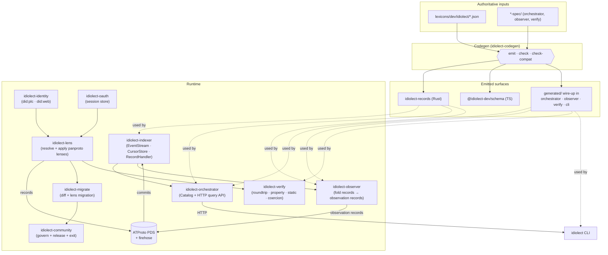

<div align="center">

<picture>
  <source media="(prefers-color-scheme: dark)" srcset=".github/assets/wordmark-dark.svg">
  
</picture>

<p><strong>Infrastructure for communities to define, translate, verify, and evolve shared data.</strong></p>

<p>
  <a href="https://github.com/idiolect-dev/idiolect/actions/workflows/ci.yml"></a>
  <a href="https://idiolect.dev/book/"></a>
  <a href="https://github.com/idiolect-dev/idiolect/blob/main/LICENSE"></a>
</p>

</div>

---

## What Idiolect is for

Idiolect is a toolkit for groups that share data but may not share one fixed
schema forever. A community can use it to define its record formats, explain a
proposed change, translate old records into a new shape, record who approved
the change, verify the translation, produce a signed release, and keep a
portable history of the process.

Consider two communities that both record votes. One stores `yes` and `no`;
the other stores `support`, `oppose`, and `abstain`. Idiolect lets them publish
their own definitions and a checked translation between them. Neither
community has to surrender control of its schema, and an application can
inspect the translation and its verification evidence before using it. The
same machinery handles a community changing its own schema over time.

Use Idiolect when you need to:

- maintain shared schemas and vocabularies under explicit community rules;
- translate records between schema variants without hiding the conversion in
  application code;
- determine how a schema change affects existing records and readers;
- attach reviews, verification results, signatures, and migration progress to
  a change;
- index and query published records without appointing one global authority;
- export a community's definitions and decision history to another host.

Idiolect does not decide which schema is correct, which community should be
trusted, or which translation an application must use. It makes those choices
inspectable and portable.

## How it works

Idiolect treats the linguistic distinction between *idiolects*, *dialects*,
and *languages* as an operating model. An **idiolect** is one party's schemas,
translations, and conventions. A **dialect** is the bundle a community adopts.
The **language** is the federated substrate on which communities publish,
compare, and translate those bundles without a central schema owner.

A typical community workflow is:

1. Define record shapes as ATProto lexicons and generate matching Rust and
   TypeScript types.
2. Compare a proposed definition with the current one and produce a change
   packet that explains compatibility, data loss, and migration needs.
3. Review the packet under the community's governance policy and attach
   verification evidence.
4. Sign a release containing the approved definitions, translations, and
   change records.
5. Migrate records with resumable checkpoints, then retain or export the full
   workspace.

Schemas and translations are
[Panproto](https://github.com/panproto/panproto) artifacts. Public identities,
records, and discovery use [ATProto](https://atproto.com). Local drafts, keys,
migration checkpoints, and exports remain ordinary files under the
community's control.

Begin with [Idiolect for a new community](docs/book/src/start/index.md). It
requires no prior knowledge of ATProto, Panproto, or Rust.

## What each component does

| Component | What it does | Use it when |
| --- | --- | --- |
| [`idiolect-cli`][cli] | Exposes the workspace, identity, record, query, and verification operations as shell commands. | You want to operate Idiolect without writing Rust. |
| [`idiolect-community`][community] | Stores community policy, change packets, reviews, signed releases, migration runs, federation dependencies, and exports. | A group needs an accountable definition-change process. |
| [`idiolect-codegen`][cg] | Turns lexicons and declarative specs into checked Rust, TypeScript, CLI, and HTTP code. | You author or change a record definition or query. |
| [`idiolect-records`][recs] | Provides typed Rust identifiers and record structures generated from the lexicons. | A Rust service reads or writes Idiolect records. |
| [`@idiolect-dev/schema`][npm] | Provides the same record types and runtime validators for TypeScript. | A TypeScript boundary must classify or validate incoming records. |
| [`idiolect-lens`][lens] | Resolves a published translation, loads its schemas, and applies it to record data. | Two data shapes need to interoperate. |
| [`idiolect-migrate`][mig] | Classifies schema changes, proposes migrations, and translates individual records. | Existing data must move to a revised schema. |
| [`idiolect-verify`][ver] | Runs round-trip, property, static, and coercion checks and emits verification records. | A consumer needs evidence that a translation satisfies a stated property. |
| [`idiolect-indexer`][idx] | Reads an ATProto event stream, decodes selected record families, dispatches handlers, and persists cursors. | A service must keep local state synchronized with published records. |
| [`idiolect-orchestrator`][orc] | Builds a searchable catalog of published records and serves read-only queries. | Clients need to discover communities, translations, evidence, releases, or migrations. |
| [`idiolect-observer`][obs] | Aggregates event-stream activity into publishable observation records. | A community wants auditable measurements such as adoption or migration health. |
| [`idiolect-identity`][id] | Resolves DIDs and locates the account's personal data server. | Code starts with an identity and needs to find its records. |
| [`idiolect-oauth`][oauth] | Models and stores local authentication sessions used for record writes. | A client must authenticate to a personal data server without publishing credentials as records. |

## Architecture


```mermaid
flowchart TB
    subgraph sources["Authoritative inputs"]
        LEX["lexicons/dev/idiolect/*.json"]
        SPEC["*-spec/ (orchestrator, observer, verify)"]
    end

    subgraph codegen["Codegen (idiolect-codegen)"]
        CG{{"emit · check · check-compat"}}
    end

    subgraph emitted["Emitted surfaces"]
        RECS["idiolect-records (Rust)"]
        NPM["@idiolect-dev/schema (TS)"]
        WIRE["generated/ wire-up in<br/>orchestrator · observer · verify · cli"]
    end

    subgraph runtime["Runtime"]
        PDS[("ATProto PDS<br/>+ firehose")]
        IDX["idiolect-indexer<br/>(EventStream · CursorStore · RecordHandler)"]
        ORC["idiolect-orchestrator<br/>(Catalog + HTTP query API)"]
        OBS["idiolect-observer<br/>(fold records → observation records)"]
        VER["idiolect-verify<br/>(roundtrip · property · static · coercion)"]
        MIG["idiolect-migrate<br/>(diff + lens migration)"]
        COMCTL["idiolect-community<br/>(govern + release + exit)"]
        LENS["idiolect-lens<br/>(resolve + apply panproto lenses)"]
        ID["idiolect-identity<br/>(did:plc · did:web)"]
        OAUTH["idiolect-oauth<br/>(session store)"]
    end

    CLI["idiolect CLI"]

    LEX --> CG
    SPEC --> CG
    CG --> RECS
    CG --> NPM
    CG --> WIRE

    PDS -->|commits| IDX
    IDX --> ORC
    IDX --> OBS
    OBS -->|observation records| PDS
    LENS -->|records| PDS
    ID --> LENS
    OAUTH --> LENS
    ORC -->|HTTP| CLI
    LENS --> MIG
    MIG --> COMCTL
    LENS --> VER

    RECS -.used by.-> IDX
    RECS -.used by.-> ORC
    RECS -.used by.-> OBS
    WIRE -.used by.-> ORC
    WIRE -.used by.-> OBS
    WIRE -.used by.-> VER
    WIRE -.used by.-> CLI
```

Lexicons under `lexicons/dev/` are the authoritative record definitions.
`idiolect-codegen` derives the Rust types in `idiolect-records` and the
TypeScript validators in `@idiolect-dev/schema` from them.

Three declarative JSON specs define four generated surfaces. The orchestrator
spec drives catalog queries and their CLI subcommands; the observer and
verifier specs drive their respective method and runner inventories. Each
spec is validated against its own atproto-shaped lexicon. Codegen emits the
dispatch code, while hand-written predicates and implementations supply the
behavior.

Some runtime state must remain local. Firehose cursors and OAuth tokens use
the same panproto schema machinery as federated records, but their
`dev.idiolect.internal.*` namespace tells firehose consumers to skip them.

## Choose an entry point

- Use [Fieldwork](https://idiolect.dev/fieldwork/) for a browser interface
  that reveals technical evidence progressively.
- Use the [`idiolect` CLI](crates/idiolect-cli) for local files, Git review,
  CI automation, and shell workflows.
- Use the Rust crates or TypeScript package to build Idiolect into an appview,
  community service, or client.

## Quickstart

```sh
# Install the CLI from this checkout.
cargo install --path crates/idiolect-cli

# Start a portable community workspace.
idiolect init --workspace neighborhood-archive \
  --name "Neighborhood Archive" --did did:plc:replace-me
idiolect doctor --workspace neighborhood-archive

# Resolve a public identity and fetch one of its records.
idiolect resolve did:plc:example
idiolect fetch at://did:plc:example/dev.idiolect.bounty/3l5

# Query a local orchestrator catalog.
idiolect orchestrator stats
idiolect orchestrator adapters --framework hasura

# TypeScript: validate incoming records at an appview boundary.
bun add @idiolect-dev/schema
```

```ts
import { NSID, isRecord, type Encounter } from "@idiolect-dev/schema";

if (isRecord(NSID.encounter, payload)) {
  const e: Encounter = payload;
  console.log(e.kind);
}
```

[recs]: crates/idiolect-records
[cg]: crates/idiolect-codegen
[lens]: crates/idiolect-lens
[id]: crates/idiolect-identity
[idx]: crates/idiolect-indexer
[oauth]: crates/idiolect-oauth
[obs]: crates/idiolect-observer
[orc]: crates/idiolect-orchestrator
[ver]: crates/idiolect-verify
[mig]: crates/idiolect-migrate
[community]: crates/idiolect-community
[cli]: crates/idiolect-cli
[npm]: packages/schema

## Install

Each release publishes binaries to the
[releases page](https://github.com/idiolect-dev/idiolect/releases), signed
with sigstore keyless. Container images for the daemons ship to
`ghcr.io/idiolect-dev/orchestrator` and `ghcr.io/idiolect-dev/observer`. See
[`docs/deployment.md`](docs/deployment.md) for operator-facing setup,
[`docs/ci-cd.md`](docs/ci-cd.md) for artifact verification, and
[`RELEASE.md`](RELEASE.md) for the release cadence.

## Implementation stack

- **Rust:** runtime libraries, daemons, CLI, and code generation.
- **TypeScript:** generated browser and server validators.
- **Moon:** polyglot task orchestration and toolchain pinning.

## Getting started as a contributor

```sh
# One-off setup.
moon :setup

# The common loops.
moon :build         # build everything
moon :test          # run every test
moon :lint          # fmt + clippy + biome + tsc

# Regenerate after editing a lexicon or a spec.
cargo run -p idiolect-codegen -- generate
```

Before opening a PR, confirm `cargo fmt --all`, `cargo clippy --workspace
--all-targets -- -D warnings`, `cargo test --workspace`, and `bun run lint
&& bun run typecheck && bun run test` all pass. CI runs the same commands
plus a lexicon breaking-change gate against the PR's merge base.

## Contributing

Use the issue templates and PR template under `.github/` for reports and
proposals. Before proposing a new architectural primitive, work through the
[feature-request template](.github/ISSUE_TEMPLATE/feature.yml); it records the
constraints a proposal must address.

## Acknowledgments

idiolect was architected and implemented with substantial assistance from Claude Code.

## License

[MIT](LICENSE)
