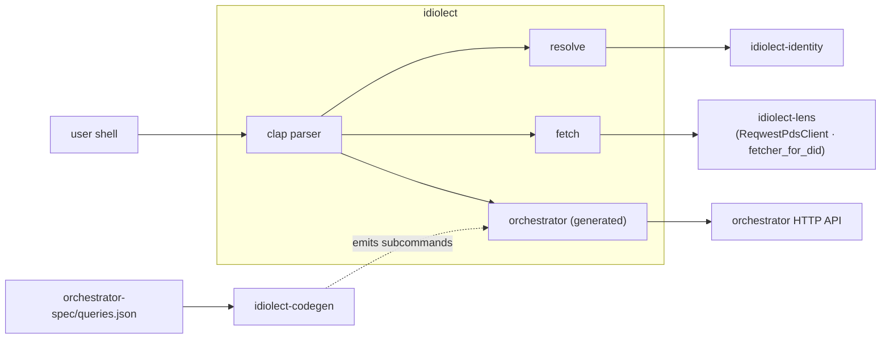

# idiolect-cli

Command-line tool wrapping the library crates.

## Overview

Single binary named `idiolect`. Subcommands cover the common
operations: resolve a DID, fetch a record from its home PDS, query
a running local orchestrator, and compose an encounter record from
structured prompts. The orchestrator subcommand dispatcher is
**generated** from
[`orchestrator-spec/queries.json`](../../orchestrator-spec/queries.json)
so the CLI never drifts out of sync with the HTTP API it's targeting.

## Architecture



Every command prints pretty-printed JSON to stdout — pipe through `jq`
for further filtering.

## Install

```sh
cargo install --path crates/idiolect-cli
# Or, once released:
cargo install idiolect-cli
```

Binary archives for every release ship on the
[releases page](https://github.com/idiolect-dev/idiolect/releases) for
Linux (x86_64, aarch64) and macOS (x86_64, aarch64).

## Usage

```sh
# Identity resolution.
idiolect resolve did:plc:alice

# Fetch a record body (uses the DID's own PDS).
idiolect fetch at://did:plc:alice/dev.idiolect.bounty/3l5

# Orchestrator queries (default base URL http://localhost:8787).
idiolect orchestrator stats
idiolect orchestrator bounties                            # open bounties
idiolect orchestrator bounties --requester did:plc:alice
idiolect orchestrator adapters --framework hasura
idiolect orchestrator recommendations
idiolect orchestrator verifications --lens at://did:plc:x/dev.panproto.schema.lens/l1

# Point at a non-default orchestrator.
idiolect orchestrator stats --url https://orch.example.com

# Compose an encounter record interactively. The output is JSON on
# stdout; pipe into a record creator to publish.
idiolect encounter record \
  --lens at://did:plc:x/dev.panproto.schema.lens/l1 \
  --source-schema at://did:plc:x/dev.panproto.schema.schema/s1
```

## Design notes

- The `orchestrator` subcommand dispatcher is emitted from the
  orchestrator's query spec; adding a query to the spec produces a new
  CLI subcommand automatically on the next codegen run.
- Authentication is not wired: `resolve` and `fetch` hit public
  endpoints; the orchestrator API is read-only and public by design.
  Authenticated writes are
  [`idiolect-lens::SigningPdsWriter`](../idiolect-lens)'s responsibility.

## Stability

idiolect is pre-1.0. Releases in the `0.x` series may include
arbitrary breaking changes between minor versions — Rust APIs,
lexicon shapes, wire formats, and CLI surfaces are all in scope.
Pin to an exact version if you depend on this crate, and read
[CHANGELOG.md](../../CHANGELOG.md) before bumping.

## Related

- [`idiolect-identity`](../idiolect-identity) — `resolve` backs onto
  this crate.
- [`idiolect-lens`](../idiolect-lens) — `fetch` uses `ReqwestPdsClient`
  via `fetcher_for_did`.
- [`idiolect-orchestrator`](../idiolect-orchestrator) — the HTTP API
  the `orchestrator` subcommands query.
