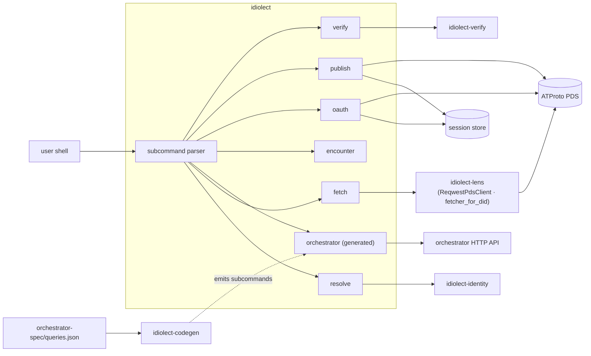

# idiolect-cli

Command-line access to the idiolect libraries and orchestrator API.

## Overview

The `idiolect` binary resolves DIDs, fetches and publishes records, manages
PDS sessions, queries an orchestrator, composes encounter records, and runs
lens verifications. Its orchestrator subcommands are generated from
[`orchestrator-spec/queries.json`](../../orchestrator-spec/queries.json)
so the CLI and HTTP API share one command inventory.

## Architecture


```mermaid
flowchart LR
    USER["user shell"]
    subgraph cli["idiolect"]
        PARSER["subcommand parser"]
        RES["resolve"]
        FET["fetch"]
        ORCSUB["orchestrator (generated)"]
        ENC["encounter"]
        AUTH["oauth"]
        PUB["publish"]
        VER["verify"]
    end
    OSPEC["orchestrator-spec/queries.json"]
    CG["idiolect-codegen"]

    ID["idiolect-identity"]
    LENSP["idiolect-lens<br/>(ReqwestPdsClient · fetcher_for_did)"]
    STORE[("session store")]
    PDS[("ATProto PDS")]
    VERIFY["idiolect-verify"]
    ORCHTTP["orchestrator HTTP API"]

    USER --> PARSER
    PARSER --> RES --> ID
    PARSER --> FET --> LENSP --> PDS
    PARSER --> ORCSUB --> ORCHTTP
    PARSER --> ENC
    PARSER --> AUTH --> STORE
    AUTH --> PDS
    PARSER --> PUB --> STORE
    PUB --> PDS
    PARSER --> VER --> VERIFY
    OSPEC --> CG -.emits subcommands.-> ORCSUB
```

Commands that return records or query results print formatted JSON to stdout.
Pipe those results through `jq` for further filtering.

## Install

```sh
cargo install --path crates/idiolect-cli
# Or, once released:
cargo install idiolect-cli
```

Binary archives for every release ship on the
[releases page](https://github.com/idiolect-dev/idiolect/releases) for
Linux (x86_64, aarch64) and macOS (x86_64, aarch64).

## Usage

```sh
# Identity resolution.
idiolect resolve did:plc:alice

# Fetch a record body (uses the DID's own PDS).
idiolect fetch at://did:plc:alice/dev.idiolect.bounty/3l5

# Orchestrator queries (default base URL http://localhost:8787).
idiolect orchestrator stats
idiolect orchestrator bounties                            # open bounties
idiolect orchestrator bounties --requester did:plc:alice
idiolect orchestrator adapters --framework hasura
idiolect orchestrator recommendations
idiolect orchestrator verifications --lens at://did:plc:x/dev.panproto.schema.lens/l1

# Point at a non-default orchestrator.
idiolect orchestrator stats --url https://orch.example.com

# Compose an encounter record interactively. The output is JSON on
# stdout; pipe into a record creator to publish.
idiolect encounter record \
  --lens at://did:plc:x/dev.panproto.schema.lens/l1 \
  --source-schema at://did:plc:x/dev.panproto.schema.schema/s1

# Store, inspect, and remove authenticated PDS sessions. Omit
# --app-password to read ATPROTO_APP_PASSWORD from the environment.
idiolect oauth login --handle alice.example.com --pds-url https://bsky.social
idiolect oauth list
idiolect oauth logout --did did:plc:alice

# Validate a local record body and publish it with a stored session.
idiolect publish encounter --record encounter.json
idiolect publish verification --record verification.json \
  --rkey 3l5example --did did:plc:alice

# Run a verification and print the resulting verification record.
idiolect verify roundtrip-test --lens at://did:plc:x/dev.panproto.schema.lens/l1
idiolect verify property-test \
  --lens at://did:plc:x/dev.panproto.schema.lens/l1 \
  --corpus fixtures/corpus.json --budget 200
idiolect verify static-check --lens at://did:plc:x/dev.panproto.schema.lens/l1
idiolect verify coercion-law \
  --lens at://did:plc:x/dev.panproto.schema.lens/l1 \
  --vcs-url https://vcs.example.com --standard json
```

## Design notes

- The orchestrator query spec drives the `orchestrator` subcommand
  dispatcher. The next codegen run adds a CLI subcommand for each new query.
- `resolve` and `fetch` use public endpoints. `oauth login` stores a PDS
  bearer session under `~/.config/idiolect/sessions/`, and `publish` uses
  that session for authenticated writes. Set `IDIOLECT_SESSION_DIR` to use
  a different store.
- The orchestrator API is read-only and public by design.

## Stability

idiolect is pre-1.0. Minor releases may change Rust APIs, lexicon shapes,
wire formats, or CLI surfaces. Pin an exact version if you depend on this
crate, and read [CHANGELOG.md](../../CHANGELOG.md) before upgrading.

## Related

- [`idiolect-identity`](../idiolect-identity): `resolve` uses
  this crate.
- [`idiolect-lens`](../idiolect-lens): `fetch` uses `ReqwestPdsClient`
  via `fetcher_for_did`.
- [`idiolect-orchestrator`](../idiolect-orchestrator): defines the HTTP API
  the `orchestrator` subcommands query.
