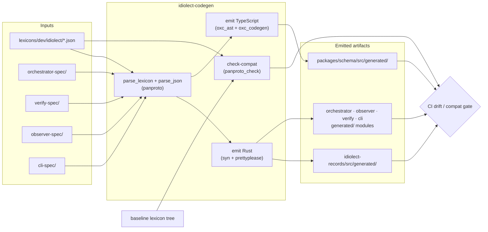

# idiolect-codegen

Lexicon-driven code generator: emits Rust record types, TypeScript
validators, and spec-driven wire-up for the `dev.idiolect.*` lexicon
family.

## Overview

A single binary and library exposing four deterministic emit targets and a
CI compatibility gate. Inputs are JSON on disk (lexicons + specs); outputs
are formatted Rust and TypeScript committed to the repository. The drift
gate in CI recomputes the emit and fails the build if the committed output
disagrees.

## Architecture



The four emit targets:

1. **Rust records** — each lexicon into
   `crates/idiolect-records/src/generated/`, built with `syn` +
   `prettyplease`.
2. **TypeScript types + validators** — into
   `packages/schema/src/generated/`, built with `oxc_ast` +
   `oxc_codegen`.
3. **Spec-driven wire-up** — reads `<crate>-spec/` JSON files, validates
   them through `panproto_protocols::web_document::atproto::parse_lexicon`
   + `panproto_inst::parse::parse_json` against the spec's own lexicon,
   and emits Rust into each consuming crate's `generated/` module.
4. **Panproto-check CI gate** — `check-compat --baseline <path>`
   classifies lexicon diffs via `panproto_check`, exiting non-zero on any
   breaking change.

The entire chain is pure: the same inputs yield byte-for-byte identical
outputs.

## Usage

```sh
# Regenerate every emitted artifact.
cargo run -p idiolect-codegen -- generate

# Check drift against what's committed.
cargo run -p idiolect-codegen -- check

# Print a bundled fixture to stdout.
cargo run -p idiolect-codegen -- example encounter

# Classify lexicon changes against a baseline tree.
cargo run -p idiolect-codegen -- check-compat --baseline /path/to/old-lexicons

# Workspace layout report.
cargo run -p idiolect-codegen -- doctor
```

## Design notes

- Every emitter routes through a canonical AST library (`syn` for Rust,
  `oxc` for TypeScript). Hand-rolled string concatenation is a rejected
  pattern — the entire emit surface is AST-first so structural invariants
  are runtime-unrepresentable.
- Spec files (`orchestrator-spec/queries.json`, etc.) ship with a sibling
  lexicon (`<crate>-spec/lexicon.json`) under the
  `dev.idiolect.internal.spec.*` namespace. Loading a spec always
  round-trips it through `parse_lexicon` + `parse_json` first, so a spec
  that drifts from its lexicon surfaces at load time, not at emit time.

## Related

- [`idiolect-records`](../idiolect-records) — Rust emit target.
- [`@idiolect-dev/schema`](../../packages/schema) — TypeScript emit target.
- [`idiolect-orchestrator`](../idiolect-orchestrator),
  [`idiolect-observer`](../idiolect-observer),
  [`idiolect-verify`](../idiolect-verify),
  [`idiolect-cli`](../idiolect-cli) — spec-driven wire-up consumers.
