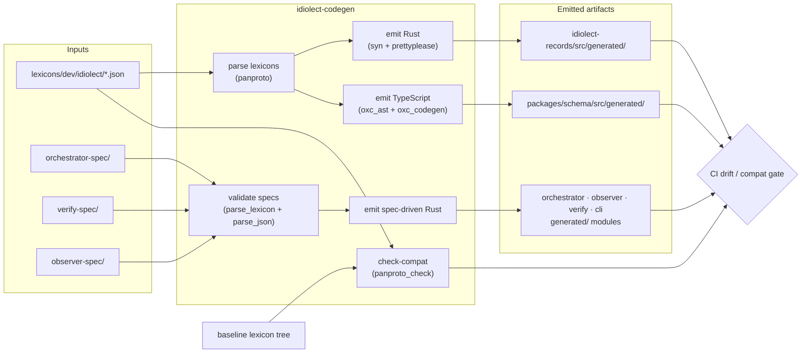

# idiolect-codegen

Lexicon-driven code generator: emits Rust record types, TypeScript
validators, and spec-driven wire-up for the `dev.idiolect.*` lexicon
family plus the vendored `dev.panproto.*` tree.

## Overview

The crate exposes three deterministic artifact generators and a compatibility
gate through one library and binary. It reads lexicons and specs from JSON and
writes formatted Rust and TypeScript that are committed to the repository.
The emitted tree mirrors the lexicon tree one-to-one:
`lexicons/dev/panproto/schema/lens.json` becomes
`generated/dev/panproto/schema/lens.rs` (and `.ts`), with
per-directory `mod.rs` / `index.ts` barrels stitching the tree. The
drift gate in CI recomputes the emit and fails the build if the
committed output disagrees.

## Architecture


```mermaid
flowchart LR
    subgraph inputs["Inputs"]
        LEX["lexicons/dev/idiolect/*.json"]
        OSPEC["orchestrator-spec/"]
        VSPEC["verify-spec/"]
        MSPEC["observer-spec/"]
    end

    subgraph codegen["idiolect-codegen"]
        LPARSE["parse lexicons<br/>(panproto)"]
        SPARSE["validate specs<br/>(parse_lexicon + parse_json)"]
        EMIT_R["emit Rust<br/>(syn + prettyplease)"]
        EMIT_TS["emit TypeScript<br/>(oxc_ast + oxc_codegen)"]
        EMIT_SPEC["emit spec-driven Rust"]
        CHECK["check-compat<br/>(panproto_check)"]
    end

    subgraph outputs["Emitted artifacts"]
        RECS["idiolect-records/src/generated/"]
        NPM["packages/schema/src/generated/"]
        WIRE["orchestrator · observer · verify · cli<br/>generated/ modules"]
    end

    BASELINE["baseline lexicon tree"]
    GATE{"CI drift / compat gate"}

    LEX --> LPARSE
    OSPEC --> SPARSE
    VSPEC --> SPARSE
    MSPEC --> SPARSE
    LPARSE --> EMIT_R
    LPARSE --> EMIT_TS
    SPARSE --> EMIT_SPEC
    EMIT_R --> RECS
    EMIT_TS --> NPM
    EMIT_SPEC --> WIRE
    BASELINE --> CHECK
    LEX --> CHECK
    RECS --> GATE
    NPM --> GATE
    WIRE --> GATE
    CHECK --> GATE
```

The generated artifacts and compatibility gate are:

1. **Rust records:** each lexicon into
   `crates/idiolect-records/src/generated/`, built with `syn` +
   `prettyplease`.
2. **TypeScript types and validators:** into
   `packages/schema/src/generated/`, built with `oxc_ast` +
   `oxc_codegen`.
3. **Spec-driven wire-up:** reads `<crate>-spec/` JSON files, validates
   them through `panproto_protocols::web_document::atproto::parse_lexicon`
   + `panproto_inst::parse::parse_json` against the spec's own lexicon,
   and emits Rust into each consuming crate's `generated/` module.
4. **Panproto-check CI gate:** `check-compat --baseline <path>`
   classifies lexicon diffs via `panproto_check`, exiting non-zero on any
   breaking change.

The emitters are deterministic: the same inputs yield byte-for-byte
identical outputs.

## Usage

```sh
# Regenerate every emitted artifact.
cargo run -p idiolect-codegen -- generate

# Check drift against what's committed.
cargo run -p idiolect-codegen -- check

# Print a bundled fixture to stdout.
cargo run -p idiolect-codegen -- example encounter

# Classify lexicon changes against a baseline tree.
cargo run -p idiolect-codegen -- check-compat --baseline /path/to/old-lexicons

# Workspace layout report.
cargo run -p idiolect-codegen -- doctor
```

## Design notes

- Every emitter constructs a language AST (`syn` for Rust, `oxc` for
  TypeScript) rather than assembling source text by concatenation. This
  keeps structural checks in typed builders before either printer runs.
- Spec files (`orchestrator-spec/queries.json`, etc.) ship with a sibling
  lexicon (`<crate>-spec/lexicon.json`) under the
  `dev.idiolect.internal.spec.*` namespace. Loading a spec always
  round-trips it through `parse_lexicon` + `parse_json` first, so a spec
  that drifts from its lexicon surfaces at load time, not at emit time.

## Stability

idiolect is pre-1.0. Minor releases may change Rust APIs, lexicon shapes,
wire formats, or CLI surfaces. Pin an exact version if you depend on this
crate, and read [CHANGELOG.md](../../CHANGELOG.md) before upgrading.

## Related

- [`idiolect-records`](../idiolect-records): Rust emit target.
- [`@idiolect-dev/schema`](../../packages/schema): TypeScript emit target.
- [`idiolect-orchestrator`](../idiolect-orchestrator),
  [`idiolect-observer`](../idiolect-observer),
  [`idiolect-verify`](../idiolect-verify),
  [`idiolect-cli`](../idiolect-cli): spec-driven wire-up consumers.
