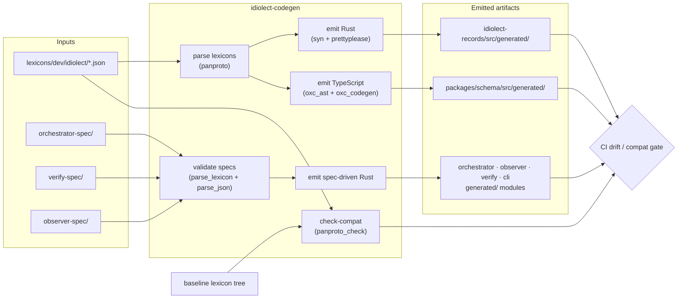

# idiolect-codegen

Turns Idiolect's declarative record and query definitions into the Rust and
TypeScript code that the runtime uses.

## What it does

`idiolect-codegen` is the build-time bridge between protocol definitions and
application code. It reads ATProto lexicons and Idiolect's declarative service
specs, validates them, and writes formatted source files that are committed to
the repository. It also compares a changed lexicon tree with a baseline so CI
can report compatibility before generated code is accepted.

| Input | Work performed | Output |
| --- | --- | --- |
| `lexicons/dev/**/*.json` | Parses record definitions and emits language ASTs | Rust record types and TypeScript types, constants, and validators |
| Orchestrator, observer, and verifier specs | Validates each spec against its own lexicon and emits dispatch code | Rust queries, HTTP handlers, CLI commands, and method descriptors |
| Current and baseline lexicon trees | Classifies changes with Panproto | Compatibility report and CI exit status |
| Current checkout | Recomputes every generated file | Drift report when committed output is stale |

Use this crate when adding a record kind, query, observation method, or
verification runner. Runtime applications consume its output; they do not
normally call the generator.

The crate exposes three deterministic artifact generators and a compatibility
gate through one library and binary. The emitted tree mirrors the lexicon tree
one-to-one:
`lexicons/dev/panproto/schema/lens.json` becomes
`generated/dev/panproto/schema/lens.rs` (and `.ts`), with
per-directory `mod.rs` / `index.ts` barrels stitching the tree. The
drift gate in CI recomputes the emit and fails the build if the
committed output disagrees.

## Architecture


```mermaid
flowchart LR
    subgraph inputs["Inputs"]
        LEX["lexicons/dev/idiolect/*.json"]
        OSPEC["orchestrator-spec/"]
        VSPEC["verify-spec/"]
        MSPEC["observer-spec/"]
    end

    subgraph codegen["idiolect-codegen"]
        LPARSE["parse lexicons<br/>(panproto)"]
        SPARSE["validate specs<br/>(parse_lexicon + parse_json)"]
        EMIT_R["emit Rust<br/>(syn + prettyplease)"]
        EMIT_TS["emit TypeScript<br/>(oxc_ast + oxc_codegen)"]
        EMIT_SPEC["emit spec-driven Rust"]
        CHECK["check-compat<br/>(panproto_check)"]
    end

    subgraph outputs["Emitted artifacts"]
        RECS["idiolect-records/src/generated/"]
        NPM["packages/schema/src/generated/"]
        WIRE["orchestrator · observer · verify · cli<br/>generated/ modules"]
    end

    BASELINE["baseline lexicon tree"]
    GATE{"CI drift / compat gate"}

    LEX --> LPARSE
    OSPEC --> SPARSE
    VSPEC --> SPARSE
    MSPEC --> SPARSE
    LPARSE --> EMIT_R
    LPARSE --> EMIT_TS
    SPARSE --> EMIT_SPEC
    EMIT_R --> RECS
    EMIT_TS --> NPM
    EMIT_SPEC --> WIRE
    BASELINE --> CHECK
    LEX --> CHECK
    RECS --> GATE
    NPM --> GATE
    WIRE --> GATE
    CHECK --> GATE
```

The generated artifacts and compatibility gate are:

1. **Rust records:** each lexicon into
   `crates/idiolect-records/src/generated/`, built with `syn` +
   `prettyplease`.
2. **TypeScript types and validators:** into
   `packages/schema/src/generated/`, built with `oxc_ast` +
   `oxc_codegen`.
3. **Spec-driven wire-up:** reads `<crate>-spec/` JSON files, validates
   them through `panproto_protocols::web_document::atproto::parse_lexicon`
   + `panproto_inst::parse::parse_json` against the spec's own lexicon,
   and emits Rust into each consuming crate's `generated/` module.
4. **Panproto-check CI gate:** `check-compat --baseline <path>`
   classifies lexicon diffs via `panproto_check`, exiting non-zero on any
   breaking change.

The emitters are deterministic: the same inputs yield byte-for-byte
identical outputs.

## Usage

```sh
# Regenerate every emitted artifact.
cargo run -p idiolect-codegen -- generate

# Check drift against what's committed.
cargo run -p idiolect-codegen -- check

# Print a bundled fixture to stdout.
cargo run -p idiolect-codegen -- example encounter

# Classify lexicon changes against a baseline tree.
cargo run -p idiolect-codegen -- check-compat --baseline /path/to/old-lexicons

# Workspace layout report.
cargo run -p idiolect-codegen -- doctor
```

## Boundaries and design choices

- Every emitter constructs a language AST (`syn` for Rust, `oxc` for
  TypeScript) rather than assembling source text by concatenation. This
  keeps structural checks in typed builders before either printer runs.
- Spec files (`orchestrator-spec/queries.json`, etc.) ship with a sibling
  lexicon (`<crate>-spec/lexicon.json`) under the
  `dev.idiolect.internal.spec.*` namespace. Loading a spec always
  round-trips it through `parse_lexicon` + `parse_json` first, so a spec
  that drifts from its lexicon surfaces at load time, not at emit time.

## Related

- [`idiolect-records`](../idiolect-records): Rust emit target.
- [`@idiolect-dev/schema`](../../packages/schema): TypeScript emit target.
- [`idiolect-orchestrator`](../idiolect-orchestrator),
  [`idiolect-observer`](../idiolect-observer),
  [`idiolect-verify`](../idiolect-verify),
  [`idiolect-cli`](../idiolect-cli): spec-driven wire-up consumers.
