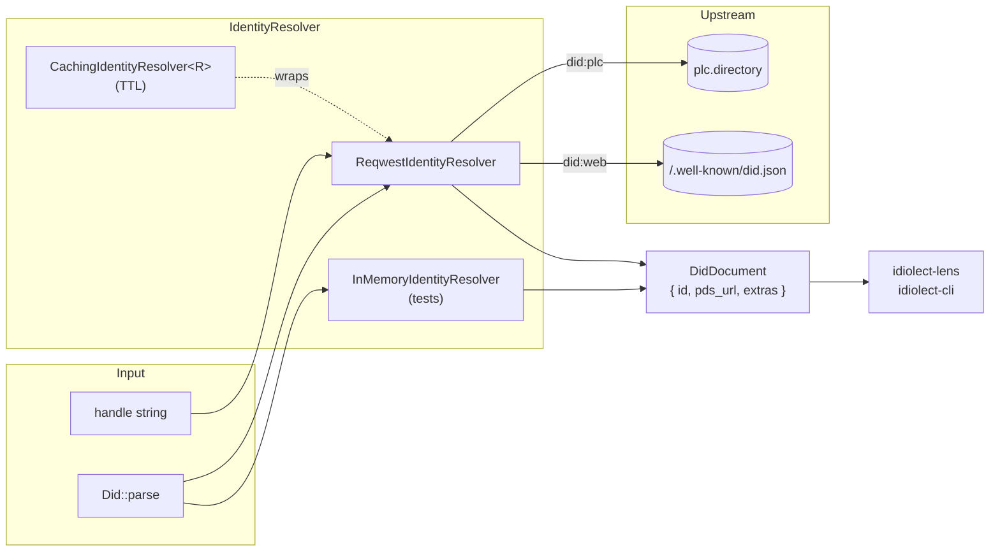

# idiolect-identity

DID resolution for idiolect: `did:plc` via plc.directory, `did:web` via
`/.well-known/did.json`.

## Overview

Maps DID identifiers to their W3C DID documents and, by way of
`DidDocument::pds_url`, the repo's PDS base URL. The core is
transport-agnostic — an `InMemoryIdentityResolver` ships for tests and a
reqwest-backed `ReqwestIdentityResolver` sits behind a feature flag. A
`CachingIdentityResolver<R>` wraps any resolver with a TTL cache,
matching the resolve-then-cache pattern every live appview uses.

## Architecture



## Usage

```rust
use idiolect_identity::{Did, IdentityResolver, ReqwestIdentityResolver};

let resolver = ReqwestIdentityResolver::new();
let did = Did::parse("did:plc:alice")?;
let doc = resolver.resolve(&did).await?;

// Direct access to the PDS base URL.
let pds_url = resolver.resolve_pds_url(&did).await?;

// Or go straight from handle to PDS URL.
let handle_pds = resolver.resolve_handle("alice.bsky.social").await?;
```

## Feature flags

| Flag | Default | Effect |
| ---- | ------- | ------ |
| `resolver-reqwest` | off | Live `ReqwestIdentityResolver` + `CachingIdentityResolver`. Runtime crates that never need live resolution stay transport-agnostic without this flag. |

## Design notes

- `Did` is the typed identifier from
  [`idiolect-records`](../idiolect-records); this crate re-exports it
  so callers do not need a second import for the same type. `Did::parse`
  accepts `did:plc:*` and `did:web:*`; other methods are rejected as
  out-of-scope.
- `DidDocument` carries only the atproto-relevant subset of the W3C
  spec; unknown fields survive via an `extras: BTreeMap<String, Value>`
  so round-trip through the struct preserves what the PLC directory or
  the `/.well-known/did.json` endpoint returned.

## Stability

idiolect is pre-1.0. Releases in the `0.x` series may include
arbitrary breaking changes between minor versions — Rust APIs,
lexicon shapes, wire formats, and CLI surfaces are all in scope.
Pin to an exact version if you depend on this crate, and read
[CHANGELOG.md](../../CHANGELOG.md) before bumping.

## Related

- [`idiolect-lens`](../idiolect-lens) — the `pds-resolve` helpers
  compose this crate with `ReqwestPdsClient`.
- [`idiolect-cli`](../idiolect-cli) — `idiolect resolve <did>` surfaces
  this crate's resolution at the command line.
