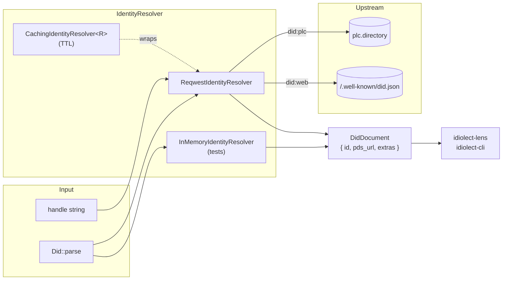

# idiolect-identity

Finds the ATProto account and data-server information represented by a DID or
handle.

## What it does

Applications often begin with a DID such as `did:plc:alice` but need the URL
of the personal data server that stores Alice's records. This crate resolves
`did:plc` identifiers through plc.directory, resolves `did:web` identifiers
through `/.well-known/did.json`, and extracts the ATProto service endpoint
from the resulting DID document. It can also resolve a handle to its DID and
PDS location.

| Input | Work performed | Output |
| --- | --- | --- |
| Parsed `Did` | Loads and parses the corresponding DID document | `DidDocument` with identity fields and PDS URL |
| ATProto handle | Resolves the handle, then its DID document | DID and PDS location |
| Any resolver wrapped in `CachingIdentityResolver` | Reuses results until the configured TTL expires | Same typed result with fewer upstream requests |

Use this crate when a client has an identity but does not yet know where to
fetch or publish that identity's records.

Resolution is transport-agnostic. Tests can use `InMemoryIdentityResolver`,
while the feature-gated
`ReqwestIdentityResolver` handles live requests. A
`CachingIdentityResolver<R>` adds a TTL cache to either implementation.

## Architecture


```mermaid
flowchart LR
    subgraph input["Input"]
        DID["Did::parse"]
        HND["handle string"]
    end
    subgraph resolvers["IdentityResolver"]
        MEM["InMemoryIdentityResolver<br/>(tests)"]
        REQ["ReqwestIdentityResolver"]
        CACHE["CachingIdentityResolver&lt;R&gt;<br/>(TTL)"]
    end
    subgraph sources["Upstream"]
        PLC[("plc.directory")]
        WEB[("/.well-known/did.json")]
    end
    DOC["DidDocument<br/>{ id, pds_url, extras }"]
    CONS["idiolect-lens<br/>idiolect-cli"]

    DID --> MEM
    DID --> REQ
    HND --> REQ
    CACHE -.wraps.-> REQ
    REQ -->|did:plc| PLC
    REQ -->|did:web| WEB
    MEM --> DOC
    REQ --> DOC
    DOC --> CONS
```

## Usage

```rust
use idiolect_identity::{Did, IdentityResolver, ReqwestIdentityResolver};

let resolver = ReqwestIdentityResolver::new();
let did = Did::parse("did:plc:alice")?;
let doc = resolver.resolve(&did).await?;

// Direct access to the PDS base URL.
let pds_url = resolver.resolve_pds_url(&did).await?;

// Or go straight from handle to PDS URL.
let handle_pds = resolver.resolve_handle("alice.bsky.social").await?;
```

## Feature flags

| Flag | Default | Effect |
| ---- | ------- | ------ |
| `resolver-reqwest` | off | Live `ReqwestIdentityResolver` + `CachingIdentityResolver`. Runtime crates that never need live resolution stay transport-agnostic without this flag. |

## Boundaries and design choices

- `Did` is the typed identifier from
  [`idiolect-records`](../idiolect-records). This crate re-exports it,
  so callers need only one import. `Did::parse`
  accepts `did:plc:*` and `did:web:*`. Other methods are rejected as
  out-of-scope.
- `DidDocument` carries only the atproto-relevant subset of the W3C
  spec. Unknown fields survive via an `extras: BTreeMap<String, Value>`
  so round-trip through the struct preserves what the PLC directory or
  the `/.well-known/did.json` endpoint returned.

## Related

- [`idiolect-lens`](../idiolect-lens): the `pds-resolve` helpers
  compose this crate with `ReqwestPdsClient`.
- [`idiolect-cli`](../idiolect-cli): `idiolect resolve <did>` exposes
  this crate's resolution at the command line.
