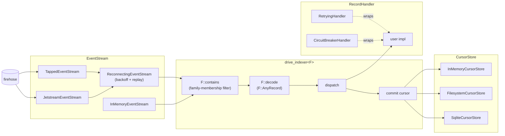

# idiolect-indexer

Firehose consumer parameterised over a record family.

## Overview

Sits between a firehose transport (`tapped`, jetstream, a custom adapter)
and an appview's per-record handlers. The crate owns the event loop,
cursor management, and reconnect/retry policy; consumers provide handler
logic, pick their transport via feature flag, and pin the loop to a
[`RecordFamily`](../idiolect-records/src/family.rs). The default family
is `IdiolectFamily` (the `dev.idiolect.*` record set); downstream
consumers running their own codegen pass wire their own.

## Architecture



Three traits carry every boundary, all parameterised over a
`RecordFamily`:

- **`EventStream`** yields commits, one at a time. Impls for in-memory
  fixtures, tapped, and jetstream.
- **`CursorStore`** persists the ack cursor so the indexer resumes
  after restart. Impls for in-memory, filesystem JSON, and sqlite.
- **`RecordHandler<F>`** is user code. Receives each decoded commit as an
  `IndexerEvent<F>` whose body is already materialized into `F::AnyRecord`.

`drive_indexer::<F, _, _, _>` wires the three together and owns the
event loop: family-membership filter, decode, dispatch, commit the
cursor, handle backpressure errors, exit cleanly on stream close.
Out-of-family commits are dropped silently before decode. The
convenience entry `drive_idiolect_indexer` runs the loop pinned to
`IdiolectFamily` without an explicit type parameter.
`ReconnectingEventStream` layers exponential-backoff reconnect plus
cursor replay for production deployments where transport flaps are
routine. `RetryingHandler` and `CircuitBreakerHandler` wrap any
`RecordHandler` with the matching resilience policy.

## Usage

The default family is `IdiolectFamily`, so the typical case names no
type parameter:

```rust
use idiolect_indexer::{
    InMemoryCursorStore, InMemoryEventStream, IndexerConfig, NoopRecordHandler,
    drive_idiolect_indexer,
};

let mut stream = InMemoryEventStream::new();
let handler = NoopRecordHandler::new();
let cursors = InMemoryCursorStore::new();

drive_idiolect_indexer(&mut stream, &handler, &cursors, &IndexerConfig::default()).await?;
```

Index a custom family by spelling out the type parameter:

```rust
use idiolect_indexer::drive_indexer;

drive_indexer::<MyFamily, _, _, _>(&mut stream, &handler, &cursors, &cfg).await?;
```

## Feature flags

| Flag | Default | Effect |
| ---- | ------- | ------ |
| `firehose-tapped` | off | `TappedEventStream` backed by [`tapped`](https://crates.io/crates/tapped). Live firehose + repo backfill. |
| `firehose-jetstream` | off | `JetstreamEventStream` for jetstream's JSON-over-websocket. Includes keepalive pings. |
| `cursor-filesystem` | off | `FilesystemCursorStore` — one JSON file per subscription id. |
| `cursor-sqlite` | off | `SqliteCursorStore` — WAL-journaled sqlite table. |
| `reconnecting` | off | `ReconnectingEventStream` + `BackoffPolicy`. |
| `resilience` | off | `RetryingHandler` + `CircuitBreakerHandler`. |

## Design notes

- Every event carries a `live: bool`. Live and backfill events dispatch
  identically at the handler, but the cursor store only advances on live
  events; replaying backfill on reconnect is safe and expected.
- `IndexerEvent.collection` is a typed `Nsid` (parsed at the
  stream-decode boundary). A frame with a malformed NSID is skipped
  with a `tracing::warn!` rather than fatal-ing the loop, so a single
  buggy publisher does not drop the firehose for everyone else.
- Family membership is `F::contains`. A NSID outside the family is
  dropped before decode, so an upstream PDS that adds a record type
  ahead of our codegen does not halt the loop. A `contains`-true /
  `decode`-`Ok(None)` mismatch surfaces as
  `IndexerError::FamilyContract` (a family-implementation bug, not a
  data bug).
- Trait objects are not dyn-compatible because the traits use native
  `async fn`; the crate ships Arc blanket impls so consumers share state
  via `Arc<ConcreteImpl>` instead.

## Stability

idiolect is pre-1.0. Releases in the `0.x` series may include
arbitrary breaking changes between minor versions — Rust APIs,
lexicon shapes, wire formats, and CLI surfaces are all in scope.
Pin to an exact version if you depend on this crate, and read
[CHANGELOG.md](../../CHANGELOG.md) before bumping.

## Related

- [`idiolect-records`](../idiolect-records) defines `RecordFamily`,
  ships `IdiolectFamily`, and produces the `F::AnyRecord` materialised
  inside the indexer.
- [`idiolect-orchestrator`](../idiolect-orchestrator) and
  [`idiolect-observer`](../idiolect-observer) both consume this crate's
  firehose stream; the observer pins to `IdiolectFamily` explicitly.
