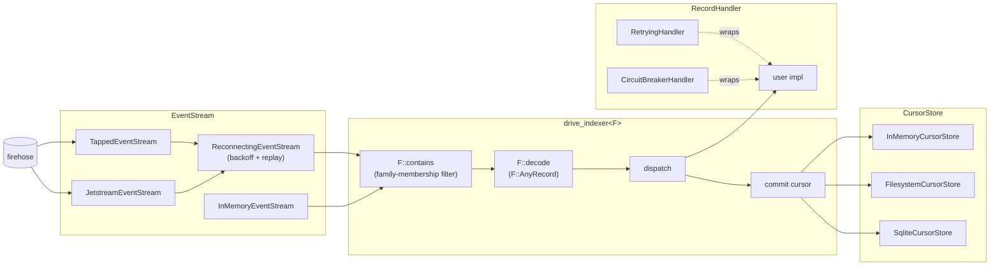

# idiolect-indexer

Keeps an application synchronized with selected ATProto record families.

## What it does

The indexer reads commits from a firehose or test stream, discards collections
outside the selected record family, decodes matching record bodies, and hands
typed events to application code. It advances a durable cursor only after a
live event has been handled, so a process can resume after restart.

| Input | Work performed | Output |
| --- | --- | --- |
| Firehose or in-memory event stream | Filters by record family and decodes each matching commit | Typed `IndexerEvent<F>` values sent to a handler |
| `RecordHandler<F>` | Runs application-specific upsert and delete behavior | Updated catalog, observation state, or other application state |
| Cursor store | Reads the resume point and commits acknowledged live positions | Restart-safe subscription progress |
| Optional resilience wrappers | Reconnects streams, retries handlers, or opens a circuit breaker | Controlled behavior under transport or handler failure |

Use this crate to build an appview, catalog, observer, search index, or any
service that follows published ATProto records over time. It does not prescribe
what the local projection should contain.

The indexer sits between a firehose transport (`tapped`, jetstream, or a
custom adapter) and an appview's per-record handlers. Consumers provide
handler logic, select a transport by feature flag, and pin the loop to a
[`RecordFamily`](../idiolect-records/src/family.rs). The default family
is `IdiolectFamily` (the `dev.idiolect.*` record set). Downstream
code generators can supply another family.

## Architecture


```mermaid
flowchart LR
    subgraph transport["EventStream"]
        T1["TappedEventStream"]
        T2["JetstreamEventStream"]
        T3["InMemoryEventStream"]
        RC["ReconnectingEventStream<br/>(backoff + replay)"]
    end

    subgraph loop["drive_indexer&lt;F&gt;"]
        FILT["F::contains<br/>(family-membership filter)"]
        DEC["F::decode<br/>(F::AnyRecord)"]
        DISP["dispatch"]
        ACK["commit cursor"]
    end

    subgraph handler["RecordHandler"]
        H0["user impl"]
        H1["RetryingHandler"]
        H2["CircuitBreakerHandler"]
    end

    subgraph cursor["CursorStore"]
        C1["InMemoryCursorStore"]
        C2["FilesystemCursorStore"]
        C3["SqliteCursorStore"]
    end

    FH[("firehose")]
    FH --> T1
    FH --> T2
    T1 --> RC
    T2 --> RC
    RC --> FILT
    T3 --> FILT
    FILT --> DEC
    DEC --> DISP
    DISP --> H0
    H1 -.wraps.-> H0
    H2 -.wraps.-> H0
    DISP --> ACK
    ACK --> C1
    ACK --> C2
    ACK --> C3
```

The runtime is organized around three traits, each parameterized over a
`RecordFamily`:

- **`EventStream`** yields commits, one at a time. Impls for in-memory
  fixtures, tapped, and jetstream.
- **`CursorStore`** persists the ack cursor so the indexer resumes
  after restart. Impls for in-memory, filesystem JSON, and sqlite.
- **`RecordHandler<F>`** is user code. Receives each decoded commit as an
  `IndexerEvent<F>` whose body is already materialized into `F::AnyRecord`.

`drive_indexer::<F, _, _, _>` connects the three traits and owns the
event loop. It filters by family membership, decodes and dispatches each
event, commits the cursor, handles backpressure errors, and exits when the
stream closes.
Out-of-family commits are dropped silently before decode. The
convenience entry `drive_idiolect_indexer` runs the loop pinned to
`IdiolectFamily` without an explicit type parameter.
`ReconnectingEventStream` layers exponential-backoff reconnect plus
cursor replay for deployments where a transport may disconnect.
`RetryingHandler` and `CircuitBreakerHandler` wrap any
`RecordHandler` with the matching resilience policy.

## Usage

The default family is `IdiolectFamily`, so the typical case names no
type parameter:

```rust
use idiolect_indexer::{
    InMemoryCursorStore, InMemoryEventStream, IndexerConfig, NoopRecordHandler,
    drive_idiolect_indexer,
};

let mut stream = InMemoryEventStream::new();
let handler = NoopRecordHandler::new();
let cursors = InMemoryCursorStore::new();

drive_idiolect_indexer(&mut stream, &handler, &cursors, &IndexerConfig::default()).await?;
```

Index a custom family by spelling out the type parameter:

```rust
use idiolect_indexer::drive_indexer;

drive_indexer::<MyFamily, _, _, _>(&mut stream, &handler, &cursors, &cfg).await?;
```

## Feature flags

| Flag | Default | Effect |
| ---- | ------- | ------ |
| `firehose-tapped` | off | `TappedEventStream` backed by [`tapped`](https://crates.io/crates/tapped). Live firehose + repo backfill. |
| `firehose-jetstream` | off | `JetstreamEventStream` for jetstream's JSON-over-websocket. Includes keepalive pings. |
| `cursor-filesystem` | off | `FilesystemCursorStore`: one JSON file per subscription id. |
| `cursor-sqlite` | off | `SqliteCursorStore`: WAL-journaled sqlite table. |
| `reconnecting` | off | `ReconnectingEventStream` + `BackoffPolicy`. |
| `resilience` | off | `RetryingHandler` + `CircuitBreakerHandler`. |

## Boundaries and design choices

- Every event carries a `live: bool`. Live and backfill events dispatch
  identically at the handler, but the cursor store only advances on live
  events. Replaying backfill on reconnect is safe and expected.
- `IndexerEvent.collection` is a typed `Nsid` (parsed at the
  stream-decode boundary). A frame with a malformed NSID is skipped
  with a `tracing::warn!` rather than terminating the loop, so one
  malformed frame does not stop the consumer.
- Family membership is `F::contains`. A NSID outside the family is
  dropped before decode, so an upstream PDS that adds a record type
  ahead of our codegen does not halt the loop. A `contains`-true /
  `decode`-`Ok(None)` mismatch surfaces as
  `IndexerError::FamilyContract` (a family-implementation bug, not a
  data bug).
- Trait objects are not dyn-compatible because the traits use native
  `async fn`. The crate ships Arc blanket impls so consumers share state
  via `Arc<ConcreteImpl>` instead.

## Related

- [`idiolect-records`](../idiolect-records): defines `RecordFamily`,
  ships `IdiolectFamily`, and produces the `F::AnyRecord` materialized
  inside the indexer.
- [`idiolect-orchestrator`](../idiolect-orchestrator) and
  [`idiolect-observer`](../idiolect-observer) both consume this crate's
  firehose stream. The observer pins to `IdiolectFamily` explicitly.
