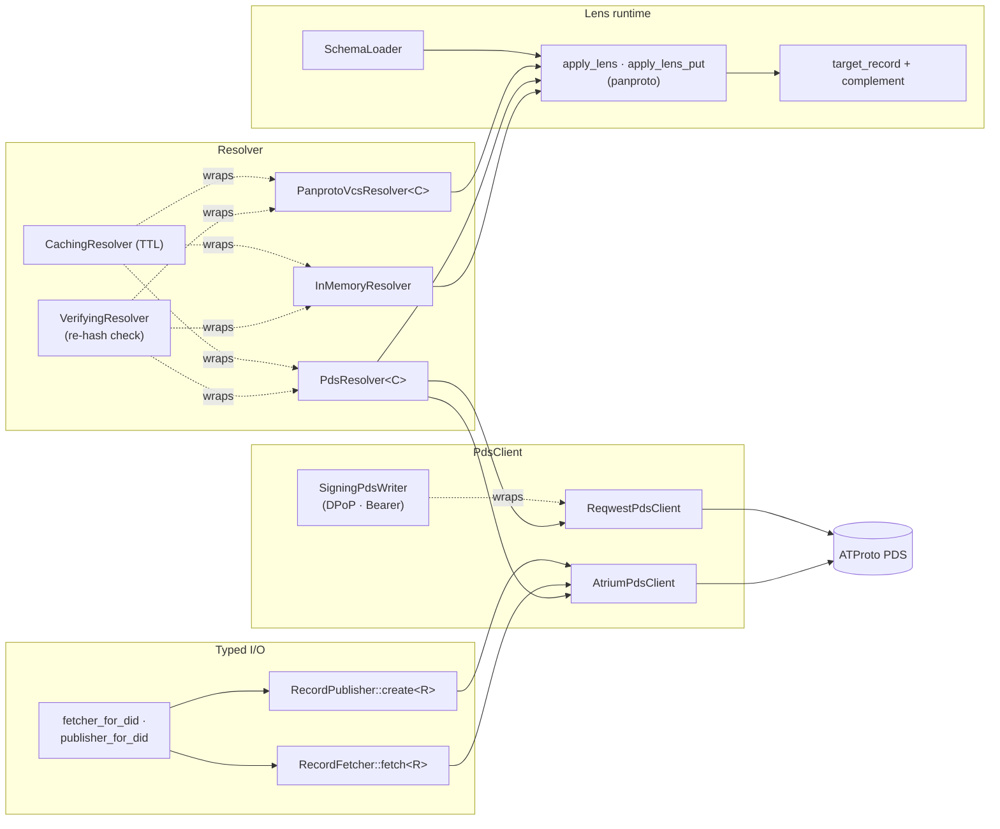

# idiolect-lens

Resolve `PanprotoLens` records and run them through the panproto lens
runtime.

## Overview

Lenses in the `dev.panproto.schema.lens` record type carry a protolens
chain plus source and target schema hashes. This crate turns that record
into runnable translation: resolve the lens record from its at-uri, load
both schemas, compile the chain against the source schema, and apply
`get` / `put` / edit-lens / symmetric-lens pipelines against record
bodies.

## Architecture



Three resolver shapes ship, all behind the narrow `Resolver` trait:

- **`InMemoryResolver`** — `HashMap<AtUri, PanprotoLens>` for tests.
- **`PdsResolver<C>`** — generic over a `PdsClient`; turns an at-uri
  into `(did, collection, rkey)` and delegates to the injected client.
- **`PanprotoVcsResolver<C>`** — generic over a `PanprotoVcsClient`;
  asks the client for the at-uri's current ref hash and then for the
  content-addressed lens object. The resolver itself is stateless;
  the ref table and object store both live behind the client.

`PanprotoVcsClient` covers the full `dev.panproto.sync.*` xrpc
surface: object reads, ref reads / writes / lists, commit-graph
traversal, the schema-tree view, and registry listings for theories
and alignments. An `InMemoryVcsClient` implements the whole surface
for tests and offline fixtures.

Two shipped PDS clients: `AtriumPdsClient` (typed XRPC via atrium)
and `ReqwestPdsClient` (raw reqwest). `VerifyingResolver<R, H>`
wraps any resolver and re-hashes the returned body against the lens
record's `object_hash` to reject content-hash mismatches.
`CachingResolver<R>` adds a TTL cache. `SigningPdsWriter<P>` layers
DPoP / Bearer auth over `ReqwestPdsClient` for authenticated writes.

## Usage

```rust
use idiolect_lens::{
    ApplyLensInput, InMemoryResolver, InMemorySchemaLoader, apply_lens,
};
use panproto_schema::Protocol;

let out = apply_lens(
    &resolver,                  // any Resolver impl
    &schema_loader,             // any SchemaLoader impl
    &Protocol::default(),
    ApplyLensInput {
        lens_uri: "at://did:plc:x/dev.panproto.schema.lens/l1".into(),
        source_record: source_json,
        source_root_vertex: None,
    },
).await?;
// out.target_record: the translated body.
// out.complement:    the data `get` discarded, needed by `put` to
//                    reconstruct the source.
```

Typed read + write helpers built over `PdsClient` / `PdsWriter`:
`RecordFetcher::fetch<R: Record>`, `RecordFetcher::list_records<R>`,
`RecordPublisher::create<R>`. `fetcher_for_did` and `publisher_for_did`
compose an `IdentityResolver` with a `ReqwestPdsClient` so callers go
from DID to typed writes in one call.

## Feature flags

| Flag | Default | Effect |
| ---- | ------- | ------ |
| `pds-atrium` | off | `AtriumPdsClient` via atrium-api + atrium-xrpc-client. |
| `pds-reqwest` | off | `ReqwestPdsClient` via raw reqwest. |
| `pds-resolve` | off | `fetcher_for_did` / `publisher_for_did` composition helpers. Implies `pds-reqwest`. |
| `dpop-p256` | off | `P256DpopProver` (ES256 DPoP via the `p256` crate). Implies `pds-reqwest`. |
| `pds-smoke-test` | off | Live-network test against a public PDS. Intentionally off in CI. |

## Design notes

- Resolver, client, and writer are three separate traits even
  though atrium happens to ship a single client that does all
  three. Splitting them keeps read-only consumers free of write
  capabilities and lets fixtures plug a single side at a time.
- `SchemaLoader::load` returns whatever panproto `Schema` is
  content-addressed by the requested hash regardless of scope —
  single-file or project-scope unioned. Dialects routinely span
  several source schemas, so the runtime intentionally avoids
  assuming a particular shape and asks for "the schema at this
  hash."
- Trait objects are not dyn-compatible because the traits use
  native `async fn`; the crate ships Arc blanket impls so consumers
  share state via `Arc<ConcreteImpl>` instead.

## Stability

idiolect is pre-1.0. Releases in the `0.x` series may include
arbitrary breaking changes between minor versions — Rust APIs,
lexicon shapes, wire formats, and CLI surfaces are all in scope.
Pin to an exact version if you depend on this crate, and read
[CHANGELOG.md](../../CHANGELOG.md) before bumping.

## Related

- [`idiolect-records`](../idiolect-records) — the `PanprotoLens` record
  type lives here.
- [`idiolect-identity`](../idiolect-identity) — DID resolution the
  `pds-resolve` helpers compose against.
- [`idiolect-migrate`](../idiolect-migrate) — migration layer sitting on
  top of `apply_lens`.
