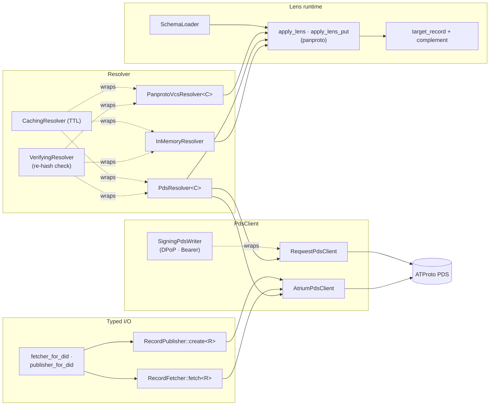

# idiolect-lens

Loads a published schema translation and applies it to record data.

## What it does

Applications use a lens when the data they have and the data they need follow
different schemas. This crate resolves a `dev.panproto.schema.lens` record
from an AT-URI or Panproto store, loads the source and target schemas named by
that record, compiles the translation, and applies it to a JSON record body.

| Input | Work performed | Output |
| --- | --- | --- |
| Lens AT-URI | Resolves and optionally re-hashes the published lens record | Authenticated `PanprotoLens` definition |
| Source and target schema hashes | Loads the exact schema objects required by the lens | Compiled translation context |
| Source record body | Runs the forward lens operation | Target record plus complement data needed for reversal |
| Edited target plus complement | Runs the backward lens operation | Reconstructed source record |
| DID and typed record | Resolves the PDS and performs a typed read or authenticated write | Typed Rust record or create-record response |

Use this crate when two communities use different record shapes, when an
application reads an older schema through a newer interface, or when a
migration worker needs to translate one record at a time.

The `dev.panproto.schema.lens` record type carries a protolens chain and
the hashes of its source and target schemas. This crate applies
`get` / `put` / edit-lens / symmetric-lens pipelines against record
bodies.

## Architecture


```mermaid
flowchart LR
    subgraph resolvers["Resolver"]
        R1["InMemoryResolver"]
        R2["PdsResolver&lt;C&gt;"]
        R3["PanprotoVcsResolver&lt;C&gt;"]
        VR["VerifyingResolver<br/>(re-hash check)"]
        CR["CachingResolver (TTL)"]
    end

    subgraph clients["PdsClient"]
        C1["AtriumPdsClient"]
        C2["ReqwestPdsClient"]
        SW["SigningPdsWriter<br/>(DPoP · Bearer)"]
    end

    subgraph runtime["Lens runtime"]
        LOAD["SchemaLoader"]
        APPLY["apply_lens · apply_lens_put<br/>(panproto)"]
        OUT["target_record + complement"]
    end

    subgraph typed["Typed I/O"]
        RF["RecordFetcher::fetch&lt;R&gt;"]
        RP["RecordPublisher::create&lt;R&gt;"]
        COMP["fetcher_for_did ·<br/>publisher_for_did"]
    end

    PDS[("ATProto PDS")]

    R2 --> C1
    R2 --> C2
    SW -.wraps.-> C2
    VR -.wraps.-> R1
    VR -.wraps.-> R2
    VR -.wraps.-> R3
    CR -.wraps.-> R1
    CR -.wraps.-> R2
    CR -.wraps.-> R3
    R1 --> APPLY
    R2 --> APPLY
    R3 --> APPLY
    LOAD --> APPLY
    APPLY --> OUT
    C1 --> PDS
    C2 --> PDS
    RF --> C1
    RP --> C1
    COMP --> RF
    COMP --> RP
```

The `Resolver` trait has three implementations:

- **`InMemoryResolver`:** a `HashMap<AtUri, PanprotoLens>` for tests.
- **`PdsResolver<C>`:** generic over a `PdsClient`. Turns an AT-URI
  into `(did, collection, rkey)` and delegates to the injected client.
- **`PanprotoVcsResolver<C>`:** generic over a `PanprotoVcsClient`.
  Asks the client for the at-uri's current ref hash and then for the
  content-addressed lens object. The resolver itself is stateless.
  The ref table and object store both live behind the client.

`PanprotoVcsClient` covers the full `dev.panproto.sync.*` xrpc
surface: object reads, ref reads / writes / lists, commit-graph
traversal, the schema-tree view, and registry listings for theories
and alignments. An `InMemoryVcsClient` implements the whole surface
for tests and offline fixtures.

The crate includes two PDS clients: `AtriumPdsClient` for typed XRPC via
atrium and `ReqwestPdsClient` for raw reqwest. `VerifyingResolver<R, H>`
wraps any resolver and re-hashes the returned body against the lens
record's `object_hash` to reject content-hash mismatches.
`CachingResolver<R>` adds a TTL cache. `SigningPdsWriter<P>` layers
DPoP / Bearer auth over `ReqwestPdsClient` for authenticated writes.

## Usage

```rust
use idiolect_lens::{
    ApplyLensInput, InMemoryResolver, InMemorySchemaLoader, apply_lens,
};
use panproto_schema::Protocol;

let out = apply_lens(
    &resolver,                  // any Resolver impl
    &schema_loader,             // any SchemaLoader impl
    &Protocol::default(),
    ApplyLensInput {
        lens_uri: "at://did:plc:x/dev.panproto.schema.lens/l1".into(),
        source_record: source_json,
        source_root_vertex: None,
    },
).await?;
// out.target_record: the translated body.
// out.complement:    the data `get` discarded, needed by `put` to
//                    reconstruct the source.
```

Typed read + write helpers built over `PdsClient` / `PdsWriter`:
`RecordFetcher::fetch<R: Record>`, `RecordFetcher::list_records<R>`,
`RecordPublisher::create<R>`. `fetcher_for_did` and `publisher_for_did`
compose an `IdentityResolver` with a `ReqwestPdsClient` so callers go
from DID to typed writes in one call.

## Feature flags

| Flag | Default | Effect |
| ---- | ------- | ------ |
| `pds-atrium` | off | `AtriumPdsClient` via atrium-api + atrium-xrpc-client. |
| `pds-reqwest` | off | `ReqwestPdsClient` via raw reqwest. |
| `pds-resolve` | off | `fetcher_for_did` / `publisher_for_did` composition helpers. Implies `pds-reqwest`. |
| `dpop-p256` | off | `P256DpopProver` (ES256 DPoP via the `p256` crate). Implies `pds-reqwest`. |
| `pds-smoke-test` | off | Live-network test against a public PDS. Intentionally off in CI. |

## Boundaries and design choices

- Resolver, client, and writer are three separate traits even
  though atrium happens to ship a single client that does all
  three. Splitting them keeps read-only consumers free of write
  capabilities and lets fixtures plug a single side at a time.
- `SchemaLoader::load` returns whatever panproto `Schema` is
  content-addressed by the requested hash regardless of whether it
  represents one file or a project-scope union. A dialect may span several
  source schemas, so the runtime avoids
  assuming a particular shape and asks for "the schema at this
  hash."
- Trait objects are not dyn-compatible because the traits use
  native `async fn`. The crate ships Arc blanket impls so consumers
  share state via `Arc<ConcreteImpl>` instead.

## Related

- [`idiolect-records`](../idiolect-records): defines the `PanprotoLens`
  record type.
- [`idiolect-identity`](../idiolect-identity): supplies the DID resolution
  `pds-resolve` helpers compose against.
- [`idiolect-migrate`](../idiolect-migrate): builds migration operations on
  top of `apply_lens`.
