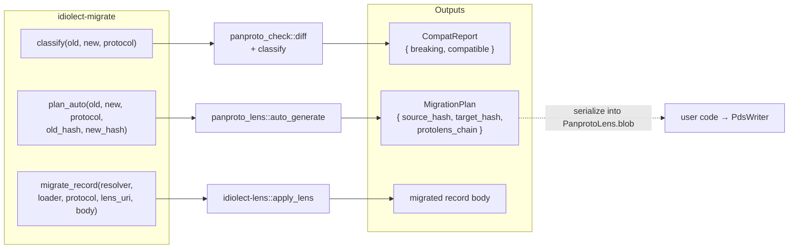

# idiolect-migrate

Schema diff and lens-based record migration.

## Overview

This crate provides one typed API over `panproto-check` diff classification
and [`idiolect-lens`](../idiolect-lens) record translation. It holds no
runtime state. Its three operations classify a schema change, derive a
migration plan, and apply a published lens to one record.

## Architecture



The operations answer three questions:

- **Is the change compatible?** [`classify`] runs `panproto_check::diff`
  + `classify` and returns a `CompatReport`.
- **Can we derive a migration?** [`plan_auto`] delegates to
  `panproto_lens::auto_generate` and returns a [`MigrationPlan`] containing
  source and target schema hashes plus a protolens chain ready to publish
  as a `dev.panproto.schema.lens` record. An error lists the
  breaking changes the auto-planner declined to synthesize.
- **How do we migrate one record?** [`migrate_record`] wraps `apply_lens`
  for the one-shot case.

## Usage

```rust
use idiolect_migrate::{classify, plan_auto, migrate_record};

let report = classify(&old_schema, &new_schema, &protocol);
if !report.breaking.is_empty() {
    let plan = plan_auto(
        &old_schema,
        &new_schema,
        &protocol,
        "sha256:old",
        "sha256:new",
    )?;
    // plan.protolens_chain: serialize into PanprotoLens.blob, publish.
}

let migrated = migrate_record(
    &resolver,
    &schema_loader,
    &protocol,
    "at://did:plc:x/dev.panproto.schema.lens/mig",
    old_record_body,
).await?;
```

## Design notes

Non-goals:

- Deciding the hashing rule for schemas. Hashes are deployment policy;
  pass yours into [`MigrationPlan`].
- Publishing records. [`MigrationPlan`] is a payload shape ready for a
  `PdsWriter`. This crate does not reach out to a PDS.
- Batch-rewriting records on disk. Compose `migrate_record` with your
  own record stream.

## Stability

idiolect is pre-1.0. Minor releases may change Rust APIs, lexicon shapes,
wire formats, or CLI surfaces. Pin an exact version if you depend on this
crate, and read [CHANGELOG.md](../../CHANGELOG.md) before upgrading.

## Related

- [`idiolect-lens`](../idiolect-lens): runtime that `migrate_record`
  calls into.
- [`idiolect-codegen`](../idiolect-codegen): its `check-compat`
  subcommand uses the same `panproto_check` pipeline this crate
  surfaces programmatically.
