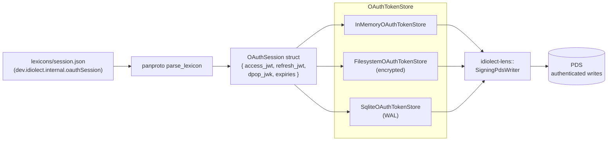

# idiolect-oauth

Panproto-native schema and store trait for atproto OAuth session state.

## Overview

OAuth tokens never travel back to a PDS as published records — they are
ephemeral secrets scoped to the authoring side. This crate nevertheless
models them as a **panproto schema** so the rest of the system treats
session lifecycle uniformly with everything else that speaks panproto:
firehose cursors, identity caches, DPoP nonces.

The schema lives in-crate at `lexicons/session.json`, parsed via
`panproto_protocols::web_document::atproto::parse_lexicon` into a
`panproto_schema::Schema`. The matching Rust struct is `OAuthSession`;
the persistence boundary is `OAuthTokenStore`.

## Architecture



## Usage

```rust
use idiolect_oauth::{OAuthSession, OAuthTokenStore, InMemoryOAuthTokenStore};

let store = InMemoryOAuthTokenStore::new();
let session = OAuthSession::new(
    "did:plc:alice",
    "https://pds.example",
    "access-jwt",
    "refresh-jwt",
    "dpop-jwk",
    "2026-04-19T00:00:00Z",
    "2026-04-19T01:00:00Z",
);

store.save(&session).await?;
let loaded = store.load("did:plc:alice").await?;

// Proactive refresh via expiry helpers.
use time::{OffsetDateTime, Duration};
if session.needs_refresh(OffsetDateTime::now_utc(), Duration::minutes(5)) {
    refresh_and_save(&store).await?;
}
```

## Feature flags

| Flag | Default | Effect |
| ---- | ------- | ------ |
| `store-filesystem` | off | `FilesystemOAuthTokenStore` — one encrypted file per session. |
| `store-sqlite` | off | `SqliteOAuthTokenStore` — one row per session, WAL-journaled. |

## Security

The `access_jwt`, `refresh_jwt`, and `dpop_private_key_jwk` fields are
secrets. `Debug` is derived for development ergonomics but must be
filtered from production logs. Disk-backed stores are responsible for
encryption at rest; the refresh token grants full repo write until the
account re-authenticates.

## Design notes

- The schema's nsid is `dev.idiolect.internal.oauthSession`. The
  `internal.` segment keeps the namespace under `dev.idiolect.*` (so
  panproto's atproto parser accepts it) while flagging consumers that
  this nsid never appears on a PDS firehose.
- Lenses over w-instances of the session schema express token lifecycle
  as ordinary panproto operations — issue via `put`, refresh via a
  field-rewriting `get`, revoke via a token-dropping `put`. Those lenses
  live in whichever component needs them; this crate ships only the
  schema, the struct, and the store trait.

## Stability

idiolect is pre-1.0. Releases in the `0.x` series may include
arbitrary breaking changes between minor versions — Rust APIs,
lexicon shapes, wire formats, and CLI surfaces are all in scope.
Pin to an exact version if you depend on this crate, and read
[CHANGELOG.md](../../CHANGELOG.md) before bumping.

## Related

- [`idiolect-lens`](../idiolect-lens) — `SigningPdsWriter` consumes
  sessions from this crate's store to authenticate record writes.
