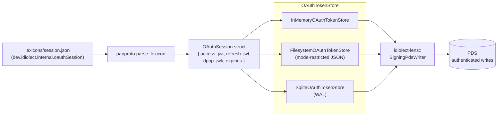

# idiolect-oauth

Stores the local credentials that an Idiolect client uses to write ATProto
records.

## What it does

OAuth tokens, refresh tokens, and DPoP keys are private client state. This
crate gives that state one typed shape, persistence traits, expiry helpers, an
in-memory store, a permission-restricted JSON-file store, and a SQLite store.
A publisher can load a session by DID and use it to authenticate writes
without treating credentials as public records.

| Input | Work performed | Output |
| --- | --- | --- |
| Login result or refreshed credentials | Normalizes the fields into `OAuthSession` | Typed session with expiry metadata |
| Session and account DID | Saves, loads, lists, or removes credentials | Store-specific persisted state |
| Current time and refresh margin | Compares token expiries | Decision to refresh before a write |

Use this crate in an authoring client or service that publishes records. It
does not implement the interactive authorization flow and never publishes
session data to a PDS.

The crate models local sessions with a Panproto schema. We call this the
**internal-state schema pattern**: local
state such as sessions, firehose cursors, identity caches, and DPoP nonces
uses the same schema operations without entering the federated record stream.

The schema lives in-crate at `lexicons/session.json`, parsed via
`panproto_protocols::web_document::atproto::parse_lexicon` into a
`panproto_schema::Schema`. The matching Rust struct is `OAuthSession`;
the persistence boundary is `OAuthTokenStore`.

## Architecture


```mermaid
flowchart LR
    SCHEMA["lexicons/session.json<br/>(dev.idiolect.internal.oauthSession)"]
    PP["panproto parse_lexicon"]
    SESS["OAuthSession struct<br/>{ access_jwt, refresh_jwt,<br/>dpop_jwk, expiries }"]

    subgraph store["OAuthTokenStore"]
        MEM["InMemoryOAuthTokenStore"]
        FS["FilesystemOAuthTokenStore<br/>(mode-restricted JSON)"]
        SQL["SqliteOAuthTokenStore<br/>(WAL)"]
    end

    SW["idiolect-lens::<br/>SigningPdsWriter"]
    PDS[("PDS<br/>authenticated writes")]

    SCHEMA --> PP --> SESS
    SESS --> MEM
    SESS --> FS
    SESS --> SQL
    MEM --> SW
    FS --> SW
    SQL --> SW
    SW --> PDS
```

## Usage

```rust
use idiolect_oauth::{OAuthSession, OAuthTokenStore, InMemoryOAuthTokenStore};

let store = InMemoryOAuthTokenStore::new();
let session = OAuthSession::new(
    "did:plc:alice",
    "https://pds.example",
    "access-jwt",
    "refresh-jwt",
    "dpop-jwk",
    "2026-04-19T00:00:00Z",
    "2026-04-19T01:00:00Z",
);

store.save(&session).await?;
let loaded = store.load("did:plc:alice").await?;

// Proactive refresh via expiry helpers.
use time::{OffsetDateTime, Duration};
if session.needs_refresh(OffsetDateTime::now_utc(), Duration::minutes(5)) {
    refresh_and_save(&store).await?;
}
```

## Feature flags

| Flag | Default | Effect |
| ---- | ------- | ------ |
| `store-filesystem` | off | `FilesystemOAuthTokenStore`: one permission-restricted JSON file per session. |
| `store-sqlite` | off | `SqliteOAuthTokenStore`: one row per session, WAL-journaled. |

## Security

The `access_jwt`, `refresh_jwt`, and `dpop_private_key_jwk` fields are
secrets. `Debug` is derived for development ergonomics but must be
filtered from production logs. The filesystem store writes plaintext JSON
with owner-only permissions on Unix; the SQLite store also does not add
encryption. Use an encrypted volume or another store when encryption at rest
is required. The refresh token grants full repo write until the account
re-authenticates.

## Boundaries and design choices

- The schema's nsid is `dev.idiolect.internal.oauthSession`. The
  `internal.` segment keeps the namespace under `dev.idiolect.*` (so
  panproto's atproto parser accepts it) while flagging consumers that
  this nsid never appears on a PDS firehose.
- Lenses over w-instances of the session schema express token lifecycle
  as panproto operations: issue via `put`, refresh via a field-rewriting
  `get`, and revoke via a token-dropping `put`. Those lenses
  live in whichever component needs them. This crate ships only the
  schema, the struct, and the store trait.

## Related

- [`idiolect-lens`](../idiolect-lens): `SigningPdsWriter` consumes
  sessions from this crate's store to authenticate record writes.
