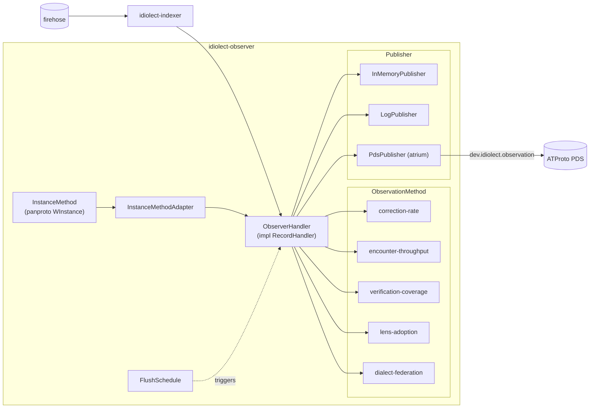

# idiolect-observer

Reference observer daemon for `dev.idiolect.*`.

## Overview

An *observer* consumes encounter-family records off the firehose, runs a
pluggable aggregation method over them, and periodically publishes a
structured `dev.idiolect.observation` record summarizing what it has
seen. The observer layer exists so ranking does not live in
orchestrators: any number of observers may publish competing aggregates
over the same firehose, and users choose which to trust.

## Architecture



Five reference methods ship:

- **`correction-rate`** — per-lens correction counts grouped by reason.
  Signals translation-quality rumor.
- **`encounter-throughput`** — encounter traffic by kind and downstream
  result. Signals firehose liveness.
- **`verification-coverage`** — per-lens verification counts by kind,
  result, and distinct verifiers. Signals formal-channel evidence.
- **`lens-adoption`** — per-lens encounter count and distinct-invoker
  DIDs. Signals adoption breadth.
- **`dialect-federation`** — watched communities' current dialect +
  lens-set deltas since the previous snapshot. Signals federation
  surface change.

Two method shapes coexist: [`ObservationMethod`](src/method.rs) takes the
raw `IndexerEvent`; [`InstanceMethod`](src/instance_method.rs) takes a
`panproto_inst::WInstance` and is wrapped into an `ObservationMethod` by
`InstanceMethodAdapter`, which decodes each event's record into graph
form via a caller-supplied schema resolver. Use the instance form for
methods that need to walk a record as a vertex/edge graph; use the
record form for flat-field counting and grouping.

## Usage

```rust
use idiolect_indexer::{InMemoryCursorStore, InMemoryEventStream, IndexerConfig};
use idiolect_observer::{
    CorrectionRateMethod, FlushSchedule, InMemoryPublisher, ObserverConfig,
    ObserverHandler, drive_observer,
};

let method = CorrectionRateMethod::new();
let publisher = InMemoryPublisher::new();
let config = ObserverConfig {
    observer_did: "did:plc:my-observer".to_owned(),
    ..ObserverConfig::default()
};
let handler = ObserverHandler::new(method, publisher, config);

let mut stream = InMemoryEventStream::new();
let cursors = InMemoryCursorStore::new();

drive_observer(
    &mut stream,
    &handler,
    &cursors,
    &IndexerConfig::default(),
    FlushSchedule::EveryEvents(100),
)
.await?;
```

## Feature flags

| Flag | Default | Effect |
| ---- | ------- | ------ |
| `daemon` | off | Long-running `idiolect-observer` binary: tapped firehose + sqlite cursor store + atrium-backed PDS publisher. |
| `pds-atrium` | off | `PdsPublisher` backed by `idiolect_lens::AtriumPdsClient`. |

## Daemon binary

```sh
IDIOLECT_OBSERVER_DID=did:plc:alice \
IDIOLECT_TAP_URL=http://localhost:2480 \
IDIOLECT_PDS_URL=https://bsky.social \
cargo run -p idiolect-observer --features daemon
```

Without `IDIOLECT_PDS_URL` the binary aggregates into an in-memory
publisher and logs counts on shutdown — useful as a smoke test against
a live firehose. `LogPublisher` is a third option for deployments that
only want a structured `tracing::info!` per snapshot. Setting
`IDIOLECT_OBSERVER_CURSORS` points the cursor store at a persistent
sqlite file so restarts resume.

## Design notes

- Authentication is not wired at the binary layer. Deployments that
  publish authenticated writes wrap the daemon in their own `main`,
  construct an authenticated `AtriumPdsClient`, and pass it to
  `PdsPublisher::new` directly.

## Related

- [`idiolect-indexer`](../idiolect-indexer) — the firehose layer
  `drive_observer` runs atop.
- [`idiolect-lens`](../idiolect-lens) — publishes via `PdsWriter` impls.
