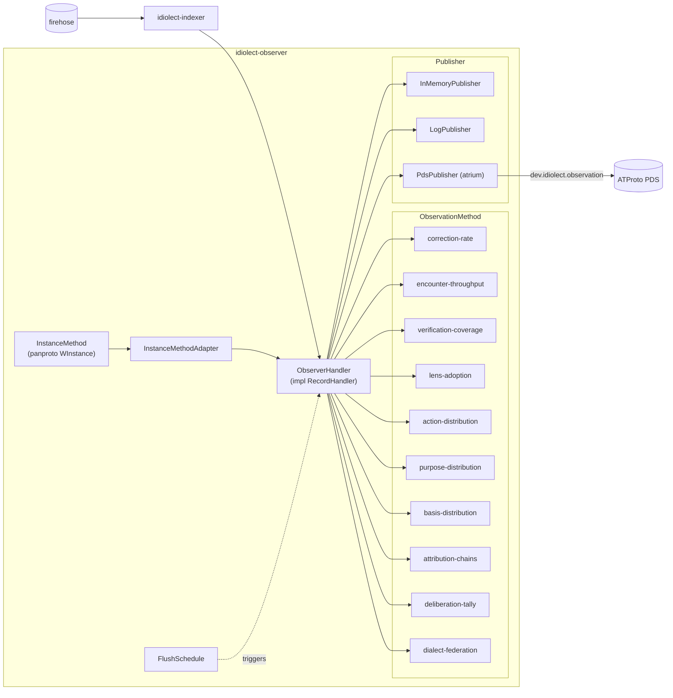

# idiolect-observer

Reference observer daemon for `dev.idiolect.*`.

## Overview

An *observer* consumes idiolect records from the firehose, runs a pluggable
aggregation method over them, and periodically publishes a
structured `dev.idiolect.observation` record summarizing what it has
seen. Aggregation remains separate from orchestration: several observers may
publish different summaries of the same firehose, and clients decide which
observer records to trust.

## Architecture


```mermaid
flowchart LR
    FH[("firehose")]
    IDX["idiolect-indexer"]

    subgraph observer["idiolect-observer"]
        OH["ObserverHandler<br/>(impl RecordHandler)"]
        subgraph methods["ObservationMethod"]
            M1["correction-rate"]
            M2["encounter-throughput"]
            M3["verification-coverage"]
            M4["lens-adoption"]
            M5["action-distribution"]
            M6["purpose-distribution"]
            M7["basis-distribution"]
            M8["attribution-chains"]
            M9["deliberation-tally"]
            M10["dialect-federation"]
        end
        IM["InstanceMethod<br/>(panproto WInstance)"]
        ADAPT["InstanceMethodAdapter"]
        FS["FlushSchedule"]
        subgraph pub["Publisher"]
            P1["InMemoryPublisher"]
            P2["LogPublisher"]
            P3["PdsPublisher (atrium)"]
        end
    end

    PDS[("ATProto PDS")]

    FH --> IDX --> OH
    OH --> M1
    OH --> M2
    OH --> M3
    OH --> M4
    OH --> M5
    OH --> M6
    OH --> M7
    OH --> M8
    OH --> M9
    OH --> M10
    IM --> ADAPT --> OH
    FS -.triggers.-> OH
    OH --> P1
    OH --> P2
    OH --> P3
    P3 -->|dev.idiolect.observation| PDS
```

The generated default set contains nine methods:

- **`correction-rate`:** per-lens correction counts grouped by reason.
- **`encounter-throughput`:** encounter traffic by kind and downstream
  result.
- **`verification-coverage`:** per-lens verification counts by kind,
  result, and distinct verifiers.
- **`lens-adoption`:** per-lens encounter counts and distinct invoker DIDs.
- **`action-distribution`:** encounter counts by structured action, with
  optional rollup through a resolved action vocabulary.
- **`purpose-distribution`:** encounter counts by structured purpose, with
  optional rollup through a resolved purpose vocabulary.
- **`basis-distribution`:** record counts by basis variant and record kind.
- **`attribution-chains`:** belief counts by holder DID and subject AT-URI.
- **`deliberation-tally`:** vote counts by statement and stance.

The crate also exports **`dialect-federation`**, which records each watched
community's current dialect and the lens-set changes since the previous
snapshot. It requires an explicit community watch list, so
[`default_methods`](src/generated.rs) does not construct it.

Two method shapes coexist: [`ObservationMethod`](src/method.rs) takes the
raw `IndexerEvent`; [`InstanceMethod`](src/instance_method.rs) takes a
`panproto_inst::WInstance` and is wrapped into an `ObservationMethod` by
`InstanceMethodAdapter`, which decodes each event's record into graph
form via a caller-supplied schema resolver. Use the instance form for
methods that need to walk a record as a vertex/edge graph. Use the
record form for flat-field counting and grouping.

## Usage

```rust
use idiolect_indexer::{InMemoryCursorStore, InMemoryEventStream, IndexerConfig};
use idiolect_observer::{
    CorrectionRateMethod, FlushSchedule, InMemoryPublisher, ObserverConfig,
    ObserverHandler, drive_observer,
};

let method = CorrectionRateMethod::new();
let publisher = InMemoryPublisher::new();
let config = ObserverConfig {
    observer_did: "did:plc:my-observer".to_owned(),
    ..ObserverConfig::default()
};
let handler = ObserverHandler::new(method, publisher, config);

let mut stream = InMemoryEventStream::new();
let cursors = InMemoryCursorStore::new();

drive_observer(
    &mut stream,
    &handler,
    &cursors,
    &IndexerConfig::default(),
    FlushSchedule::EveryEvents(100),
)
.await?;
```

## Feature flags

| Flag | Default | Effect |
| ---- | ------- | ------ |
| `daemon` | off | Long-running `idiolect-observer` binary: tapped firehose + sqlite cursor store + atrium-backed PDS publisher. |
| `pds-atrium` | off | `PdsPublisher` backed by `idiolect_lens::AtriumPdsClient`. |

## Daemon binary

```sh
IDIOLECT_OBSERVER_DID=did:plc:alice \
IDIOLECT_TAP_URL=http://localhost:2480 \
IDIOLECT_PDS_URL=https://bsky.social \
cargo run -p idiolect-observer --features daemon
```

Without `IDIOLECT_PDS_URL` the binary aggregates into an in-memory
publisher and logs counts on shutdown. This mode can test a live firehose
without publishing records. `LogPublisher` is a third option for deployments
that only want a structured `tracing::info!` per snapshot. Setting
`IDIOLECT_OBSERVER_CURSORS` points the cursor store at a persistent
sqlite file so restarts resume.

## Design notes

- Authentication is not wired at the binary layer. Deployments that
  publish authenticated writes wrap the daemon in their own `main`,
  construct an authenticated `AtriumPdsClient`, and pass it to
  `PdsPublisher::new` directly.

## Stability

idiolect is pre-1.0. Minor releases may change Rust APIs, lexicon shapes,
wire formats, or CLI surfaces. Pin an exact version if you depend on this
crate, and read [CHANGELOG.md](../../CHANGELOG.md) before upgrading.

## Related

- [`idiolect-indexer`](../idiolect-indexer): the firehose layer
  `drive_observer` runs atop.
- [`idiolect-lens`](../idiolect-lens): provides the `PdsWriter`
  implementations used for publication.
