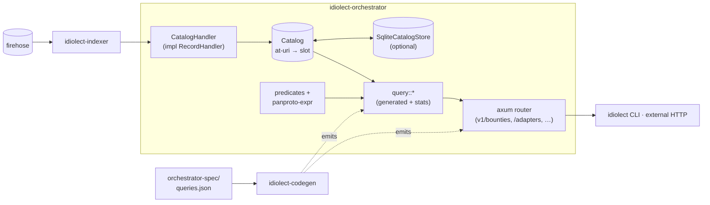

# idiolect-orchestrator

Reference orchestrator for the `dev.idiolect.*` record family.

## Overview

The orchestrator folds the *declarative* records — adapters, bounties,
communities, dialects, recommendations, verifications — off the firehose
into an in-memory catalog and answers queries over it. It never enforces;
a recommendation exists, the orchestrator tells you it exists and whether
its required verifications are in place. Adoption is the caller's
decision.

## Architecture



Three parts:

- **`Catalog`** — one slot per at-uri per record kind. Updates overwrite;
  deletes remove; no ranking. A cross-kind re-upsert evicts the prior
  kind's slot, so one at-uri is always at most one kind.
- **`CatalogHandler`** — implements `idiolect_indexer::RecordHandler`.
  Folds commits into the catalog; ignores encounter-family records
  (those are observer territory).
- **`query::*`** — pure functions over `&Catalog`, re-exported from the
  generated module. Adding a query is a spec edit, not a code edit; see
  [`orchestrator-spec/queries.json`](../../orchestrator-spec/queries.json).

Every list query is generated from the spec, plus hand-written
`catalog_stats` and `sufficient_verifications_for`. List queries
support two predicate forms: a named Rust fn in `crate::predicates`,
or a panproto-expr expression evaluated against each record's JSON
body. The spec picks per-query.

## Usage

```rust
use idiolect_orchestrator::{Catalog, query};
use std::sync::{Arc, Mutex};

let catalog: Arc<Mutex<Catalog>> = Arc::new(Mutex::new(Catalog::new()));
// …populate via the CatalogHandler driven by idiolect-indexer…

let c = catalog.lock().unwrap();
let open = query::open_bounties(&c);
let adapters = query::adapters_for_framework(&c, "hasura");
```

### HTTP query API (`query-http`)

Read-only JSON over HTTP. Every list endpoint accepts
`?limit=<n>&offset=<m>` (default 100, max 1000) and returns
`{ items, total, limit, offset }`. Errors return structured
`{ error, message }` bodies.

| Method | Path |
| ------ | ---- |
| GET | `/healthz` |
| GET | `/readyz` |
| GET | `/metrics` (Prometheus text format) |
| GET | `/v1/stats` |
| GET | `/v1/bounties/open` |
| GET | `/v1/bounties/want-lens?source_uri=&target_uri=` |
| GET | `/v1/bounties/by-requester?requester_did=` |
| GET | `/v1/adapters?framework=` |
| GET | `/v1/adapters/by-invocation-protocol?kind=` |
| GET | `/v1/adapters/with-verification` |
| GET | `/v1/recommendations` |
| GET | `/v1/verifications?lens_uri=` |
| GET | `/v1/verifications/by-kind?kind=&lens_uri=` |
| GET | `/v1/verifications/sufficient?lens_uri=&kinds=&hold=` |
| GET | `/v1/communities?member_did=` |
| GET | `/v1/communities/by-name?name=` |
| GET | `/v1/dialects/for-community?community_uri=` |

The API is strictly read-only: records enter through the firehose, never
through HTTP. Writers author records directly against their PDS (see
[`idiolect-lens`](../idiolect-lens)).

## Feature flags

| Flag | Default | Effect |
| ---- | ------- | ------ |
| `catalog-sqlite` | off | `SqliteCatalogStore` — persists upserts/deletes to a sqlite file; warm on startup via `load_catalog()`. |
| `query-http` | off | `router()` — axum router + `AppState` serving the HTTP API. |
| `daemon` | off | Long-running `idiolect-orchestrator` binary. |

## Daemon binary

```sh
IDIOLECT_TAP_URL=http://localhost:2480 \
IDIOLECT_CATALOG_SQLITE=/var/lib/idiolect/orchestrator/catalog.db \
IDIOLECT_CURSORS=/var/lib/idiolect/orchestrator/cursors.db \
IDIOLECT_HTTP_ADDR=0.0.0.0:8787 \
cargo run -p idiolect-orchestrator --features daemon
```

Graceful shutdown on SIGINT / SIGTERM.

## Design notes

- The catalog is one slot per at-uri across record kinds; a re-upsert
  to a different kind evicts the prior slot. Adoption is a caller
  decision, never the orchestrator's: every query is read-only and
  surfaces what is recorded, not what should win.
- List queries are generated from
  [`orchestrator-spec/queries.json`](../../orchestrator-spec/queries.json)
  with its matching atproto-shaped lexicon. Adding a query is a spec
  edit; codegen emits the Rust fn, the HTTP handler, the CLI
  subcommand, and the xrpc lexicon in one pass.
- Predicate evaluation runs through `crate::predicates` for hand-
  written logic and a panproto-expr engine for spec-driven boolean
  conditions on record bodies. Both forms see the same `Catalog`
  borrow.

## Stability

idiolect is pre-1.0. Releases in the `0.x` series may include
arbitrary breaking changes between minor versions — Rust APIs,
lexicon shapes, wire formats, and CLI surfaces are all in scope.
Pin to an exact version if you depend on this crate, and read
[CHANGELOG.md](../../CHANGELOG.md) before bumping.

## Related

- [`idiolect-indexer`](../idiolect-indexer) — firehose feeding the
  `CatalogHandler`.
- [`idiolect-cli`](../idiolect-cli) — talks to this crate's HTTP API;
  the CLI's subcommand set is generated from the same spec.
