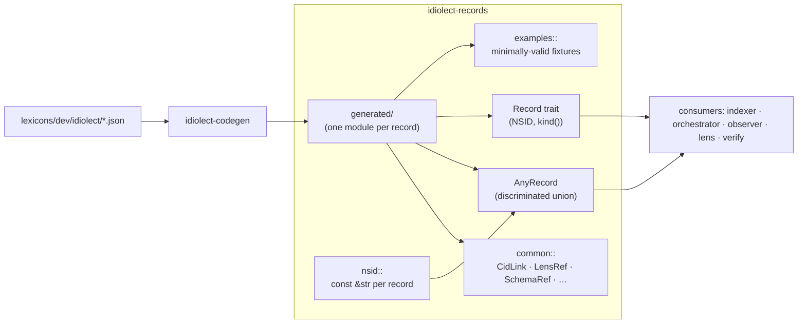

# idiolect-records

Serde record types mirroring the `dev.idiolect.*` lexicon family.

## Overview

Every record lexicon in `lexicons/dev/idiolect/` has a corresponding module
here with a strongly-typed struct deserializable from the lexicon's
canonical JSON shape. Shared types (visibility, schema references, lens
references) live in `common`; NSID constants live in `nsid`. The entire
crate is generated by [`idiolect-codegen`](../idiolect-codegen) and
regenerated in CI — the lexicons are the source of truth, these types
are the derived reflection.

## Architecture



`AnyRecord` is the runtime discriminated union across every shipped record
kind. `decode_record(nsid, value)` dispatches by nsid string into the
matching variant.

## Usage

```rust
use idiolect_records::{AnyRecord, Encounter, decode_record};

// Decode a record body whose nsid is only known at runtime.
let record: AnyRecord = decode_record("dev.idiolect.encounter", payload)?;
match record {
    AnyRecord::Encounter(e) => index_encounter(e),
    AnyRecord::Correction(c) => index_correction(c),
    // …one arm per record kind; the compiler enforces exhaustiveness.
    _ => {}
}

// Or decode directly into a typed struct.
let e: Encounter = serde_json::from_value(payload)?;
```

Every generated record type implements the `Record` trait, which carries
`const NSID: &'static str` and `fn kind()` for generic code:

```rust
use idiolect_records::Record;

fn log_kind<R: Record>() {
    tracing::info!(kind = R::kind(), nsid = R::NSID, "indexed");
}
```

Minimally-valid record fixtures are available via
`idiolect_records::examples`:

```rust
use idiolect_records::examples;

let e = examples::encounter();
let json = examples::ENCOUNTER_JSON;
```

## Design notes

- Records: `#[serde(rename_all = "camelCase")]`.
- Enum variants: `#[serde(rename_all = "kebab-case")]`.
- Datetimes: RFC 3339 `String`s (compared byte-wise for ordering; callers
  parse via `time::OffsetDateTime` when they need arithmetic).
- CID links: `{ "$link": "bafy..." }` wrapper (`common::CidLink`).
- `#[serde(skip_serializing_if = "Option::is_none")]` on every optional
  field.

## Related

- [`idiolect-codegen`](../idiolect-codegen) — emits this crate.
- [`@idiolect-dev/schema`](../../packages/schema) — TypeScript twin,
  generated from the same lexicons.
