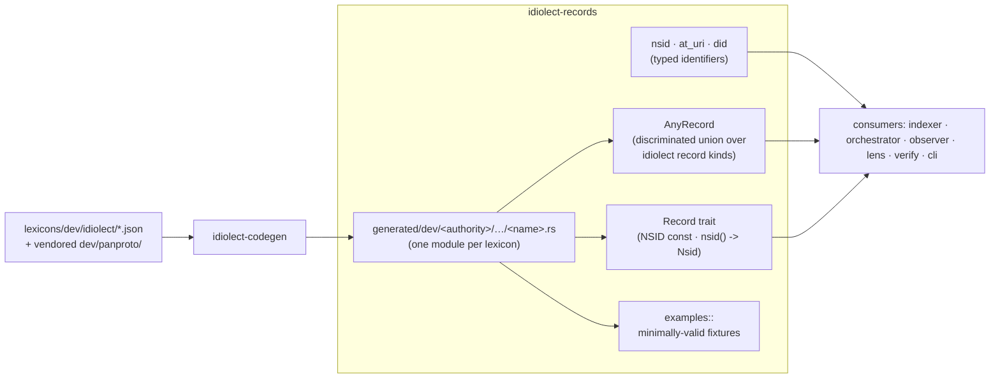

# idiolect-records

Serde record types and typed atproto identifiers for the
`dev.idiolect.*` lexicon family.

## Overview

The crate ships two layers. The first is a typed core for atproto
identifiers (`Nsid`, `AtUri`, `Did`) that enforces the spec at parse
time so malformed values cannot leak into routing, codegen, or
dispatch. The second is the generated record set: every lexicon in
`lexicons/dev/idiolect/` (plus the vendored `dev/panproto/` tree)
produces a strongly-typed struct, deserializable from the lexicon's
canonical JSON shape. The generated tree mirrors the lexicon
directory layout 1:1: `lexicons/dev/idiolect/encounter.json` emits
`generated/dev/idiolect/encounter.rs`. Each lexicon's main record
type is re-exported at the crate root for ergonomic call sites
(`idiolect_records::Encounter`).

## Architecture



`AnyRecord` is the runtime discriminated union across every shipped
idiolect record kind. `decode_record(nsid, value)` takes a typed
`Nsid` and dispatches into the matching variant; the parser refuses
malformed NSIDs at the boundary, so an `AnyRecord` always carries a
spec-valid identifier.

## Usage

```rust
use idiolect_records::{AnyRecord, Encounter, Nsid, Record, decode_record};

// Decode a record body whose nsid is only known at runtime.
let nsid = Nsid::parse("dev.idiolect.encounter")?;
let record: AnyRecord = decode_record(&nsid, payload)?;
match record {
    AnyRecord::Encounter(e) => index_encounter(e),
    AnyRecord::Correction(c) => index_correction(c),
    // …one arm per record kind; the compiler enforces exhaustiveness.
    _ => {}
}

// Or decode directly into a typed struct.
let e: Encounter = serde_json::from_value(payload)?;
```

Every generated record type implements the `Record` trait, which
carries `const NSID: &'static str` plus `fn nsid() -> Nsid` and
`fn kind()` for generic code:

```rust
use idiolect_records::Record;

fn log_kind<R: Record>() {
    tracing::info!(kind = R::kind(), nsid = R::NSID, "indexed");
}
```

Minimally-valid record fixtures are available via
`idiolect_records::examples`:

```rust
use idiolect_records::examples;

let e = examples::encounter();
let json = examples::ENCOUNTER_JSON;
```

Sub-modules (defs, query types, vendored panproto records) are
addressed by their full lexicon path:

```rust
use idiolect_records::generated::dev::idiolect::defs::{LensRef, SchemaRef};
use idiolect_records::generated::dev::panproto::schema::lens::PanprotoLens;
```

## Design notes

- Records: `#[serde(rename_all = "camelCase")]`.
- Enum variants: `#[serde(rename_all = "kebab-case")]`.
- Datetimes: RFC 3339 `String`s (compared byte-wise for ordering;
  callers parse via `time::OffsetDateTime` when they need arithmetic).
- CID links: `{ "$link": "bafy..." }` wrapper (in
  `generated::dev::idiolect::defs`).
- `#[serde(skip_serializing_if = "Option::is_none")]` on every
  optional field.
- `Nsid::parse` enforces the atproto spec (≥3 segments, ASCII only,
  ≤317 bytes total, ≤63 bytes per segment, name segment is
  camelCase). `AtUri::parse` rejects fragments, query strings, and
  trailing or extra path segments — the at-uris idiolect cares about
  always point at a single record.

## Stability

idiolect is pre-1.0. Releases in the `0.x` series may include
arbitrary breaking changes between minor versions — Rust APIs,
lexicon shapes, wire formats, and CLI surfaces are all in scope.
Pin to an exact version if you depend on this crate, and read
[CHANGELOG.md](../../CHANGELOG.md) before bumping.

## Related

- [`idiolect-codegen`](../idiolect-codegen) — emits this crate.
- [`@idiolect-dev/schema`](../../packages/schema) — TypeScript twin,
  generated from the same lexicons.
