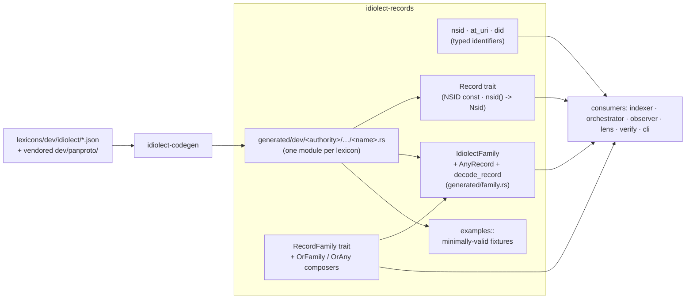

# idiolect-records

Serde record types and typed atproto identifiers for the
`dev.idiolect.*` lexicon family.

## Overview

The crate has an identifier layer and a record-family layer. The identifier
layer parses `Nsid`, `AtUri`, and `Did` values before they reach routing,
codegen, or dispatch. The record-family layer is generated: every lexicon in
`lexicons/dev/idiolect/` (plus the vendored `dev/panproto/` tree)
produces a strongly-typed struct, deserializable from the lexicon's
canonical JSON shape. The generated tree mirrors the lexicon
directory layout one-to-one: `lexicons/dev/idiolect/encounter.json` emits
`generated/dev/idiolect/encounter.rs`. Each lexicon's main record
type is re-exported at the crate root for shorter imports
(`idiolect_records::Encounter`).

## Architecture


```mermaid
flowchart LR
    LEX["lexicons/dev/idiolect/*.json<br/>+ vendored dev/panproto/"]
    CG["idiolect-codegen"]

    subgraph crate["idiolect-records"]
        TYPED["nsid · at_uri · did<br/>(typed identifiers)"]
        GEN["generated/dev/&lt;authority&gt;/…/&lt;name&gt;.rs<br/>(one module per lexicon)"]
        FAM["IdiolectFamily<br/>+ AnyRecord + decode_record<br/>(generated/family.rs)"]
        TRAIT["Record trait<br/>(NSID const · nsid() -> Nsid)"]
        FAMTRAIT["RecordFamily trait<br/>+ OrFamily / OrAny composers"]
        EX["examples::<br/>minimally-valid fixtures"]
    end

    CONS["consumers: indexer · orchestrator · observer · lens · verify · cli"]

    LEX --> CG --> GEN
    GEN --> TRAIT
    GEN --> FAM
    GEN --> EX
    FAMTRAIT --> FAM
    TYPED --> CONS
    FAM --> CONS
    FAMTRAIT --> CONS
    TRAIT --> CONS
```

`RecordFamily` is the boundary used by workspace components that consume
more than one record set. It provides an NSID membership predicate, a
decoder, and a serializer. The
`IdiolectFamily` marker (codegen output) implements it for the
`dev.idiolect.*` set. Two families compose via `OrFamily<F1, F2>`
into a single family that recognizes every NSID either side claims;
its `AnyRecord` is the tagged union `OrAny`. Use
`detect_or_family_overlap` at boot when wiring an `OrFamily` to
catch overlaps that would otherwise give the left family precedence.

`AnyRecord` is the runtime discriminated union across every shipped
idiolect record kind, and `decode_record(nsid, value)` dispatches
into the matching variant. Both are generated from the lexicon set
by `idiolect-codegen`'s family emitter. Adding a record is a
one-file lexicon change. The `RecordFamily` impl on `IdiolectFamily`
delegates `contains`/`decode` to the same generated table, so
consumers can switch between the bare `decode_record` API and the
family-generic `F::decode` API without behavior change.

## Usage

```rust
use idiolect_records::{AnyRecord, Encounter, Nsid, Record, decode_record};

// Decode a record body whose nsid is only known at runtime.
let nsid = Nsid::parse("dev.idiolect.encounter")?;
let record: AnyRecord = decode_record(&nsid, payload)?;
match record {
    AnyRecord::Encounter(e) => index_encounter(e),
    AnyRecord::Correction(c) => index_correction(c),
    // …one arm per record kind; the compiler enforces exhaustiveness.
    _ => {}
}

// Or decode directly into a typed struct.
let e: Encounter = serde_json::from_value(payload)?;
```

The family abstraction exposes the same dispatch to the indexer,
orchestrator, and observer:

```rust
use idiolect_records::{IdiolectFamily, Nsid, RecordFamily};

let nsid = Nsid::parse("dev.idiolect.encounter")?;
match IdiolectFamily::decode(&nsid, payload)? {
    Some(any) => index(any),       // in-family, decoded
    None => {}                     // out-of-family, drop silently
}
```

Compose two families into one when you want to index across record
sets in a single pipeline:

```rust
use idiolect_records::{IdiolectFamily, OrFamily};
// Pretend `LayersFamily` came from a sibling codegen pass.
type Combined = OrFamily<IdiolectFamily, LayersFamily>;
// drive_indexer::<Combined, _, _, _>(...).await?;
```

Every generated record type implements the `Record` trait, which
carries `const NSID: &'static str` plus `fn nsid() -> Nsid` and
`fn kind()` for generic code:

```rust
use idiolect_records::Record;

fn log_kind<R: Record>() {
    tracing::info!(kind = R::kind(), nsid = R::NSID, "indexed");
}
```

Minimally-valid record fixtures are available via
`idiolect_records::examples`:

```rust
use idiolect_records::examples;

let e = examples::encounter();
let json = examples::ENCOUNTER_JSON;
```

Sub-modules (defs, query types, vendored panproto records) are
addressed by their full lexicon path:

```rust
use idiolect_records::generated::dev::idiolect::defs::{LensRef, SchemaRef};
use idiolect_records::generated::dev::panproto::schema::lens::PanprotoLens;
```

## Design notes

- Records use `#[serde(rename_all = "camelCase")]`.
- Enum variants use `#[serde(rename_all = "kebab-case")]`.
- Datetimes are RFC 3339 `String`s (compared byte-wise for ordering;
  callers parse via `time::OffsetDateTime` when they need arithmetic).
- CID links use the `{ "$link": "bafy..." }` wrapper (in
  `generated::dev::idiolect::defs`).
- Every optional field uses
  `#[serde(skip_serializing_if = "Option::is_none")]`.
- `Nsid::parse` enforces the atproto spec (≥3 segments, ASCII only,
  ≤317 bytes total, ≤63 bytes per segment, name segment is
  camelCase). `AtUri::parse` rejects fragments, query strings, and
  trailing or extra path segments because idiolect AT-URIs identify one
  record.

## Stability

idiolect is pre-1.0. Minor releases may change Rust APIs, lexicon shapes,
wire formats, or CLI surfaces. Pin an exact version if you depend on this
crate, and read [CHANGELOG.md](../../CHANGELOG.md) before upgrading.

## Related

- [`idiolect-codegen`](../idiolect-codegen): emits this crate.
- [`@idiolect-dev/schema`](../../packages/schema): TypeScript package
  generated from the same lexicons.
