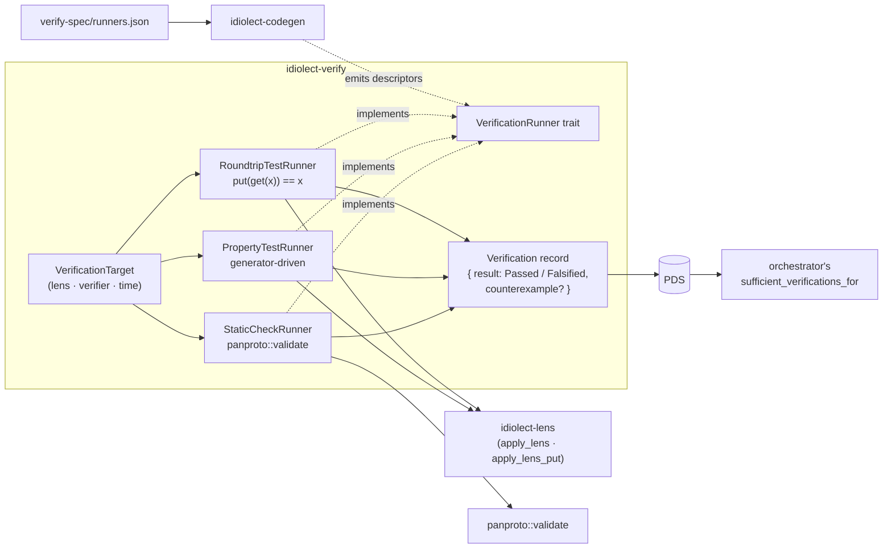

# idiolect-verify

Verification runners for `dev.idiolect.verification` records.

## Overview

A `Verification` record asserts a formal property of a lens — that
`put(get(x)) == x` for a corpus of records, that both schemas validate
against a protocol, that a generator-driven property search found no
falsifier. This crate actually runs those checks and emits the record
the orchestrator's `sufficient_verifications_for` consults.

## Architecture



Four runners ship:

- **`RoundtripTestRunner`** — applies the lens forward then backward on
  a corpus of source records and checks `put(get(src)) == src` for every
  one. A single counterexample falsifies.
- **`PropertyTestRunner`** — same shape, but the corpus is produced by
  a caller-supplied generator closure rather than a static `Vec`.
  Budget-bounded; falsification reports the failing case index.
- **`StaticCheckRunner`** — runs `panproto::validate` on the lens's
  source and target schemas against a configured protocol. Validates
  the graph shape, not the lens body itself.
- **`CoercionLawRunner`** — dispatches the lens to panproto's
  `dev.panproto.translate.verifyCoercionLaws` xrpc and reports any
  returned `coercionLawViolation` entries as a falsified verification.
  Generic over a `CoercionLawClient` so deployments can plug an
  http-backed client while tests stub the xrpc.

All four implement the `VerificationRunner` trait; adding a kind
(`formal-proof`, `conformance-test`, `convergence-preserving`) is a
new runner module following the same shape.

## Usage

```rust
use idiolect_verify::{RoundtripTestRunner, VerificationRunner, VerificationTarget};
use idiolect_records::generated::dev::idiolect::defs::LensRef;

let runner = RoundtripTestRunner::new(
    resolver,
    schema_loader,
    protocol,
    vec![serde_json::json!({ "text": "corpus record 1" })],
);

let target = VerificationTarget {
    lens: LensRef {
        uri: Some("at://did:plc:x/dev.panproto.schema.lens/l".into()),
        cid: None,
        direction: None,
    },
    verifier: "did:plc:me".into(),
    occurred_at: "2026-04-21T00:00:00Z".into(),
    tool_override: None,
};

let verification = runner.run(&target).await?;
// Publish via idiolect_lens::RecordPublisher::create.
```

## Design notes

- A falsified property returns `Ok(Verification { result: Falsified,
  counterexample: Some(…), .. })`, not an error. Falsification is the
  signal the community is paying the runner to produce; `VerifyError`
  is reserved for input-shape or transport failures.
- `VerificationRunner` forwards through `Arc<T>` for shared deployment
  use, matching the Arc-blanket pattern every other idiolect boundary
  trait uses.
- The runner taxonomy lives in
  [`verify-spec/runners.json`](../../verify-spec/runners.json) with its
  matching atproto-shaped lexicon; codegen emits `generated.rs` carrying
  descriptors for every shipped runner.

## Related

- [`idiolect-lens`](../idiolect-lens) — round-trip runners drive
  `apply_lens` + `apply_lens_put`.
- [`idiolect-orchestrator`](../idiolect-orchestrator) —
  `sufficient_verifications_for` consumes the records this crate emits.
