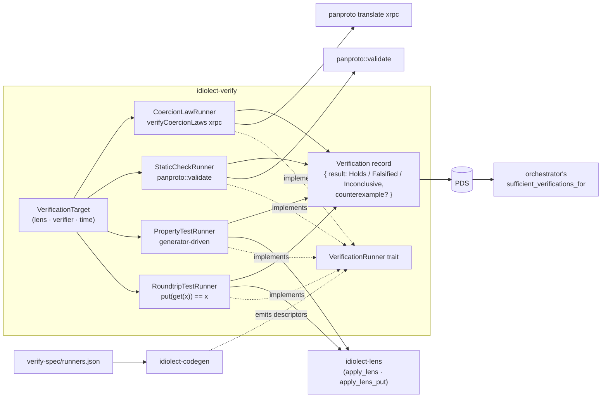

# idiolect-verify

Tests claims about a schema translation and expresses the result as a
publishable verification record.

## What it does

A `Verification` record reports a claim about a lens: a corpus may satisfy a
round-trip law, both schemas may validate against a protocol, or a bounded
property search may find no counterexample. The runners in this crate perform
the check rather than merely recording that somebody requested it. Their
output is the evidence consulted by the
orchestrator's `sufficient_verifications_for` query.

| Input | Work performed | Output |
| --- | --- | --- |
| Lens target plus fixed corpus | Applies the lens forward and backward to every case | Holds, falsified, or inconclusive verification |
| Lens target plus generator and budget | Searches generated cases for a counterexample | Bounded property-test result with failing case when found |
| Source schema, target schema, and protocol | Validates both schema graphs | Static-check verification |
| Lens plus coercion-law service | Requests Panproto's law checker | Verification containing reported violations |

Use this crate when a recommendation, release, or application policy requires
evidence about a translation. A falsified claim is a successful test result
with negative evidence, not a runner error.

## Architecture


```mermaid
flowchart LR
    SPEC["verify-spec/runners.json"]
    CG["idiolect-codegen"]

    subgraph verify["idiolect-verify"]
        TRAIT["VerificationRunner trait"]
        R1["RoundtripTestRunner<br/>put(get(x)) == x"]
        R2["PropertyTestRunner<br/>generator-driven"]
        R3["StaticCheckRunner<br/>panproto::validate"]
        R4["CoercionLawRunner<br/>verifyCoercionLaws xrpc"]
        TGT["VerificationTarget<br/>(lens · verifier · time)"]
        OUT["Verification record<br/>{ result: Holds / Falsified / Inconclusive,<br/>counterexample? }"]
    end

    LENS["idiolect-lens<br/>(apply_lens · apply_lens_put)"]
    PROTO["panproto::validate"]
    PPT["panproto translate xrpc"]
    ORC["orchestrator's<br/>sufficient_verifications_for"]
    PDS[("PDS")]

    SPEC --> CG
    CG -.emits descriptors.-> TRAIT
    R1 -.implements.-> TRAIT
    R2 -.implements.-> TRAIT
    R3 -.implements.-> TRAIT
    R4 -.implements.-> TRAIT
    TGT --> R1
    TGT --> R2
    TGT --> R3
    TGT --> R4
    R1 --> LENS
    R2 --> LENS
    R3 --> PROTO
    R4 --> PPT
    R1 --> OUT
    R2 --> OUT
    R3 --> OUT
    R4 --> OUT
    OUT --> PDS
    PDS --> ORC
```

Four runners evaluate the shipped verification kinds:

- **`RoundtripTestRunner`:** applies the lens forward then backward on
  a corpus of source records and checks `put(get(src)) == src` for every
  one. A single counterexample falsifies.
- **`PropertyTestRunner`:** follows the same procedure, but a
  caller-supplied generator closure produces the corpus rather than a static
  `Vec`. The budget bounds the search, and a falsification reports the failing
  case index.
- **`StaticCheckRunner`:** runs `panproto::validate` on the lens's
  source and target schemas against a configured protocol. Validates
  the graph shape, not the lens body itself.
- **`CoercionLawRunner`:** dispatches the lens to panproto's
  `dev.panproto.translate.verifyCoercionLaws` xrpc and reports any
  returned `coercionLawViolation` entries as a falsified verification.
  Generic over a `CoercionLawClient` so deployments can plug an
  http-backed client while tests stub the xrpc.

All four implement `VerificationRunner`. A new verification kind requires a
runner module and a descriptor in the runner spec.

## Usage

```rust
use idiolect_verify::{RoundtripTestRunner, VerificationRunner, VerificationTarget};
use idiolect_records::generated::dev::idiolect::defs::LensRef;

let runner = RoundtripTestRunner::new(
    resolver,
    schema_loader,
    protocol,
    vec![serde_json::json!({ "text": "corpus record 1" })],
);

let target = VerificationTarget {
    lens: LensRef {
        uri: Some("at://did:plc:x/dev.panproto.schema.lens/l".into()),
        cid: None,
        direction: None,
    },
    verifier: "did:plc:me".into(),
    occurred_at: "2026-04-21T00:00:00Z".into(),
    tool_override: None,
};

let verification = runner.run(&target).await?;
// Publish via idiolect_lens::RecordPublisher::create.
```

## Boundaries and design choices

- A falsified property returns `Ok(Verification { result: Falsified,
  counterexample: Some(…), .. })`, not an error. A falsified result is
  a finding the runner is meant to report. `VerifyError` is reserved
  for input-shape or transport failures.
- `VerificationRunner` forwards through `Arc<T>` for shared deployment
  use, matching the Arc-blanket pattern every other idiolect boundary
  trait uses.
- The runner taxonomy lives in
  [`verify-spec/runners.json`](../../verify-spec/runners.json) with its
  matching atproto-shaped lexicon. Codegen emits `generated.rs` carrying
  descriptors for every shipped runner.

## Related

- [`idiolect-lens`](../idiolect-lens): round-trip runners drive
  `apply_lens` + `apply_lens_put`.
- [`idiolect-orchestrator`](../idiolect-orchestrator):
  `sufficient_verifications_for` consumes the records this crate emits.
