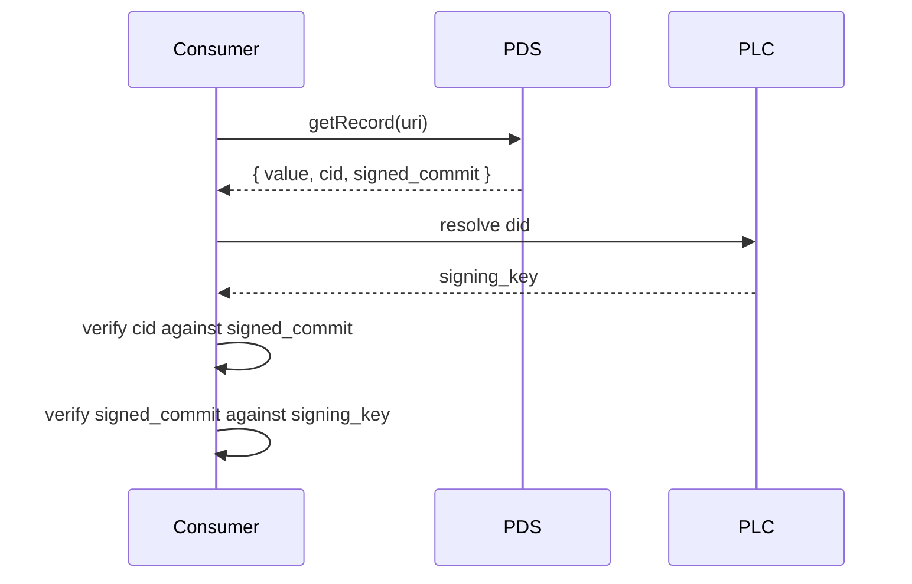

# Records as content-addressed signed data

Every artifact in idiolect is an ATProto record. A record is:

- a JSON object,
- with a `$type` field naming a lexicon,
- stored at a `(did, collection, rkey)` triple,
- content-addressed by its CID,
- signed by the publishing repo's signing key.

The substrate is documented in the
[ATProto spec](https://atproto.com/specs/repository).
This chapter covers the properties idiolect relies on.

## Properties idiolect relies on

### 1. Records are signed

Every commit is signed by the repo's signing key. A consumer
fetching a record can verify the signature against the repo head
and the head against the canonical PLC directory entry. idiolect's
trust model is rooted in those signatures: a verification record
is only as trustworthy as its signer.

The runtime does not re-validate signatures on every read. The
shipped path is:

The verification step is what `idiolect-identity` plus the
`VerifyingResolver` in `idiolect-lens` give you. Cache the
resolved signing key, re-fetch only on cache miss, and treat a
mismatch as a hard error.

### 2. Records are content-addressed

A record's CID is derived from its canonical bytes. Two records
with the same content have the same CID. The CID is what the lens
record's `object_hash` field carries, and what the
`VerifyingResolver` checks before instantiating a lens. A
malicious upstream cannot serve a different lens under the same
at-uri without changing the CID, and the CID change is observable.

### 3. Records compose by reference

A record can reference another record by at-uri or by `strongRef`
(at-uri + CID). A `strongRef` is content-addressed, so the
reference points at exactly one byte sequence. An at-uri is a
mutable pointer.

idiolect uses `strongRef` for evidence (`belief.evidence`,
`correction.encounter`, `verification.lens`) and at-uri for
queries that should follow updates (`recommendation.lensPath`,
`dialect.entries[].vocab`). The choice in each lexicon is
deliberate; see the per-lexicon reference for the rationale.

### 4. Records survive PDS migration

ATProto's identity layer (PLC plus did:web) lets a repo move
between PDSes without changing its `did`. A record fetched by
at-uri after a PDS migration goes through one extra DID-resolve
hop and arrives at the new PDS. idiolect's runtime path goes
through `idiolect-identity` for every fetch; PDS migration is
transparent.

## Properties idiolect adds on top

### 5. Lexicon validation at the boundary

Every shipped record kind validates against its lexicon at parse
time. A field that violates a `format`, `maxLength`, or
`required` constraint fails to deserialize before any business
logic runs. The boundary is exactly where you want it.

### 6. Family-typed dispatch

The codegen-emitted family modules (`idiolect_records::IdiolectFamily`)
let consumers be generic over the family. A firehose handler that
takes a `RecordHandler<F: RecordFamily>` filters out-of-family
commits before decode. The crate-level reference covers
`OrFamily<F1, F2>` for composing families.

### 7. Open enums

Every enum-shaped field is an open enum: known values are typed
constants, unknown values fall through to `Other(String)`, and the
sibling `*Vocab` field points at a `dev.idiolect.vocab` record
where unknown values resolve. This is what lets two communities
extend the same field without a centralized governance step. See
[Open enums and vocabularies](./open-enums.md).

### 8. Internal records do not federate

Runtime state that should not federate (firehose cursors, OAuth
tokens) uses the same panproto schema apparatus, but under a
sibling `dev.idiolect.internal.*` namespace. Conformant firehose
consumers skip the prefix; the data still travels through the
same runtime as a public record, just out of band.

## What ATProto does not give you

- **A schema language.** ATProto Lexicon is a constrained type
  language; it does not cover lens algebra, schema diffs, or
  optic classification. Those live in panproto, which idiolect
  embeds.
- **A migration story.** Lexicon revision is wire-compatible by
  policy, not by tooling. The lexicon-evolution policy fills the
  gap; see [Lexicon evolution policy](./lexicon-evolution.md).
- **A vocabulary registry.** Open-enum slugs need a published
  knowledge graph to resolve; ATProto does not ship one. The
  `dev.idiolect.vocab` record is where the resolution lives.
