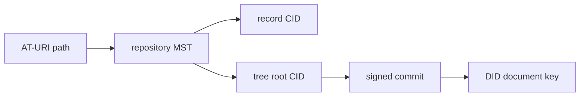

# Records in signed, content-addressed repositories

ATProto separates three coordinates that are easy to conflate: a record's
mutable address, the CID of its current content, and the signed commit that
authenticates a repository state. idiolect relies on all three, but its current
runtime does not verify all three on every read.

## Address, content, and proof

A [record](../glossary.md#record "A typed data object stored at a repository path")
lives at a repository path `(collection, rkey)` owned by an account DID. An
[AT-URI](../glossary.md#at-uri "A mutable address for an ATProto record") combines
those coordinates:

```text
at://did:plc:example/dev.panproto.schema.lens/3kexample
```

The AT-URI is stable across updates to that path. A
[CID](../glossary.md#cid "A content identifier derived from encoded bytes") names
one encoded record value. Updating the record preserves the AT-URI and changes
the CID when its content changes.

The repository's Merkle Search Tree maps the path to that record CID. Its root
appears in a signed repository commit. Consequently, provenance verification is
a chain:


```mermaid
flowchart LR
    URI[AT-URI path] --> MST[repository MST]
    MST --> CID[record CID]
    MST --> ROOT[tree root CID]
    ROOT --> COMMIT[signed commit]
    COMMIT --> DID[DID document key]
```

The official [repository specification](https://atproto.com/specs/repository)
defines this proof structure. Saying that a record is "signed" is convenient
shorthand, but the signature is on the commit, not embedded in each record.

## Mutable and strong references

An AT-URI alone follows the current value at a path. A
[strong reference](../glossary.md#strong-reference "An AT-URI paired with a CID to pin one record revision")
pairs that URI with a CID. idiolect uses strong-reference-shaped definitions
where later mutation would change the subject of a claim, including beliefs,
deliberation statements, votes, and outcomes. Other fields intentionally use an
AT-URI or a custom reference with an optional CID when following updates may be
intended.

This choice is semantic. A vote should continue to name the statement revision
on which it was cast; a dialect's `previousVersion` link, by contrast, names a
record path in a version chain.

## What the current runtime verifies

The read path has two distinct verification layers:

1. `PdsResolver` and the PDS clients fetch record values. They do not currently
   validate an ATProto repository proof chain or commit signature.
2. `VerifyingResolver<R, H>` canonicalizes a resolved lens record's `blob`,
   hashes those JSON bytes, and compares the result with that same record's
   `objectHash`. The bundled `Sha256Hasher` accepts the `sha256:` prefix.

The second check detects disagreement between a lens blob and its declared
application-level hash. It is not a substitute for repository signature
verification: an untrusted response could alter both fields unless the caller
also authenticates the record through ATProto's repository machinery.

The `idiolect-identity` crate resolves a DID document and its PDS service URL.
It does not connect a fetched record CID to a signed repository commit. We call
this missing connection the **proof-boundary gap (PBG)**. Deployments that need
cryptographic provenance must close the PBG outside the currently shipped
resolver stack.

## What idiolect adds above storage

ATProto supplies record addressing, repository content addressing, signed
commits, account migration through DID service resolution, and the Lexicon
schema language. idiolect adds typed Rust and TypeScript bindings, record-family
dispatch, vocabulary graph queries, lens resolution, verification records, and
community policy records.

These layers make different claims. A Lexicon describes an intended wire shape;
a generated decoder decides whether it can construct a typed value; a lens
relates two schema graphs; and a verification reports the result of a particular
check. Keeping those claims separate prevents provenance, validation, and
semantic correctness from collapsing into one ambiguous notion of "valid."

## Records outside the public family

Not every runtime datum is a `dev.idiolect.*` record. Cursor stores, OAuth
sessions, in-memory catalogs, and cached vocabulary graphs are local state.
Some reuse generated schema machinery, but they do not become federated merely
because they serialize. The public record family begins where a publisher
commits a Lexicon-shaped record to an ATProto repository.
