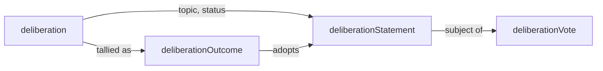

# Deliberation

The deliberation lexicons (`deliberation`,
`deliberationStatement`, `deliberationVote`,
`deliberationOutcome`) name a process. The `belief` /
`recommendation` lexicons name results. They are deliberately
distinct.

## What each lexicon is for

- **`dev.idiolect.deliberation`** declares a community-scoped
  topic. Carries the owning community, an open-enum
  `classification` (question / proposal / grievance / ...), an
  open-enum `status` (open / closed / tabled / adopted / ...), and
  an optional pointer to the resulting outcome.
- **`dev.idiolect.deliberationStatement`** is one statement made
  inside a deliberation. Carries the deliberation it belongs to,
  the text, an open-enum `classification` (claim / proposal /
  dissent / clarification / ...), and an `anonymous` flag with an
  optional `authoredOn` service-DID surrogate.
- **`dev.idiolect.deliberationVote`** is a vote on a statement.
  Carries the statement (as a `strongRef`), an open-enum `stance`
  (defaults to `agree` / `pass` / `disagree`), an optional
  `weight` integer, and an optional `rationale`.
- **`dev.idiolect.deliberationOutcome`** is an observer-published
  tally. Carries the deliberation, per-stance counts per
  statement, the `computedAt` timestamp, and an optional list of
  adopted statements.

## Why this is separate from belief and recommendation

A `dev.idiolect.belief` is a community's standing claim about a
lens or schema. A `dev.idiolect.recommendation` is an opinionated
path with conditions. Both are settled artifacts: they record what
a community thinks, not how a community arrived there.

Deliberation is the process. The four lexicons together let
consumers see what the community considered, who voted, what the
tally was, and which statements were adopted, before reading the
resulting belief or recommendation. A consumer that only ever
sees the belief is in the same position as a consumer of any
asserted truth; a consumer that wants context can follow the
deliberation.

## Maps to Acorn's assembly records

Bluesky's Acorn project publishes the same shape under
`community.blacksky.assembly.{conversation, statement, vote}`.
The four idiolect lexicons are shaped so a future bridge to
Acorn's records can be lossless. Stance, classification, and
status are open-enum slugs resolved through community-published
vocabularies; Acorn's `-1 | 0 | 1` stances become vocab nodes.

The bridge crate is downstream work and is not shipped. The
lexicons are; they were designed against the assembly records as
a forcing function.

## How the tally is produced

A `deliberationOutcome` is observer-published, not voter-published.
The fold (in `idiolect-observer`) walks every `deliberationVote`
that points at a statement in the deliberation, tallies stances
per statement, and emits one outcome record per (deliberation,
window) tuple.

Multiple observers can publish concurrent outcomes for the same
deliberation; consumers can require quorum across observers
before adopting an outcome. This is the same shape as the
`observation` fold over encounters.

## Open-enum extension

The shipped vocabularies seed canonical defaults:

- `deliberation-classifications` (question, proposal, grievance,
  process, position, ...).
- `statement-classifications` (claim, proposal, dissent,
  clarification, question, ...).
- `deliberation-statuses` (open, closed, tabled, adopted,
  rejected, ...).
- `vote-stances` (agree, pass, disagree, with `polar_opposite_of`
  edges).

A community publishing its own vocab over any of these slugs can
extend the value set without modifying the lexicons. Records
referencing the community's vocab through the corresponding
`*Vocab` field resolve through the extended slug set.

## What this is not

The deliberation lexicons do not implement Polis-style clustering,
quadratic voting, or any specific decision procedure. They name
the artifacts of a deliberation; the procedure that produces the
artifacts (and the procedure that adopts an outcome) is the
community's choice.

A community that wants quadratic voting publishes a
`vote-weights` vocabulary and uses the optional `weight` field on
`deliberationVote` to carry its scheme. A community that wants
delegation publishes a `delegations` mapping (out-of-band or in
its own lexicon) and lets observers fold votes along the
delegation chain. The substrate carries the votes; the procedure
carries the meaning.
