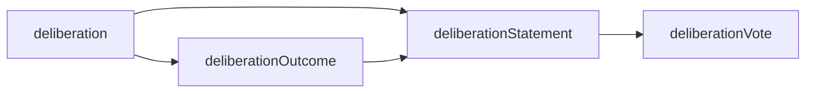

# Deliberation

The deliberation records preserve an unsettled community process. Beliefs and
recommendations preserve attributed positions after or outside that process.
We call this separation the **process/position split (PPS)**.

## Four linked records

```mermaid
flowchart LR
    DEL[deliberation] --> DST[deliberationStatement]
    DST --> DVO[deliberationVote]
    DEL --> DOU[deliberationOutcome]
    DOU --> DST
```

`dev.idiolect.deliberation` names an owning community and topic. It may also
carry a description, authentication requirement, classification, status,
closure time, and outcome AT-URI. The known classifications are `question`,
`proposal`, `grievance`, and `retrospective`; the known statuses include `open`,
`closed`, `tabled`, `adopted`, and `rejected`. Both fields remain open strings.

`dev.idiolect.deliberationStatement` strongly references the deliberation and
stores one statement. Its optional classification distinguishes claims,
proposals, dissent, clarification, questions, and community extensions. The
optional `anonymous` flag describes presentation policy; it does not remove the
repository DID from ATProto provenance.

`dev.idiolect.deliberationVote` strongly references one statement revision. Its
stance defaults to the known vocabulary of `agree`, `pass`, and `disagree`, with
an optional `stanceVocab`, integer weight, and rationale. The Lexicon constrains
weight to the range 0 through 1000 but does not define how a community must
interpret that number.

`dev.idiolect.deliberationOutcome` strongly references the deliberation and
contains per-statement stance counts, an optional list of adopted statements, a
computation time, and optional tool metadata. Multiple observers may publish
different outcomes for the same deliberation.

## What PPS permits

A `dev.idiolect.belief` says that a holder stands behind a claim about a record.
A `dev.idiolect.recommendation` advises a conditioned lens path. Neither record
contains the statements considered, the votes cast, or the aggregation method.

The PPS permits a consumer to choose its evidential depth. A lightweight client
may display a recommendation alone. A client auditing the decision can follow
the community, deliberation, statement, vote, and outcome references. These
records supply provenance coordinates; they do not guarantee a fair process or
a correct conclusion.

## Tallying in the current observer

`DeliberationTallyMethod` implements one aggregation. It counts votes by strong
statement reference and stance slug, and it sums optional weights. When
configured with a `VocabRegistry` and canonical stance vocabulary, it translates
stances through `equivalent_to` before counting; a slug with no translation
remains in its original bucket.

The method's snapshot resembles
`dev.idiolect.deliberationOutcome.statementTallies`, but the standard observer
publisher wraps that snapshot in `dev.idiolect.observation`. The current method
does not publish a typed `deliberationOutcome`, select adopted statements, or
update the deliberation's `outcome` field. An application that wants those
records must add the policy and publication step.

## Procedure remains external

The four Lexicons do not implement voter eligibility, quorum, vote delegation,
ranked choice, quadratic weighting, or clustering. A community may describe
some of these choices in its community conventions or a vocabulary, but the
runtime does not infer a decision rule from the presence of `weight`.

A potential worry is that an open stance vocabulary makes two tallies
incomparable. Vocabulary translation can reduce that problem when communities
publish accepted equivalences. It cannot determine that an asserted
equivalence preserves the communities' intended meanings, and untranslated
stances remain a live possibility. The observer's method descriptor and output
must thus accompany any comparison.
