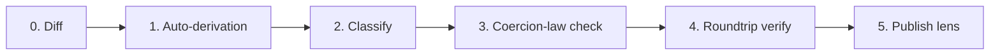

# Lexicon evolution policy

Every lexicon revision in idiolect ships with an auto-derived,
classified, verified, published lens. Hand-authored lenses are an
escape hatch that requires governance sign-off. The same policy
applies to vendored externals (Blacksky, layers-pub, ...).

The policy is the lexicon-level half of the project's stability
story; the schema-level half is the
[stability and versioning](../reference/stability.md) note. The
policy below is enforced by `scripts/lexicon-evolve.sh` and the
release CI workflow.

## The six stages



Each stage maps onto a panproto primitive; nothing is bespoke.

### Stage 0 — Diff

```bash
schema diff --src lexicons/<nsid>.<old>.json --tgt lexicons/<nsid>.<new>.json
```

Produces a structured change graph: vertex / edge additions,
removals, renames, kind coercions, constraint tightenings. Cached
under `migrations/<nsid>/<old>-<new>/diff.json`.

### Stage 1 — Auto-derivation

```bash
schema lens generate <old>.json <new>.json --hints <hints>.json
```

Produces a *protolens chain*: a sequence of dependent optics, each
parameterized by a precondition over schemas. The elementary
constructors are listed in
[Lens semantics](./lens-laws.md). Hints declare anchors for
ambiguous renames; forward-chaining propagates declared anchors
into derived ones before the CSP solver runs.

### Stage 2 — Classify

```bash
schema lens inspect chain.json --protocol atproto
```

Each chain receives one of five optic classes. The class drives
the gate:

| Class | Gate behavior |
| --- | --- |
| **Iso** | Auto-merge. No governance review. |
| **Injection** | Auto-merge as forward-only. |
| **Projection** | PR review required. Complement persistence required. |
| **Affine** | PR review plus a `dev.idiolect.recommendation` from a recognised reviewer. |
| **General** | Manual lens authoring. Coercion-law check, verification gate, and recommendation all required. |

The class also feeds `dev.idiolect.dialect#deprecations`: any
non-Iso lens revision implicitly deprecates the previous schema
and must populate `deprecations` with the lens at-uri as
`replacement`.

### Stage 3 — Coercion-law check

For any `CoerceType` step crossing primitive kinds:

```bash
schema theory check-coercion-laws theory.ncl --json
```

Sample-based; exit code is non-zero on any falsifying sample. The
chain declares each `CoerceType` with an honest `CoercionClass`.
Dishonest declarations corrupt the asymmetric-lens put law
silently; this gate catches them.

### Stage 4 — Roundtrip verification

```bash
schema lens verify <corpus>/ --protocol atproto --schema <new>.json --chain chain.json
```

Checks GetPut and PutGet over the corpus. The corpus is the live
indexer's catalog snapshot at the time of revision: actual
records published across the network for that NSID. CI fails on
any record that violates either law. Verification is grounded in
real data, not synthetic test cases.

### Stage 5 — Publish

```bash
schema lens inspect chain.json --json | idiolect-cli publish-lens \
  --collection dev.panproto.schema.lens
```

The verified chain serializes to Nickel via `panproto-lens-dsl`
and ships as a `dev.panproto.schema.lens` record from idiolect's
DID. The lens at-uri is added to:

- The new lexicon revision's
  `dev.idiolect.dialect#preferredLenses`.
- The previous lexicon's `deprecations` block as `replacement`.

Codegen re-runs on revision bump; downstream consumers pulling
the dialect record see the lens automatically.

## Vocab edits go through the same pipeline

Vocab edits are *record* edits, not *schema* edits, but the same
six stages apply via dependent optics:

| Edit | Class | Action |
| --- | --- | --- |
| Add node, add edge | (no migration needed) | Open enums tolerate. Stage 4 corpus regression only. |
| Remove node | Projection | Full pipeline. |
| Rename node | Iso | `RenameEdgeName` over consumers. Auto-merge. |
| Add `equivalent_to` between vocabs | (free) | Triggers a derived lens automatically lifted into the orchestrator's `mapEnum` cache. |

## Why this is modular

- **Modular.** Each elementary protolens is a stand-alone, well-typed combinator. The pipeline composes them; no bespoke migration code per revision.
- **Abstract.** Protolenses are quantified over schemas, not specific to a revision pair. `RenameField("oldName", "newName")` is a schema-parametric morphism; it applies to the lexicon and to every record across the network without per-record code.
- **Composable.** Chain auto-simplification, ScopedTransform sub-chains, Nickel record merge for fragments, symmetric lenses for forward / backward pairing, lift across protocols via theory morphisms.
- **Verifiable.** Optic classification is mechanical. Coercion-law checks are sample-based. Corpus regression uses real records. Trust comes from the substrate, not from review prose.
- **Decentralized.** Communities author their own protolens chains for their own lexicons. The policy applies to anyone adopting idiolect's framework.

## Vendored externals

Vendored lexicons (Blacksky, layers-pub, ...) are consumed as
schemas idiolect does not own. When they revise, the same six
stages run against their old / new pair. The output is a
*symmetric* lens (per panproto's `symmetricLens`): syncing A → B
and B → A keeps both sides consistent up to complement. This is
the right shape for a bridge crate (e.g. the planned
`idiolect-acorn`): when the upstream changes, the bridge auto-
updates and downstream idiolect records remain syncable.

## Tooling

- `scripts/lexicon-evolve.sh <nsid> <old> <new>` runs stages 0–5
  in sequence.
- `.github/workflows/lexicon-evolution.yml` runs stages 3–4 on
  PR; stage 5 on tagged release.
- A pre-commit hook runs stages 0–2 locally on every lexicon
  edit.
- `migrations/<nsid>/<old>-<new>/{diff.json, chain.ncl, hints.json,
  classification.json, verification.json}` is the per-revision
  audit trail.

The policy is what makes lexicon evolution reviewable. The tooling
is what makes the policy cheap to follow.
