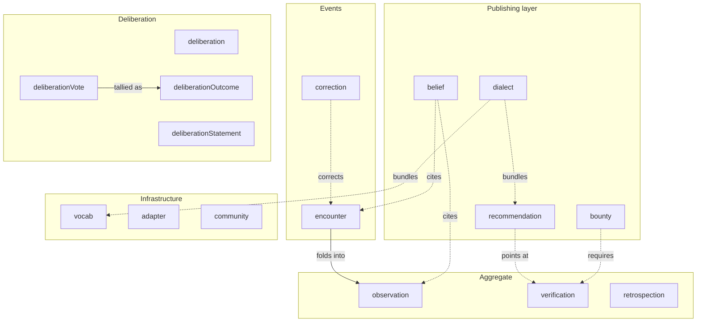

# The dev.idiolect.* lexicon family

idiolect ships sixteen record-kind lexicons plus one shared-defs
lexicon (`dev.idiolect.defs`) under the `dev.idiolect.*`
namespace. The record kinds are organized by what they describe.

The arrows are by-reference relationships; the records themselves
are independent.

## Lexicon-by-lexicon

| Lexicon | What it names |
| --- | --- |
| `dev.idiolect.encounter` | One invocation of a lens. Carries the lens, the source schema, the action / material / purpose / actor (`use`), and the outcome. |
| `dev.idiolect.observation` | Aggregate over encounters folded by an observer. Per-outcome counts plus optional weighted aggregates over a window. |
| `dev.idiolect.correction` | A claim that a specific encounter's outcome was wrong, plus the corrected output. |
| `dev.idiolect.belief` | A community's standing claim about a lens or schema, citing encounters / observations as evidence. |
| `dev.idiolect.recommendation` | A community-published opinionated path: lens chain plus structured applicability conditions, preconditions, caveats, and required verifications. |
| `dev.idiolect.bounty` | A request for someone to do verification work, with structured `wantVerification` and `constraintConformance` fields. |
| `dev.idiolect.verification` | The outcome of a verification runner: which lens, which kind, pass/fail, structured report. |
| `dev.idiolect.retrospection` | A post-hoc review of a sequence of encounters / observations, with a structured `finding`. |
| `dev.idiolect.dialect` | A community-curated bundle: NSIDs, preferred lenses, endorsed vocabularies, deprecations. |
| `dev.idiolect.community` | The community itself: members (with optional roles), record-hosting policy, optional AppView endpoint. |
| `dev.idiolect.vocab` | A typed multi-relation knowledge graph used to resolve open-enum slugs. |
| `dev.idiolect.adapter` | A description of an external surface (subprocess, http, wasm, ...) that consumes idiolect records, with isolation policy. |
| `dev.idiolect.deliberation` | A community-scoped deliberation: topic, classification, status, optional outcome pointer. |
| `dev.idiolect.deliberationStatement` | One statement made inside a deliberation. |
| `dev.idiolect.deliberationVote` | One vote on a statement, with an open-enum stance plus optional weight + rationale. |
| `dev.idiolect.deliberationOutcome` | An observer-published tally: per-statement per-stance counts plus optional adopted-statements. |

The full per-lexicon reference is under
[Lexicons](../reference/lexicons/index.md).

## Why this set

The family was assembled to cover four concerns:

1. **What happened?** The encounter / correction / observation
   triple. One record per invocation, with corrections and folds
   on top.
2. **What should happen?** The recommendation / belief / dialect /
   verification quad. Communities express opinions; opinions cite
   evidence; consumers route translations through them.
3. **What does this mean?** The vocab + open-enum convention.
   Slugs are open-enum strings resolved through community-published
   knowledge graphs.
4. **What did we decide?** The deliberation quad (deliberation,
   statement, vote, outcome). A process-shaped counterpart to the
   settled-belief shape.

A new record kind that fits into one of those four columns is a
candidate for the family. A record kind that does not fit is
likely a downstream extension; the [Bundle records into a
dialect](../guide/dialect.md) guide covers how to ship one.

## Composition with downstream lexicons

idiolect's shape is meant to be the substrate, not the ceiling. A
downstream community publishes its own NSID family and uses
`OrFamily<IdiolectFamily, MyFamily>` at the indexer boundary so its
records flow alongside idiolect's. Lenses bridge the two. A
dialect record from the downstream community lists both
families' canonical NSIDs.

The shipped example of this pattern is the planned `idiolect-acorn`
bridge; the design is in `notes/`.
