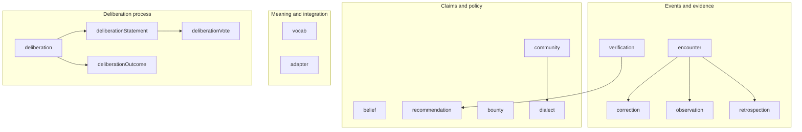

# The `dev.idiolect.*` lexicon family

The repository ships sixteen record Lexicons and one shared-definitions
Lexicon, `dev.idiolect.defs`. Together they separate event traces, aggregate
claims, community policy, deliberation, and runtime integration.

```mermaid
flowchart TB
    subgraph evidence["Events and evidence"]
        ENC[encounter]
        COR[correction]
        OBS[observation]
        VER[verification]
        RET[retrospection]
    end
    subgraph policy["Claims and policy"]
        BEL[belief]
        REC[recommendation]
        BOU[bounty]
        DIA[dialect]
        COM[community]
    end
    subgraph meaning["Meaning and integration"]
        VOC[vocab]
        ADA[adapter]
    end
    subgraph process["Deliberation process"]
        DEL[deliberation]
        DST[deliberationStatement]
        DVO[deliberationVote]
        DOU[deliberationOutcome]
    end

    ENC --> COR
    ENC --> OBS
    ENC --> RET
    VER --> REC
    COM --> DIA
    DEL --> DST
    DST --> DVO
    DEL --> DOU
```

The arrows show common reference or fold relationships. They do not imply that
publishing one record automatically creates another.

## Events and evidence

- `dev.idiolect.encounter` records one lens invocation, including the lens,
  source schema, structured use, encounter kind, and visibility.
- `dev.idiolect.correction` attaches a path, reason, and corrected value to an
  encounter reference.
- `dev.idiolect.observation` carries an observer DID, method descriptor, scope,
  version, and free-form aggregate output.
- `dev.idiolect.verification` records a runner's `holds`, `falsified`, or
  `inconclusive` judgment about a structured lens property.
- `dev.idiolect.retrospection` reports a delayed finding about one encounter,
  including detecting party, detection time, and optional confidence.

These records form the **evidence chain (EC)**: an invocation may be corrected
or reviewed later, while an observer can publish a method-specific aggregate
over the stream it processed. The EC is plural because different parties may
publish incompatible assessments.

## Claims and community policy

- `dev.idiolect.belief` is a holder-attributed claim about a strongly referenced
  record. Its subject is required; holder, basis, annotations, and visibility
  are optional.
- `dev.idiolect.recommendation` publishes a conditioned lens path from an
  issuing community, with optional preconditions, verification requirements,
  caveats, and supersession.
- `dev.idiolect.bounty` requests a lens, adapter, or verification under stated
  constraints and eligibility rules.
- `dev.idiolect.dialect` bundles the schema references in a community's
  idiolect set, along with preferred lenses, deprecations, and version links.
- `dev.idiolect.community` describes membership, hosting policy, core schemas
  and lenses, endorsements, and conventions.

The distinction between belief and recommendation is intentional. Belief is an
attributed claim about a subject; recommendation advises a translation path
under conditions.

## Meaning and integration

`dev.idiolect.vocab` represents nodes, typed edges, relation metadata, and
human-facing annotations. It also retains the earlier `actions`/`parents` tree
shape, which `VocabGraph` normalizes into `subsumed_by` edges. See
[The vocabulary knowledge graph](./vocab-graph.md).

`dev.idiolect.adapter` describes how a named framework version can be invoked
and what isolation policy it requires. It is a declaration, not an executable
plugin or proof that the framework is safe.

## Deliberation process

The four deliberation records preserve a process before it becomes settled
policy:

1. `dev.idiolect.deliberation` names the community, topic, and optional status.
2. `dev.idiolect.deliberationStatement` places a statement in that
   deliberation.
3. `dev.idiolect.deliberationVote` pins a statement revision and records a
   stance.
4. `dev.idiolect.deliberationOutcome` carries an observer-computed tally and
   optional adopted statements.

[Deliberation](./deliberation.md) explains why the process records remain
separate from belief and recommendation.

## Composition at the indexer boundary

The Rust bindings collect these sixteen record types under `IdiolectFamily`.
Consumers can combine it with another generated family through
`OrFamily<F1, F2>`. That composition widens typed dispatch; it does not generate
lenses or assert that records from the two families are semantically
equivalent. Translation still requires an explicit lens.

The [Lexicons reference](../reference/lexicons/index.md) gives the field-level
contract for each record.
