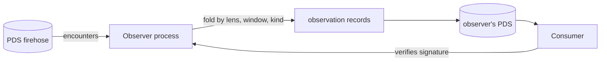

# Observer protocol

Aggregate state in idiolect is records, not endpoints. An
observer is a process that reads encounter-family records from
the firehose, folds them along a key, and publishes the fold as
a record.

## What an observer is

- The observer subscribes to the firehose.
- It accumulates encounters into a windowed bucket keyed by
  `(lens, kind, window)`.
- At window close, it computes the fold (per-outcome counts plus
  optional weighted aggregates) and publishes one
  `dev.idiolect.observation` record.
- The record is signed by the observer's DID.

The shape generalises beyond the `observation` lexicon. The same
fold path runs over `deliberationVote` records to produce
`deliberationOutcome` records (per-statement per-stance tallies
plus optional adopted-statements).

## Why records, not metrics

A central metrics endpoint cannot:

- Be verified after the fact. Once the endpoint serves a counter,
  the counter's history is whatever the endpoint says it is.
- Be re-folded by an independent party. A consumer that distrusts
  the operator cannot re-derive the count from the underlying
  data.
- Disagree with itself across observers. There is one operator,
  one number.

A signed record can be:

- Verified against the signer's key. The same trust model as any
  ATProto record.
- Re-folded from the underlying encounter records. A consumer
  reading an observation can ask the indexer for the encounters
  in scope and recompute the fold independently.
- Compared across observers. Two observers running the same fold
  on overlapping data will produce records with comparable
  counts; consumers can require quorum before treating an
  observation as authoritative.

The cost is an extra serialization per fold and an extra commit
per window. The shipped daemons amortize this over the window
duration.

## Fold shapes

A fold is a deterministic function:

$$
F : (E_1, E_2, \dots, E_n) \to R
$$

over the encounters $E_i$ visible in the window, producing one
record $R$. Determinism matters because the consumer recomputing
the fold should get the same result the observer published.
The constraints:

- The fold reads a stable view of the encounters in scope. The
  observer commits the cursor only after the fold is published, so
  a restart re-folds the window.
- The fold does not branch on local time. The window timestamp is
  derived from the encounters' `occurredAt`.
- The fold does not branch on local randomness. Anything derived
  from random sampling has to commit the seed in the record.

The shipped methods (declared in `observer-spec/methods.json`):

| Method | Folds |
| --- | --- |
| `correction-rate` | Per-lens correction counts grouped by reason. |
| `encounter-throughput` | Encounter traffic by kind and downstream result. |
| `verification-coverage` | Per-lens verification counts by kind, result, and distinct verifiers. |
| `lens-adoption` | Per-lens encounter count and distinct invokers. |
| `action-distribution` | Encounter counts grouped by `use.action`. |
| `purpose-distribution` | Encounter counts grouped by `use.purpose`. |
| `basis-distribution` | Record counts grouped by `basis` variant. |
| `attribution-chains` | `dev.idiolect.belief` counts by holder and subject. |

All eight produce `dev.idiolect.observation` records. A
`deliberation-tally` method that produces
`dev.idiolect.deliberationOutcome` records is a plausible
addition but is not in the shipped set at v0.8.0.

The spec is a single JSON file (`observer-spec/methods.json`),
not a directory of files; codegen emits the descriptor table.
See [Run the observer daemon](../guide/observer.md) for the
operator-facing path.

## Coordination among observers

Two observers running the same fold will produce records that
agree up to:

- The window boundary they chose. Observers should align on a
  shared cadence (e.g. UTC-aligned 1-hour windows).
- Late-arriving encounters. Encounters posted after the window
  closes will be folded into the next window.
- The encounter scope the observer indexed. An observer that
  missed a firehose segment will have a different count than one
  that did not.

Consumers that want consensus require $k$ of $n$ trusted observers
to publish records that agree within a tolerance. This is a
consumer policy; the substrate ships the records.

## Why folds are the right primitive

A simple primitive — the observer publishes an aggregate signed
by its DID — supports a lot of structure:

- Quorum (a consumer requires multiple observers to agree).
- Reputation (a consumer prefers observers with a track record).
- Delegation (a consumer treats one observer's records as
  authoritative when it does not want to fold itself).
- Fork detection (two observers' aggregates over the same window
  diverging is a signal that one of them is missing data).

None of those need protocol changes. They are policies on top of
records.
