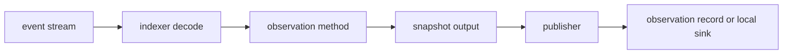

# Observer protocol

An [observer](../glossary.md#observer "A process that folds indexed records and publishes method-specific snapshots")
turns a stream of typed records into an aggregate claim. The aggregate is a
`dev.idiolect.observation` record when a persistent publisher is configured.
We call this path the **published-fold path (PFP)**.

```mermaid
flowchart LR
    STREAM[event stream] --> INDEX[indexer decode]
    INDEX --> METHOD[observation method]
    METHOD --> SNAPSHOT[snapshot output]
    SNAPSHOT --> PUB[publisher]
    PUB --> RECORD[observation record or local sink]
```

## A fold is stateful

Let $E$ be the event space, $S$ a method's private state, and $O$ its snapshot
space. An observation method supplies a transition and a partial snapshot
function:

$$
\operatorname{step} : S \times E \to S
$$

$$
\operatorname{snapshot} : S \to O \cup \{\varnothing\}
$$

Starting from $s_0$, the method processes events in stream order:

$$
s_{i+1} = \operatorname{step}(s_i,e_i)
$$

If `snapshot` returns a value after $n$ events, the runtime wraps that value
with the observer DID, method descriptor, declared scope, method version,
visibility, and timestamp. A method may return no snapshot when it has not seen
enough relevant data.

This formulation is more accurate than treating every method as a set function.
Some methods may be order-insensitive, but `ObservationMethod` does not require
commutativity or idempotence. Comparability thus depends on method name,
version, scope, input coverage, and method semantics.

## Stream and flush boundaries

The observer driver accepts any `idiolect_indexer::EventStream`. The reference
daemon currently uses `TappedEventStream`, backed by a tap service; the indexer
also has a Jetstream adapter behind its feature flag. The driver filters for
`IdiolectFamily`, decodes creates and updates, forwards them to one configured
method, and commits the cursor for live events after the handler succeeds.

`FlushSchedule` is event-count based or manual. `EveryEvents(n)` asks the
handler to publish after each $n$ processed events and once more when the stream
closes normally. It does not create clock-aligned windows. A method can declare
a window in its observation scope, but the generic driver does not enforce or
derive that window.

## What gets published

Three publisher implementations exist:

- `InMemoryPublisher` retains typed observations for tests and local callers.
- `LogPublisher` emits structured tracing events without repository durability.
- `PdsPublisher` adds `$type: "dev.idiolect.observation"` and calls the configured
  `PdsWriter` to create a record.

The reference daemon selects `CorrectionRateMethod`. It uses the in-memory
publisher unless `IDIOLECT_PDS_URL` is set. Its PDS client is not authenticated
by the reference binary, so a normal PDS that requires authenticated writes
needs a wrapper or further integration before records will persist.

## Bundled methods

The declarative method registry and generated `default_methods()` contain nine
record-form aggregators:

| Method | Snapshot coordinate |
| --- | --- |
| `correction-rate` | Correction counts by lens and reason |
| `encounter-throughput` | Encounters by kind and downstream result |
| `verification-coverage` | Verifications by lens, kind, result, and verifier |
| `lens-adoption` | Encounter and invoker counts by lens |
| `action-distribution` | Encounters by structured action |
| `purpose-distribution` | Encounters by structured purpose |
| `basis-distribution` | Records by basis variant and record kind |
| `attribution-chains` | Beliefs by holder and subject |
| `deliberation-tally` | Votes by statement and stance |

Though `default_methods()` constructs all nine, `drive_observer` is generic
over one method and the reference daemon instantiates only `correction-rate`.
Running multiple methods requires multiple handlers or an application-level
composite.

## Evidence and replay

The PFP separates aggregate state from a central query endpoint.
Different observers can publish snapshots under their own DIDs, and consumers
can compare them. If the record is committed to an ATProto repository, the
repository proof can authenticate who published that snapshot.

But the observation record does not enumerate every input event, commit a
digest of the input set, or prove that the method was executed as described.
Recomputation requires access to an equivalent event history and the method's
actual semantics. Divergent snapshots may reflect missed events, different
cursor positions, method versions, scopes, or dishonest publication.

This is the **replay boundary (RB)**. The PFP makes a claim portable; it does not
make the claim self-proving. Consumers may impose quorum or
observer-reputation policies above the RB, but the observation Lexicon does not
implement either policy.

The [observer guide](../guide/observer.md) covers daemon configuration. The
[observation reference](../reference/lexicons/observation.md) gives the record
shape.
