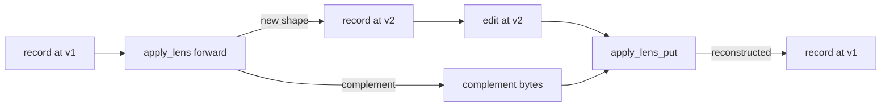

# Migrate records across a revision

A schema you depend on changed. You have records on disk against
the old schema and need them up against the new one. This is
what [`idiolect-migrate`](../reference/crates/idiolect-migrate.md)
is for.

The crate is a thin typed façade over `panproto-check` (for diff
classification) and `idiolect-lens` (for record translation). It
ships as a library only; there is no `idiolect-migrate` binary.

The runtime path:



If the lens is an isomorphism the round-trip is byte-equal. If
it is a projection, the complement carries the dropped data and
the reverse direction reconstructs the original.

## Classify the diff

Before generating a lens, classify what changed:

```rust
use idiolect_migrate::{classify, plan_auto};
use panproto_schema::Schema;

let report = classify(&schema_v1, &schema_v2)?;
```

`classify` returns a `CompatReport` (re-exported from
`panproto-check`) that distinguishes compatible from breaking
changes. Compatible diffs need no migration: records valid under
v1 remain valid under v2.

## Auto-derive the lens

For breaking diffs that are covered by shipped recipes:

```rust
let plan = plan_auto(&schema_v1, &schema_v2, &hints)?;
```

`plan_auto` returns a `MigrationPlan` carrying the source and
target schema hashes plus a lens body the caller can publish as
a `dev.panproto.schema.lens` record.

For breaking diffs that resist automation,
`plan_auto` returns `Err(PlannerError::NotAutoDerivable)`
listing the offending changes. The caller writes the lens by
hand.

## Migrate one record

```rust
use idiolect_migrate::migrate_record;

let migrated_body = migrate_record(
    &lens_record,        // PanprotoLens record (from a published lens or local plan)
    &source_record_body, // serde_json::Value
    &schema_loader,      // anything implementing idiolect_lens::SchemaLoader
).await?;
```

`migrate_record` wraps `idiolect_lens::apply_lens` for the
one-shot case: given a lens, a source record body, and a schema
loader that can resolve both schema hashes, it returns the
migrated target body.

## Verify before cutting over

Migration without verification is a guess. Run the round-trip
runner against a corpus before treating the migrated tree as
authoritative:

```rust
use idiolect_verify::{RoundtripTestRunner, VerificationRunner, VerificationTarget};

let runner = RoundtripTestRunner::new(/* ... */);
let target = VerificationTarget {/* lens, corpus, schema loader, ... */};
let verification = runner.run(&target).await?;
```

A `Verification { result: Holds, .. }` over a representative
corpus is the strongest signal you can get short of formal
proof. The runner returns a `Verification` record that you can
publish as a `dev.idiolect.verification` (via
`idiolect_lens::RecordPublisher`).

## Persist the lens record

If the migration is one-shot, the steps above are enough. If you
expect downstream consumers to migrate later, publish the lens
plan's body as a `dev.panproto.schema.lens` record and link it
from the new schema's `preferredLenses` list. See
[Publish and resolve a lens](./publish-lens.md).

## Hand-authored chains

Some migrations are not auto-derivable
(`NotAutoDerivable`). The release-gate policy in
[Lexicon evolution policy](../concepts/lexicon-evolution.md)
covers that case. The authoring loop is:

1. Hand-author the chain in panproto's protolens DSL.
2. Run `schema lens inspect` to classify it.
3. Run `schema theory check-coercion-laws` against any
   `CoerceType` step.
4. Run the round-trip runner against a corpus snapshot.
5. Publish the chain plus a verification record signed by a
   reviewer.

Each step is mechanical and gated; the policy is what makes
migrations reviewable.

## What is not in this crate

A streaming batch CLI that takes a directory of records and
writes a migrated directory is not currently shipped. Callers
that want one wire `migrate_record` into their own loop. The
shape is small enough that a per-deployment script is usually
the right answer.
