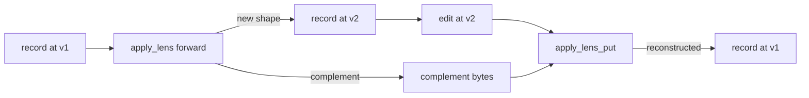

# Migrate records across a revision

Use [`idiolect-migrate`](../reference/crates/idiolect-migrate.md)
when a [schema](../glossary.md#schema "A machine-readable description of valid data")
revision no longer accepts records written against its predecessor.

The crate is a thin typed façade over `panproto-check` (for diff
classification) and `idiolect-lens` (for record translation). It
is primarily a library, and also ships an optional
`idiolect-migrate` binary behind the `cli` feature for streaming
batch migration (see [Batch migration](#batch-migration)).

The runtime path:


```mermaid
flowchart LR
    OLD[record at v1] --> APPLY[apply_lens forward]
    APPLY -->|new shape| NEW[record at v2]
    APPLY -->|complement| C[complement bytes]
    NEW --> EDIT[edit at v2]
    EDIT --> PUTBACK[apply_lens_put]
    C --> PUTBACK
    PUTBACK -->|reconstructed| OLD2[record at v1]
```

If the lens is an isomorphism the round-trip is byte-equal. If
it is a projection, the complement carries the dropped data and
the reverse direction reconstructs the original.

## Classify the diff

Before generating a lens, classify what changed:

```text
use idiolect_migrate::classify;
use panproto_schema::Protocol;

let protocol = Protocol::default();
let report = classify(&schema_v1, &schema_v2, &protocol);
```

`classify` returns a `CompatReport` (re-exported from
`panproto-check`) that distinguishes compatible from breaking
changes. Compatible diffs need no migration: records valid under
v1 remain valid under v2.

## Auto-derive the lens

For breaking diffs that are covered by shipped recipes:

```text
let plan = plan_auto(
    &schema_v1,
    &schema_v2,
    &protocol,
    source_schema_hash,
    target_schema_hash,
)?;
```

`plan_auto` returns a `MigrationPlan` carrying the two caller-supplied
schema hashes, a `protolens_chain`, and an `alignment_quality` score.
It returns `NoChange` or `OnlyNonBreaking` when a migration plan is
unnecessary.

For breaking diffs that resist automation,
`plan_auto` returns `Err(PlannerError::NotAutoDerivable)`
listing the offending changes. The caller writes the lens by
hand.

## Migrate one record

```text
use idiolect_migrate::migrate_record;

let migrated_body = migrate_record(
    &resolver,
    &schema_loader,
    &protocol,
    lens_uri,
    source_record_body,
).await?;
```

`migrate_record` resolves `lens_uri`, loads its source and target
schemas, and wraps `idiolect_lens::apply_lens`. It returns the target
record body as `serde_json::Value`.

## Verify before cutting over

Migration without verification is a guess. Run the round-trip
runner against a corpus before treating the migrated tree as
authoritative:

```text
use idiolect_verify::{RoundtripTestRunner, VerificationRunner, VerificationTarget};

let runner = RoundtripTestRunner::new(resolver, schema_loader, protocol, corpus);
let target = VerificationTarget { /* lens, verifier, occurred_at, tool_override */ };
let verification = runner.run(&target).await?;
```

A `Verification { result: Holds, .. }` establishes only that the
sampled corpus round-tripped. Record the corpus boundary, review any
projection complement, and publish the result through
`idiolect_lens::RecordPublisher` if other consumers need it.

## Persist the lens record

If the migration is one-shot, the steps above are enough. If you
expect downstream consumers to migrate later, publish the lens
plan's body as a `dev.panproto.schema.lens` record and link it
from the new schema's `preferredLenses` list. See
[Publish and resolve a lens](./publish-lens.md).

## Hand-authored chains

Some migrations are not auto-derivable
(`NotAutoDerivable`). The release-gate policy in
[Lexicon evolution policy](../concepts/lexicon-evolution.md)
covers that case. The authoring loop is:

1. Hand-author the chain in panproto's protolens DSL.
2. Run `schema lens inspect` to classify it.
3. Run `schema theory check-coercion-laws` against any
   `CoerceType` step.
4. Run the round-trip runner against a corpus snapshot.
5. Publish the chain plus a verification record signed by a
   reviewer.

The checklist records the authored chain, law checks, corpus run, and
reviewer-signed verification, but the current repository does not enforce
every gate automatically.

## Batch migration

The crate ships an `idiolect-migrate` binary (behind the `cli`
feature) that walks a directory of JSON records and writes a
migrated directory:

```bash
cargo install --path crates/idiolect-migrate --features cli
idiolect-migrate \
    --lens   at://did:plc:.../dev.panproto.schema.lens/example \
    --in     ./records-v1/ \
    --out    ./records-v2/ \
   [--pds-url URL]
```

Records stream one at a time, so memory use does not grow with the
input directory. Failed migrations go to stderr; the process exits 1
if any file fails and 0 otherwise.
