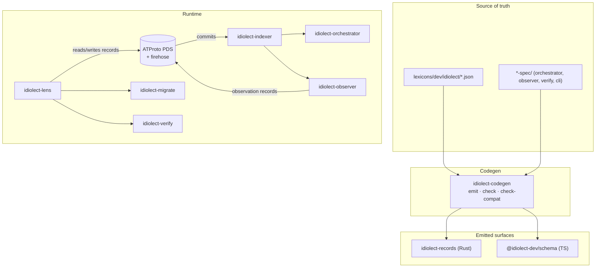

# idiolect

idiolect is a federated runtime for cross-schema interoperability on
[ATProto](https://atproto.com). It uses
[panproto](https://github.com/panproto/panproto) as its schema and lens
substrate. Records are signed and content-addressed; translations
between records are lenses with formal `get` / `put` laws; and the
sociotechnical layer above the lenses (recommendations, beliefs,
verifications, deliberations) is itself a small set of ATProto
lexicons (`dev.idiolect.*`).

The name comes from linguistics:

- An **idiolect** is one party's choice of schemas, lenses, and conventions.
- A **dialect** is the bundle of idiolects a community treats as canonical.
- A **language** is the federated substrate over which idiolects and
  dialects meet, disagree, and slowly converge without a central
  arbiter.

This documentation covers the runtime; not the reasons it exists.
For the underlying theory, see the project
[README](https://github.com/idiolect-dev/idiolect#readme) and the
[deliberation lexicons](./concepts/deliberation.md).

## Where to start

The documentation follows the [Diátaxis](https://diataxis.fr/)
structure:

- The [Tutorial](./tutorial/index.md) walks through one example end
  to end: install, fetch a record, validate, apply a lens, run a
  verification, publish a recommendation. Read this first if you have
  not used idiolect before.
- The [Guides](./guide/index.md) are task-oriented. Each guide
  answers a question of the form "how do I do X?". Reach for these
  when you know what you want to accomplish.
- The [Concepts](./concepts/index.md) explain the underlying model:
  the idiolect-dialect-language frame, the `dev.idiolect.*` lexicon
  family, lens semantics, the vocabulary knowledge graph, the
  observer protocol, and the lexicon-evolution policy. Read these
  when you want to understand why something is the way it is.
- The [Reference](./reference/index.md) is the per-symbol detail:
  one page per crate, one page per lexicon, the CLI surface, the
  HTTP query API, and the stability policy.

## Architecture

Lexicons under `lexicons/dev/idiolect/` are the single source of
truth. Rust types and TypeScript validators are derived from
them. Three downstream crates carry a taxonomy of
similarly-shaped items (the orchestrator's queries, the
observer's methods, the verifier's runners). Each lives behind a
declarative JSON spec in `<crate>-spec/`; codegen emits the
wire-up, including the CLI dispatcher that fronts the
orchestrator's queries.

## Stability

idiolect is pre-1.0. Releases in the `0.x` series may include
arbitrary breaking changes between minor versions. Pin to an exact
version if you depend on this project, and read the
[changelog](https://github.com/idiolect-dev/idiolect/blob/main/CHANGELOG.md)
before bumping. See [Stability and versioning](./reference/stability.md).
