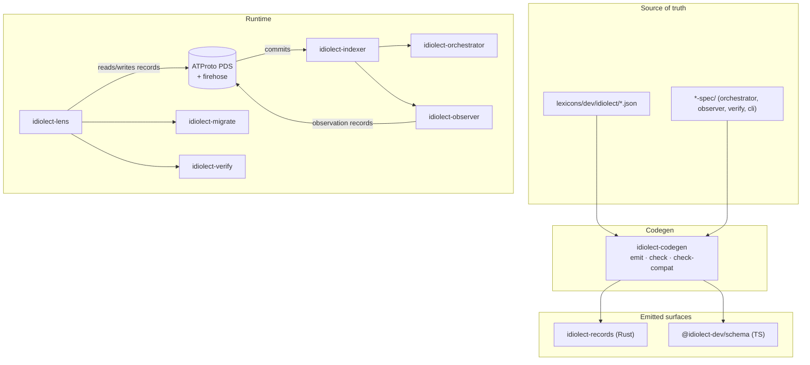

# idiolect

idiolect translates a record from one community's schema into another's while
keeping the translation, its evidence, and its social standing inspectable. It
runs on [AT Protocol](./glossary.md#at-protocol "The federated protocol that hosts idiolect records and services")
and uses [Panproto](./glossary.md#panproto "The schema and bidirectional-transformation substrate used by idiolect")
for schema comparison and lens execution.

The project names its unit of local variation the
[**idiolect**](./glossary.md#idiolect "One party's schemas, lenses, vocabularies, and conventions").
A [**dialect**](./glossary.md#dialect "A community's published bundle of preferred schemas, lenses, and deprecations")
records a community convention, while a
[**language**](./glossary.md#language "The federated substrate on which idiolects and dialects interact")
is the substrate on which those local choices meet. None of the three requires a
central schema registry.

## Start from your task

### Beginner: get a result in about five minutes

[Install the checked-out CLI and resolve a record](./tutorial/01-install.md), then
[validate it against its Lexicon](./tutorial/02-validate.md). These first two
steps produce a concrete resolution and validation result before introducing
lens laws, network publication, or the project's social records.

### Project integration: connect an existing system

Choose the guide that matches the work in front of you: [generate Rust and
TypeScript types](./guide/codegen.md), [publish a
lens](./guide/publish-lens.md), [index the
firehose](./guide/index-firehose.md), or [run the query
API](./guide/orchestrator.md). Each guide links to the exact crate, CLI, or wire
reference needed during implementation.

### Advanced and formal: extend the model

Begin with [lens semantics and laws](./concepts/lens-laws.md) or the
[vocabulary knowledge graph](./concepts/vocab-graph.md), then move to the
[observer protocol](./concepts/observer.md), [Lexicon evolution
policy](./concepts/lexicon-evolution.md), and [crate extension
points](./reference/crates/index.md). The [reading-path page](./paths.md) gives a
longer route through each level.

## How the book is organized

The book keeps the four [Diátaxis](https://diataxis.fr/) functions separate:

- The [tutorial](./tutorial/index.md) teaches through one runnable sequence.
- The [guides](./guide/index.md) give procedures for particular tasks.
- The [concepts](./concepts/index.md) explain the mechanisms and their limits.
- The [reference](./reference/index.md) records exact APIs, fields, and commands.

Use the [glossary](./glossary.md) for short definitions. The paths above cross
the four sections, but they do not turn a tutorial into reference material or a
conceptual explanation into a procedure.

## Architecture

```mermaid
flowchart TB
    subgraph sources["Source of truth"]
        LEX["lexicons/dev/idiolect/*.json"]
        SPEC["*-spec/ (orchestrator, observer, verify, cli)"]
    end

    subgraph codegen["Codegen"]
        CG["idiolect-codegen<br/>emit · check · check-compat"]
    end

    subgraph emitted["Emitted surfaces"]
        RECS["idiolect-records (Rust)"]
        NPM["@idiolect-dev/schema (TS)"]
    end

    subgraph runtime["Runtime"]
        PDS[("ATProto PDS<br/>+ firehose")]
        IDX["idiolect-indexer"]
        ORC["idiolect-orchestrator"]
        OBS["idiolect-observer"]
        VER["idiolect-verify"]
        MIG["idiolect-migrate"]
        LENS["idiolect-lens"]
    end

    LEX --> CG
    SPEC --> CG
    CG --> RECS
    CG --> NPM

    PDS -->|commits| IDX
    IDX --> ORC
    IDX --> OBS
    OBS -->|observation records| PDS
    LENS -->|reads/writes records| PDS
    LENS --> MIG
    LENS --> VER
```

Lexicons under `lexicons/dev/idiolect/` are the source of truth for the record
family. Code generation derives Rust types and TypeScript validators from those
files. The orchestrator queries, observer methods, and verifier runners each add
a declarative JSON specification; code generation emits their dispatch and wire
integration. This separation is the **declarative boundary (DB)**: record and
method taxonomies live in data, while runtime code implements their behavior.
The DB lets reviewers distinguish generated contracts from handwritten runtime
semantics.

## Stability

idiolect is pre-1.0. Releases in the `0.x` series may include
arbitrary breaking changes between minor versions. Pin to an exact
version if you depend on this project, and read the
[changelog](https://github.com/idiolect-dev/idiolect/blob/main/CHANGELOG.md)
before bumping. See [Stability and versioning](./reference/stability.md).
