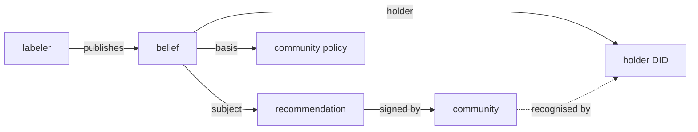

# dev.idiolect.belief

A signed doxastic claim that a referenced record is true or
applicable. Belief records are how third parties represent what
*they* think about *another* record without flattening provenance:
the `subject` strong-ref pins the exact referenced record, the
`holder` names the party whose attitude is represented, and the
`basis` names what grounds it.

> **Source:** [`lexicons/dev/idiolect/belief.json`](https://github.com/idiolect-dev/idiolect/blob/main/lexicons/dev/idiolect/belief.json)
> · **Rust:** [`idiolect_records::Belief`](https://docs.rs/idiolect-records/latest/idiolect_records/struct.Belief.html)
> · **TS:** `@idiolect-dev/schema/belief`
> · **Fixture:** `idiolect_records::examples::belief`

## Shape

| Field | Type | Required | Notes |
| --- | --- | --- | --- |
| `subject` | `strongRecordRef` | yes | AT-URI + CID for the record the belief is about. |
| `holder` | did | no | Party whose attitude is represented. Omit for first-party. |
| `basis` | `basis` | no | Structured grounding (load-bearing when `holder` differs from the repo owner). |
| `annotations` | string (≤4000 graphemes) | no | Narrative commentary. |
| `visibility` | `visibility` | no | Visibility scope. |
| `occurredAt` | datetime | yes | When the belief was published. |

## Field details

### `subject` is a strong reference

`subject` carries both the AT-URI and the CID of the record the
belief is about. Pinning by CID means a later revision of the
target record does not silently change what this belief asserts.
A consumer reading a belief about a recommendation can fetch the
exact recommendation revision the holder believed in, even if the
recommendation has been edited since.

### `holder` versus the repo owner

The simplest case: the repo owner is the holder. The record
expresses the publisher's own belief; `holder` is omitted.

The richer case: the repo owner is publishing a belief on behalf
of, or about, another party. A labeler that publishes
`{ subject: <some encounter>, holder: did:plc:other-party }`
is asserting that *the other party* believes the encounter is
applicable. The labeler's signature attests that the labeler
made the attribution; the holder field carries who the attitude
is attributed to.

### `basis` carries the grounds

When the holder is not the repo owner, the consumer needs to know
on what grounds the attribution rests. The four `basis` variants:

| Variant | Use when |
| --- | --- |
| `basisSelfAsserted` | The holder asserted directly with no external grounding claimed. The default when `basis` is omitted. |
| `basisCommunityPolicy` | Grounded in a community's published policy. |
| `basisExternalSignal` | Grounded in something outside ATProto (a license, an external standard, a statement on another network). |
| `basisDerivedFromRecord` | Grounded in another ATProto record (with an inference rule naming the derivation). |

See [`defs#basis`](./defs.md) for the field shapes.

### Use as a labeler primitive

A labeler workflow that wants to record "a third party endorses
this lens for a particular use" uses three records:

1. The lens record (in the lens author's PDS).
2. The encounter or recommendation describing the use (in either
   the labeler's or the third party's PDS).
3. A belief record (in the labeler's PDS) with `subject` pointing
   at the encounter / recommendation, `holder` set to the third
   party's DID, and `basis` carrying the structured grounds.

Consumers reading the belief see all three. The labeler's
signature on the belief is what makes the attribution accountable.

## Example

```json
{
  "$type": "dev.idiolect.belief",
  "subject": {
    "uri": "at://did:plc:other-party/dev.idiolect.recommendation/3l5",
    "cid": "bafy..."
  },
  "holder": "did:plc:other-party",
  "basis": {
    "$type": "dev.idiolect.defs#basisCommunityPolicy",
    "community": "at://did:plc:community/dev.idiolect.community/canonical",
    "policyUri": "https://community.example/policies/lens-endorsement-v1"
  },
  "annotations": "Labeler attests the holder accepted this recommendation.",
  "visibility": "public-detailed",
  "occurredAt": "2026-04-19T00:00:00.000Z"
}
```

## How beliefs compose



A consumer reading the belief sees: which record is being
endorsed (`subject`), who is doing the endorsing (`holder`), on
what grounds (`basis`), and who is attributing it (the repo
signer). Disagreements among labelers about a holder's beliefs
are themselves first-class records: a contradicting belief from
a different labeler is just another record, signed and visible.

## Concept references

- [Concepts: The dev.idiolect.* lexicon family](../../concepts/lexicon-family.md)
- [Concepts: Records as content-addressed signed data](../../concepts/atproto-records.md)
- [Lexicons: defs (`#basis`, `#strongRecordRef`)](./defs.md) · [recommendation](./recommendation.md)
