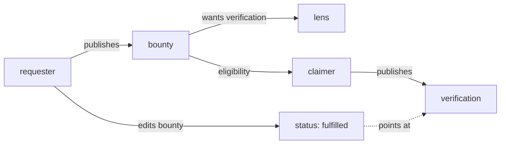

# dev.idiolect.bounty

A declaration that a translation, verification, or adapter is
wanted, with terms. The substrate does not intermediate fulfillment:
payment, review, and acceptance happen on external rails referenced
in the record. The record is the *request* primitive.

> **Source:** [`lexicons/dev/idiolect/bounty.json`](https://github.com/idiolect-dev/idiolect/blob/main/lexicons/dev/idiolect/bounty.json)
> · **Rust:** [`idiolect_records::Bounty`](https://docs.rs/idiolect-records/latest/idiolect_records/struct.Bounty.html)
> · **TS:** `@idiolect-dev/schema/bounty`
> · **Fixture:** `idiolect_records::examples::bounty`

## Shape

| Field | Type | Required | Notes |
| --- | --- | --- | --- |
| `requester` | did | yes | Who is requesting. |
| `wants` | union | yes | Exactly one of `wantLens` / `wantVerification` / `wantAdapter`. |
| `constraints` | array (≤64) | no | Structured constraints the deliverable must satisfy. |
| `reward` | object | no | `{ summary?, externalRef? }`. The substrate does not transact. |
| `eligibility` | array (≤128) | no | Postfix eligibility tree. |
| `fulfillment` | at-uri | no | Once fulfilled, points to the deliverable record. |
| `status` | open enum | no | `open` / `claimed` / `fulfilled` / `withdrawn`. |
| `statusVocab` | `vocabRef` | no | Vocab the status slug resolves against. |
| `basis` | `basis` | no | Structured grounding. |
| `occurredAt` | datetime | yes | Publication timestamp. |

## The three want shapes

### `wantLens`

Asks for a lens between two schemas.

| Subfield | Type | Required | Notes |
| --- | --- | --- | --- |
| `source` | `schemaRef` | yes | Source schema. |
| `target` | `schemaRef` | yes | Target schema. |
| `bidirectional` | boolean | no | Whether the requested lens must be invertible. |

### `wantVerification`

Asks for a verification of a lens.

| Subfield | Type | Required | Notes |
| --- | --- | --- | --- |
| `lens` | `lensRef` | yes | The lens to verify. |
| `kind` | open enum | yes | Verification kind: `roundtrip-test` / `property-test` / `formal-proof` / `conformance-test` / `static-check` / `convergence-preserving`. (Note: the lexicon's known-values list here omits `coercion-law`; that kind is reachable through the open-enum extension via `kindVocab`.) |
| `kindVocab` | `vocabRef` | no | Vocab the kind slug resolves against. |

### `wantAdapter`

Asks for an adapter for a framework.

| Subfield | Type | Required | Notes |
| --- | --- | --- | --- |
| `framework` | string (≤128) | yes | Framework name. |
| `versionRange` | string | no | Semver range. |

## The constraint variants

Each entry in `constraints` is one of:

| Variant | Captures |
| --- | --- |
| `constraintPerformance` | A quantitative bound: metric, threshold, comparison direction (`lt`, `le`, `eq`, `ge`, `gt`), optional sample size. Examples: `p99-latency-ms ≤ 50`, `error-rate < 0.001`. |
| `constraintConformance` | A verification kind (and optional specific property) the deliverable must pass. |
| `constraintLicense` | An SPDX expression plus optional allow / deny lists. |
| `constraintDeadline` | A datetime deadline plus optional grace seconds. |
| `constraintDependency` | A pointer to another bounty this one waits on. Claims are ineligible until the dependency's status is `fulfilled`. |

A consumer matching a candidate deliverable against a bounty walks
the constraint list and verifies each one. Failing constraints
are surfaced individually so the claimer can tell what is missing.

## The eligibility tree

`eligibility` is a postfix-operator tree (same shape as
recommendation conditions). Atomic predicates plus combinators:

| Variant | Arity | Meaning |
| --- | --- | --- |
| `eligibilityMember` | atomic | Claimer is a member of the named community. |
| `eligibilityVerificationFor` | atomic | Claimer has published a verification for the named lens property. |
| `eligibilityDid` | atomic | Claimer's DID matches exactly. |
| `eligibilityAnd` | combinator | Conjoin top two on stack. |
| `eligibilityOr` | combinator | Disjoin top two on stack. |
| `eligibilityNot` | combinator | Negate top on stack. |

A bounty restricted to a specific community uses
`[eligibilityMember(community=...)]`. A bounty open to either of
two communities uses
`[eligibilityMember(A), eligibilityMember(B), eligibilityOr]`.
Empty array means no eligibility restriction.

## Field details

### `reward`

`reward` is intentionally underspecified. `summary` is narrative
prose; `externalRef` is a URL pointing at the rail that handles
the actual reward (a grant portal, a payment platform, an
attestation service). The substrate does not validate that the
external rail exists, that it is solvent, or that the reward will
be paid; that is the consumer's diligence.

The pattern: a bounty with `externalRef` pointing at a known
grant portal is more credible than a bounty with only a narrative
summary. Consumers route their effort accordingly.

### `fulfillment`

Once a deliverable exists, the bounty publisher edits the bounty
record (a put, not a new record) to set `fulfillment` to the
deliverable's at-uri and `status` to `fulfilled`. Consumers
querying open bounties filter on `status: open`; consumers
auditing the fulfilled set filter on `status: fulfilled` and
follow `fulfillment`.

### `basis`

For first-party bounties (the repo owner is the requester), omit.
For third-party attribution (a labeler records that *someone else*
is requesting), set `basis` and `requester` accordingly. The
common case is `basisCommunityPolicy` (a community has a standing
policy of requesting verifications of every published lens) or
`basisDerivedFromRecord` (a researcher infers a request from a
prior recommendation that named required verifications).

## Example

```json
{
  "$type": "dev.idiolect.bounty",
  "requester": "did:plc:requester",
  "wants": {
    "$type": "dev.idiolect.bounty#wantVerification",
    "lens": { "uri": "at://did:plc:lens-author/dev.panproto.schema.lens/3l5" },
    "kind": "roundtrip-test"
  },
  "constraints": [
    { "$type": "dev.idiolect.bounty#constraintConformance",
      "kind": "roundtrip-test",
      "property": {
        "$type": "dev.idiolect.defs#lpRoundtrip",
        "domain": "all valid v1 records with bodies ≤ 1024 bytes"
      }
    },
    { "$type": "dev.idiolect.bounty#constraintDeadline",
      "deadline": "2026-06-19T00:00:00.000Z"
    }
  ],
  "reward": {
    "summary": "USD 500 paid via XYZ grants portal on acceptance.",
    "externalRef": "https://grants.example/bounties/3l5"
  },
  "eligibility": [
    { "$type": "dev.idiolect.bounty#eligibilityMember",
      "community": "at://did:plc:community/dev.idiolect.community/canonical" }
  ],
  "status": "open",
  "occurredAt": "2026-04-19T00:00:00.000Z"
}
```

## How bounties drive verification work



A community publishing recommendations with `requiredVerifications`
that nobody has published is asking for verification work. A
bounty is the canonical way to request that work. A claimer that
matches the eligibility predicate publishes the verification, the
requester points the bounty at it, and the external rail handles
the payment.

## Concept references

- [Concepts: The dev.idiolect.* lexicon family](../../concepts/lexicon-family.md)
- [Lexicons: verification](./verification.md) · [recommendation](./recommendation.md) · [adapter](./adapter.md)
