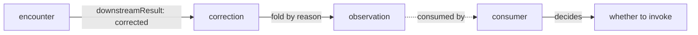

# dev.idiolect.correction

A signed record of a post-translation edit. Corrections are the
primary signal an observer uses to detect lens quality issues;
the reason taxonomy decouples "lens was wrong" from "the world
is complicated".

> **Source:** [`lexicons/dev/idiolect/correction.json`](https://github.com/idiolect-dev/idiolect/blob/main/lexicons/dev/idiolect/correction.json)
> · **Rust:** [`idiolect_records::Correction`](https://docs.rs/idiolect-records/latest/idiolect_records/struct.Correction.html)
> · **TS:** `@idiolect-dev/schema/correction`
> · **Fixture:** `idiolect_records::examples::correction`

## Shape

| Field | Type | Required | Notes |
| --- | --- | --- | --- |
| `encounter` | `encounterRef` | yes | The encounter whose output was edited. |
| `path` | string (≤1024) | yes | JSON Pointer or equivalent into the produced output. |
| `originalValue` | unknown | no | Value prior to correction. May be elided for visibility reasons. |
| `correctedValue` | unknown | no | Value after correction. |
| `reason` | open enum | yes | `lens-error` / `domain-difference` / `source-error` / `downstream-idiosyncrasy` / `user-mistake` / `retrospective`. |
| `reasonVocab` | `vocabRef` | no | Vocab the reason slug resolves against. |
| `rationale` | string (≤2000 graphemes) | no | Human-readable justification. |
| `holder` | did | no | Party the correction is attributed to. |
| `basis` | `basis` | no | Structured grounding for third-party attribution. |
| `visibility` | `visibility` | yes | Visibility scope. |
| `occurredAt` | datetime | yes | When the correction was made. |

## Field details

### Why a `reason` taxonomy

Aggregating corrections naively gives the wrong signal: a lens
that produces correct output for half its inputs and
domain-different output for the other half is not a buggy lens.
The reason taxonomy distinguishes:

| Slug | What it means | Implication for the lens |
| --- | --- | --- |
| `lens-error` | The lens produced wrong output for the input. | Bug in the lens. |
| `domain-difference` | The lens output is correct under one set of conventions; the consumer wants a different set. | Not a bug; a different community translation. |
| `source-error` | The source record was wrong; the lens propagated the error faithfully. | Not a bug; upstream issue. |
| `downstream-idiosyncrasy` | The downstream consumer has an unusual requirement the lens does not target. | Not a bug; consumer-specific. |
| `user-mistake` | The user invoked the wrong lens. | Not a bug; routing issue. |
| `retrospective` | A delayed finding caused by something other than the above; usually escalates to a `dev.idiolect.retrospection`. | Possibly a bug; investigation pending. |

Observers fold corrections by reason. A high `lens-error` rate
is signal; a high `domain-difference` rate is a community
disagreement. Conflating them is the failure mode the taxonomy
exists to prevent.

### `path`

JSON Pointer (RFC 6901) into the produced output. A path of
`/body/text` identifies the `text` field under `body`. Multi-part
paths are supported up to 1024 bytes. Consumers replaying
corrections apply the edit at the named path.

### `originalValue` may be elided

When the encounter's `visibility` restricts publishing source
data, the correction may carry only `correctedValue` and a
narrative rationale. A consumer that trusts the corrector can use
the corrected value verbatim; one that wants to verify the
correction needs to fetch the source separately.

### Holder versus the repo owner

Most corrections are first-party: the consumer that received the
output is the same as the consumer that edited it. Some are
third-party: a reviewer transcribing an off-network correction.
`holder` plus `basis` carry the third-party attribution
machinery, identical to encounter and belief.

## Example

```json
{
  "$type": "dev.idiolect.correction",
  "encounter": {
    "uri": "at://did:plc:user/dev.idiolect.encounter/3l5",
    "cid": "bafy..."
  },
  "path": "/body/text",
  "originalValue": "the quick brown foxes",
  "correctedValue": "the quick brown fox",
  "reason": "lens-error",
  "rationale": "Lens incorrectly pluralised the singular noun.",
  "visibility": "public-detailed",
  "occurredAt": "2026-04-19T00:00:00.000Z"
}
```

## How corrections feed observation



A high `lens-error` count in observations is a signal. A high
`domain-difference` count is just a record of community
disagreement. Consumers reading observations make routing
decisions on the former, not the latter; observers therefore
must publish the breakdown by reason, not just a flat correction
count.

## Concept references

- [Concepts: The dev.idiolect.* lexicon family](../../concepts/lexicon-family.md)
- [Concepts: Observer protocol](../../concepts/observer.md)
- [Lexicons: encounter](./encounter.md) · [observation](./observation.md) · [retrospection](./retrospection.md)
