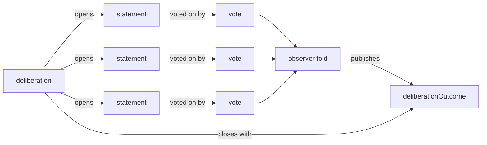

# dev.idiolect.deliberation

A community-scoped question or proposal under collective
consideration. Companion records carry the rest of the process:
[`deliberationStatement`](./deliberationStatement.md) for
participant utterances,
[`deliberationVote`](./deliberationVote.md) for stances on those
utterances, and
[`deliberationOutcome`](./deliberationOutcome.md) for the
observer-aggregated tally.

Deliberations are intentionally process-shaped: they represent the
*unsettled* moment. They are distinct from
[`belief`](./belief.md) (settled doxastic) and
[`recommendation`](./recommendation.md) (settled normative). A
deliberation that closes can name an outcome record so consumers
can read the conclusion without re-folding the votes.

> **Source:** [`lexicons/dev/idiolect/deliberation.json`](https://github.com/idiolect-dev/idiolect/blob/main/lexicons/dev/idiolect/deliberation.json)
> · **Rust:** [`idiolect_records::Deliberation`](https://docs.rs/idiolect-records/latest/idiolect_records/struct.Deliberation.html)
> · **TS:** `@idiolect-dev/schema/deliberation`
> · **Fixture:** `idiolect_records::examples::deliberation`

## Shape

| Field | Type | Required | Notes |
| --- | --- | --- | --- |
| `owningCommunity` | at-uri | yes | The community whose membership is deliberating. |
| `topic` | string (≤200 graphemes) | yes | Human-readable topic or question. |
| `description` | string (≤1000 graphemes) | no | Extended framing or context. |
| `authRequired` | boolean (default `true`) | no | Whether participation requires authenticated membership. |
| `classification` | open enum | no | `question` / `proposal` / `grievance` / `retrospective`. |
| `classificationVocab` | `vocabRef` | no | Vocab the classification slug resolves against. |
| `status` | open enum | no | `open` / `closed` / `tabled` / `adopted` / `rejected`. |
| `statusVocab` | `vocabRef` | no | Vocab the status slug resolves against. |
| `closedAt` | datetime | no | When the deliberation moved out of an open status. |
| `outcome` | at-uri | no | Pointer to a `deliberationOutcome` record summarising the resolved stance. |
| `createdAt` | datetime | yes | Publication timestamp. |

## Field details

### `owningCommunity`

The deliberation is scoped to a single community. Membership and
participation rights are resolved through that community's record.
A deliberation can be cross-referenced from other communities, but
exactly one owns it.

The substrate does not enforce membership. `authRequired` is a
declared policy: when `true`, only authenticated members'
statements and votes count toward the outcome; when `false`, the
deliberation accepts drive-by statements (which observers may
weight differently when folding the tally).

### `classification`

| Slug | What it means |
| --- | --- |
| `question` | An open question without a proposed resolution. |
| `proposal` | A specific proposal under consideration. |
| `grievance` | A complaint or dispute. |
| `retrospective` | A post-hoc review of a prior decision. |

The classification is open-enum: a community publishing its own
classifications vocabulary (`negotiation`, `process-vote`,
`amendment`, ...) extends the slug set. Resolution goes through
`classificationVocab` when set, otherwise the canonical idiolect
default.

The classification is *optional*. A community that does not want
to commit to a classification omits the field; the deliberation
record is still valid, observers and consumers just have less
metadata to fold on.

### `status` lifecycle

| Slug | What it means |
| --- | --- |
| `open` | Active. Statements and votes accepted. |
| `closed` | No longer accepting input. May or may not have an outcome. |
| `tabled` | Closed but explicitly deferred for later. |
| `adopted` | Closed with a positive resolution. |
| `rejected` | Closed with a negative resolution. |

Open-enum: a community that wants finer-grained statuses
(`closed-pending-revision`, `escalated`, ...) extends via
`statusVocab`. The lifecycle is a *declaration*; the substrate
records the value the publisher set.

### `outcome`

A pointer to a `dev.idiolect.deliberationOutcome` record. Set
after closure when an outcome record exists. Consumers reading
a closed deliberation can fetch the outcome without re-folding
the entire vote stream.

Multiple outcome records per deliberation are allowed (different
observers, different cut-offs); the deliberation's `outcome`
field points at the *canonical* one. Consumers who want a
different observer's tally query the orchestrator directly.

### `closedAt` versus `createdAt`

`createdAt` is when the deliberation was opened. `closedAt` is
when it moved out of an open status. The difference is the
deliberation's duration. Observers fold this for cadence
metrics: how long a community typically deliberates before
adopting, how often deliberations are tabled rather than
adopted.

## Example

```json
{
  "$type": "dev.idiolect.deliberation",
  "owningCommunity": "at://did:plc:community/dev.idiolect.community/canonical",
  "topic": "Should we adopt the v2 lens for post translations?",
  "description": "Community discussion on whether to make the v2 lens the default for member-published posts.",
  "authRequired": true,
  "classification": "proposal",
  "status": "open",
  "createdAt": "2026-04-19T00:00:00.000Z"
}
```

## Process flow



A deliberation is opened. Participants publish statements
referencing the deliberation. Other participants publish votes
referencing specific statements. An observer folds the vote
stream and publishes a tally. The deliberation closes with an
outcome pointer.

## Concept references

- [Concepts: Deliberation](../../concepts/deliberation.md)
- [Concepts: The dev.idiolect.* lexicon family](../../concepts/lexicon-family.md)
- [Lexicons: deliberationStatement](./deliberationStatement.md) · [deliberationVote](./deliberationVote.md) · [deliberationOutcome](./deliberationOutcome.md)
