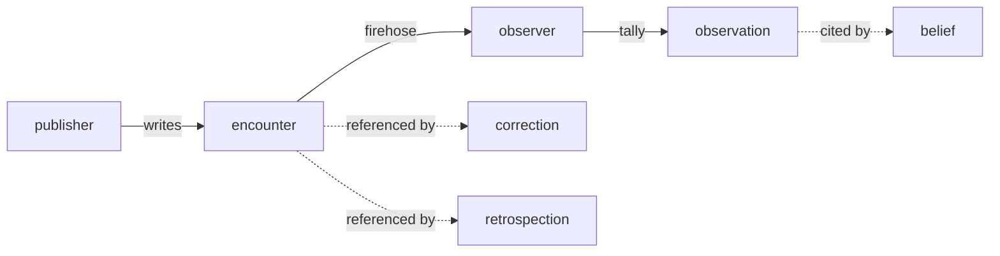

# dev.idiolect.encounter

A signed record of a single lens invocation. Encounters are the
*emergent-channel* primitive: they record that a translation
occurred, with enough context for aggregators (observations) and
correctors to reason about it. Narrative commentary lives in
`annotations`; the structured payload in `use` covers the
action / material / purpose / actor of the invocation.

> **Source:** [`lexicons/dev/idiolect/encounter.json`](https://github.com/idiolect-dev/idiolect/blob/main/lexicons/dev/idiolect/encounter.json)
> · **Rust:** [`idiolect_records::Encounter`](https://docs.rs/idiolect-records/latest/idiolect_records/struct.Encounter.html)
> · **TS:** `@idiolect-dev/schema/encounter`
> · **Fixture:** `idiolect_records::examples::encounter`

## Shape

| Field | Type | Required | Notes |
| --- | --- | --- | --- |
| `lens` | `lensRef` | yes | The lens that was invoked. |
| `sourceSchema` | `schemaRef` | yes | Source schema the lens translated from. |
| `targetSchema` | `schemaRef` | no | Target schema produced by the lens. Often implied by the lens; elided when unambiguous. |
| `sourceInstance` | `cid-link` | no | Content-addressed reference to the source instance. Omit when visibility restricts publishing source data. |
| `producedOutput` | `cid-link` | no | Content-addressed reference to the produced output. |
| `use` | `use` | yes | Structured action / material / purpose / actor. |
| `downstreamResult` | open enum | no | `success` / `corrected` / `rejected` / `unknown`. |
| `downstreamResultVocab` | `vocabRef` | no | Vocab the slug resolves against. |
| `annotations` | string (≤4000 graphemes) | no | Narrative commentary. |
| `holder` | did | no | Party the encounter is attributed to. Omit for first-party records. |
| `basis` | `basis` | no | Structured grounding when `holder` differs from the repo owner. |
| `kind` | open enum | yes | Corpus-kind slug (`invocation-log`, `curated`, `roundtrip-verified`, `production`, `adversarial`). |
| `kindVocab` | `vocabRef` | no | Vocab the kind slug resolves against. |
| `visibility` | `visibility` | yes | `public-detailed` / `public-minimal` / `public-aggregate-only` / `community-scoped` / `private`. |
| `occurredAt` | datetime | yes | When the invocation happened. Distinct from the record's `createdAt`. |

## Field details

### `use`

The structured payload. A `use` carries:

- `action` (open-enum slug, resolved against `actionVocabulary`).
- `material` (a `materialSpec`: scope plus optional corpus pointer).
- `purpose` (open-enum slug, resolved against `purposeVocabulary`).
- `actor` (string; who ultimately performs or benefits).

All four together form the "what was done, on what, for what
end, by which actor" tuple. Consumers that match on actions
match on *subsumption* against the referenced vocabulary, not on
substring equality. Two communities that disagree on whether
`train_model` subsumes `fine_tune` produce different routing
decisions from the same encounter, which is the right answer.

### `kind`

The encounter-kind slug declares what the corpus represents:

| Slug | Meaning |
| --- | --- |
| `invocation-log` | A real production invocation. |
| `curated` | A hand-picked sample, often used for evaluation. |
| `roundtrip-verified` | An invocation where `put(get(a)) == a` was verified at write time. |
| `production` | Synonym for `invocation-log` in some pipelines; exists for distinct trust weighting. |
| `adversarial` | An invocation explicitly chosen to stress the lens. |

Observers declare in their method which kinds they weight and
how. An observation aggregating `invocation-log` plus `curated`
encounters is meaningfully different from one aggregating only
`adversarial` ones; the kind plus the observer's method together
is what makes the observation interpretable.

### `downstreamResult`

The invoking party's at-record-time assessment of the outcome:

| Slug | Meaning |
| --- | --- |
| `success` | The output was accepted unchanged. |
| `corrected` | The output was edited; a `dev.idiolect.correction` record exists or is expected. |
| `rejected` | The output was unusable. |
| `unknown` | The party publishing did not know yet. |

`corrected` is the link between the emergent-channel encounter
record and the correction record that documents the edit.
Consumers reading correction records traverse back through the
encounter's `downstreamResult` to confirm the link.

### `holder` and `basis`

Most encounters are first-party: the repo owner is the party that
invoked the lens. Some are third-party: a labeler records that
*another* party invoked a lens. `holder` names the party the
record is attributed to; `basis` carries structured grounds for
the attribution (a community policy, an external signal, an
inference from another record). See [`defs#basis`](./defs.md) for
the variants.

### `visibility`

The five values are policy hints, not access control. The
substrate does not enforce them today. Records marked
`community-scoped` should not be served to parties outside the
named community once the substrate supports scope enforcement;
records marked `private` should not be published at all.

## Example

```json
{
  "$type": "dev.idiolect.encounter",
  "lens":         { "uri": "at://did:plc:lens-author/dev.panproto.schema.lens/3l5" },
  "sourceSchema": { "uri": "at://did:plc:schema-author/dev.panproto.schema.schema/v1" },
  "targetSchema": { "uri": "at://did:plc:schema-author/dev.panproto.schema.schema/v2" },
  "use": {
    "action":   "train_model",
    "material": { "scope": "production_logs" },
    "purpose":  "non_commercial",
    "actor":    "researchers"
  },
  "downstreamResult": "success",
  "kind":             "invocation-log",
  "visibility":       "public-detailed",
  "occurredAt":       "2026-04-19T12:30:00.000Z"
}
```

## How encounters are consumed



An encounter is the unit; observations and corrections reference
it. A `dev.idiolect.belief` may cite either the encounter
directly (for narrow claims) or an observation that aggregated
it (for broad claims). A `dev.idiolect.retrospection` references
an encounter to record a delayed finding about it.

## Cross-references

- [Concepts: The dev.idiolect.* lexicon family](../../concepts/lexicon-family.md)
- [Concepts: Records as content-addressed signed data](../../concepts/atproto-records.md)
- [Guides: Index a firehose](../../guide/index-firehose.md)
- [Lexicons: observation](./observation.md) · [correction](./correction.md) · [retrospection](./retrospection.md)
