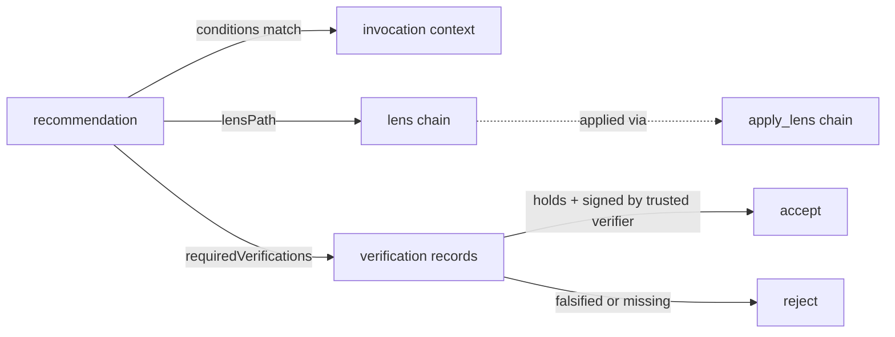

# dev.idiolect.recommendation

A community-published opinionated path with structured applicability
conditions and optional verification requirements. The `conditions`,
`preconditions`, and `caveats` arrays are *structured*: a consumer
can evaluate them mechanically against an invocation context. The
`requiredVerifications` array is a list of specific lens properties
the recommendation assumes are in place, so consumers check which
roundtrip domain or theorem or standard has been established, not
just which verification kind was run. Narrative prose lives in
`annotations` and `caveatsText`.

> **Source:** [`lexicons/dev/idiolect/recommendation.json`](https://github.com/idiolect-dev/idiolect/blob/main/lexicons/dev/idiolect/recommendation.json)
> · **Rust:** [`idiolect_records::Recommendation`](https://docs.rs/idiolect-records/latest/idiolect_records/struct.Recommendation.html)
> · **TS:** `@idiolect-dev/schema/recommendation`
> · **Fixture:** `idiolect_records::examples::recommendation`

## Shape

| Field | Type | Required | Notes |
| --- | --- | --- | --- |
| `issuingCommunity` | at-uri | yes | Community publishing the recommendation. |
| `conditions` | array (≤128) of `Condition` | yes | Structured applicability predicate. Empty array means "always applies". |
| `preconditions` | array (≤128) of `Condition` | no | Additional structured assumptions the consumer must verify. |
| `lensPath` | array (≥1) of `lensRef` | yes | Ordered sequence of lenses to compose. |
| `annotations` | string (≤8000 graphemes) | no | Narrative explanation. |
| `requiredVerifications` | array of `lensProperty` | no | Specific properties the recommendation assumes. |
| `caveats` | array (≤32) of `Caveat` | no | Structured failure-mode list. |
| `caveatsText` | string | no | Narrative companion to `caveats`. |
| `basis` | `basis` | no | Structured grounding for the attitudinal claim. |
| `supersedes` | at-uri | no | Prior recommendation this one replaces. |
| `occurredAt` | datetime | yes | Publication timestamp. |

## The condition tree

`conditions` and `preconditions` are postfix-operator trees over
the combinator set defined inline in this lexicon:

| Variant | Arity | Purpose |
| --- | --- | --- |
| `conditionSourceIs` | atomic | Match invocations whose source schema equals the named at-uri. |
| `conditionTargetIs` | atomic | Match invocations whose target schema equals the named at-uri. |
| `conditionActionSubsumedBy` | atomic | Match invocations whose `use.action` is subsumed by the named slug in the named action vocabulary. |
| `conditionPurposeSubsumedBy` | atomic | Match invocations whose `use.purpose` is subsumed by the named slug. |
| `conditionDataHas` | atomic | Match invocations whose data carries the named community-defined property identifier (e.g. `length>1024`, `contains-pii`, `multilingual`). |
| `conditionAnd` | combinator | Pop the top two predicates and conjoin them. |
| `conditionOr` | combinator | Pop the top two predicates and disjoin them. |
| `conditionNot` | combinator | Pop the top predicate and negate it. |

Postfix evaluation: walk the array left to right, push atomic
predicates onto a stack, pop operands when a combinator is
encountered, push the result. The final stack must contain exactly
one truth value, which is the predicate's result.

This shape is closer to a Reverse Polish expression than to a
nested object tree. The wire representation is flat (an array of
discriminated objects), which matches ATProto's `union` shape and
keeps the validator simple.

## Field details

### `lensPath`

The recommendation endorses a *path* of lenses, not just a single
lens. A `lensPath` of length 1 is the single-lens case; longer
paths are a community's recommendation for a chained translation
(e.g. v1 → middle-form → v3 instead of a direct v1 → v3 lens
when the direct lens has worse properties).

A consumer that adopts the recommendation calls `apply_lens` on
each step in order, threading the complement of each step into
the next. See [Concepts: Lens semantics](../../concepts/lens-laws.md).

### `requiredVerifications`

A list of specific lens properties (`lensProperty` from
[`defs`](./defs.md)). Each entry specifies what the recommendation
*assumes* is in place: a particular roundtrip domain, a specific
formal theorem, a conformance to a named standard.

A consumer verifies the recommendation by:

1. Querying the verifier registry for verification records on each
   lens in the path.
2. Confirming that each `requiredVerification` is covered by an
   accepted record (signed by a trusted verifier, with `result:
   "holds"`).
3. Adopting the recommendation only when all required
   verifications check out.

This is what makes a recommendation more than an opinion: the
required-verifications list pins exactly what the community is
relying on, and consumers can audit it.

### `caveats`

A structured failure-mode list. Each `caveat` has:

| Subfield | Type | Notes |
| --- | --- | --- |
| `mode` | string | Short failure-mode identifier (e.g. `loses-dialect-markers`). |
| `affects` | array of strings | Dotted paths or field names the caveat applies to. |
| `severity` | enum | `info` / `warn` / `error`. |

Consumers match on `mode` and `affects` to decide whether the
caveat applies to their use case. `severity` is advisory; an
`error` caveat is the community's notice that the recommendation
should not be adopted in cases the caveat covers, and a consumer
ignoring it is on its own.

## Example

```json
{
  "$type": "dev.idiolect.recommendation",
  "issuingCommunity": "at://did:plc:community/dev.idiolect.community/canonical",
  "conditions": [
    { "$type": "dev.idiolect.recommendation#conditionSourceIs",
      "schema": { "uri": "at://did:plc:schema-author/dev.panproto.schema.schema/v1" } },
    { "$type": "dev.idiolect.recommendation#conditionPurposeSubsumedBy",
      "purpose": "non_commercial",
      "vocabulary": { "uri": "at://did:plc:example/dev.idiolect.vocab/purposes" } },
    { "$type": "dev.idiolect.recommendation#conditionAnd" }
  ],
  "lensPath": [
    { "uri": "at://did:plc:lens-author/dev.panproto.schema.lens/3l5" }
  ],
  "requiredVerifications": [
    { "$type": "dev.idiolect.defs#lpRoundtrip",
      "domain": "all valid v1 records with bodies ≤ 1024 bytes" }
  ],
  "caveats": [
    { "mode": "loses-dialect-markers",
      "affects": ["body.dialect"],
      "severity": "warn" }
  ],
  "occurredAt": "2026-04-19T00:00:00.000Z"
}
```

## How recommendations route translations



A consumer queries the orchestrator's recommendation endpoint,
filters by community, evaluates each recommendation's conditions
against its invocation context, audits the required verifications,
and applies the lens path of the surviving recommendation.

## Concept references

- [Concepts: The dev.idiolect.* lexicon family](../../concepts/lexicon-family.md)
- [Concepts: Lens semantics and laws](../../concepts/lens-laws.md)
- [Tutorial: Publish a recommendation](../../tutorial/05-publish.md)
- [Lexicons: verification](./verification.md) · [defs](./defs.md)
