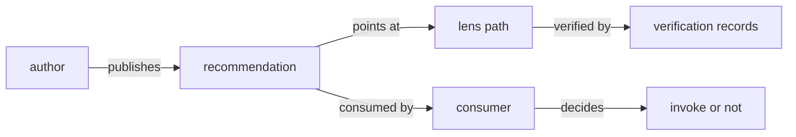

# Publish a recommendation

A `dev.idiolect.recommendation` is a community-published opinion
that a particular lens path is appropriate under specific
applicability conditions. It is the unit consumers query before
choosing a translation: a lens that nobody recommends is just
code; a lens that a community recommends under conditions a
consumer satisfies is a routing decision.

The shape is:

```text
issuingCommunity : at-uri        # the community publishing
conditions       : [Condition]   # postfix applicability tree
preconditions    : [Condition]   # additional assumptions
lensPath         : [at-uri]      # one or more chained lenses
caveats          : [Caveat]      # structured failure modes
requiredVerifications : [LensProperty]
occurredAt       : datetime
```

`conditions` and `preconditions` are postfix-operator trees over
the combinator set defined inside
[`dev.idiolect.recommendation`](../reference/lexicons/recommendation.md).

## Author the record

```toml
idiolect-records = { git = "https://github.com/idiolect-dev/idiolect", tag = "v0.9.0" }
reqwest          = { version = "0.12", features = ["json"] }
serde            = { version = "1", features = ["derive"] }
tokio            = { version = "1", features = ["full"] }
```

```rust
use idiolect_records::generated::dev::idiolect::defs::{LensRef, SchemaRef};
use idiolect_records::generated::dev::idiolect::recommendation::{
    ConditionSourceIs, Recommendation, RecommendationConditions,
};
use idiolect_records::{Datetime, Record};

const LENS_URI: &str = "at://did:plc:wdl4nnvxxdy4mc5vddxlm6f3/dev.panproto.schema.lens/tutorial-rename-sort-string-to-text";
const SRC_SCHEMA_URI: &str = "at://did:plc:wdl4nnvxxdy4mc5vddxlm6f3/dev.panproto.schema.schema/tutorial-post-body-v1";

fn build_recommendation(community_did: &str) -> anyhow::Result<Recommendation> {
    let community = format!("at://{community_did}/dev.idiolect.community/canonical");
    Ok(Recommendation {
        issuing_community: community.parse()?,
        conditions: vec![RecommendationConditions::ConditionSourceIs(
            ConditionSourceIs {
                schema: SchemaRef {
                    cid: None,
                    language: None,
                    uri: Some(SRC_SCHEMA_URI.parse()?),
                },
            },
        )],
        preconditions: None,
        lens_path: vec![LensRef {
            uri: Some(LENS_URI.parse()?),
            cid: None,
            direction: None,
        }],
        caveats: None,
        caveats_text: None,
        annotations: Some(
            "Endorses the rename-sort tutorial lens for source \
             records matching the v1 tutorial post-body schema."
                .to_owned(),
        ),
        required_verifications: None,
        basis: None,
        occurred_at: Datetime::parse("2026-05-12T00:00:00.000Z")?,
        supersedes: None,
    })
}
```

Every required field is type-checked at construction. Optional
fields are `Option<...>`. The open-enum slugs in `Condition*`
variants round-trip through their `*Vocab` siblings as covered
in [Open enums and vocabularies](../concepts/open-enums.md).

## Get an authenticated session

The simplest auth path is an app password (legacy Bearer mode,
not OAuth + DPoP). Generate one at
<https://bsky.app/settings/app-passwords> for the account you
want to publish under, then load it via env vars:

```rust
use serde::{Deserialize, Serialize};

#[derive(Serialize)]
struct CreateSessionRequest<'a> {
    identifier: &'a str,
    password: &'a str,
}

#[derive(Deserialize)]
struct Session {
    did: String,
    #[serde(rename = "accessJwt")]
    access_jwt: String,
}

async fn create_session(
    http: &reqwest::Client,
    pds: &str,
    handle: &str,
    password: &str,
) -> anyhow::Result<Session> {
    let resp = http
        .post(format!("{pds}/xrpc/com.atproto.server.createSession"))
        .json(&CreateSessionRequest { identifier: handle, password })
        .send().await?;
    if !resp.status().is_success() {
        anyhow::bail!("createSession {}: {}", resp.status(), resp.text().await?);
    }
    Ok(resp.json().await?)
}
```

OAuth + DPoP is the recommended path for production. The
machinery lives in `idiolect-lens` under the `dpop-p256` feature
plus `idiolect-oauth`'s session stores. For tutorial purposes
the Bearer path is enough.

## Sign and publish

The PDS accepts a typed record body plus a `$type` discriminator
on a `com.atproto.repo.createRecord` call:

```rust
#[derive(Serialize)]
struct CreateRecordRequest<'a> {
    repo: &'a str,
    collection: &'a str,
    rkey: &'a str,
    record: serde_json::Value,
}

async fn publish(
    http: &reqwest::Client,
    pds: &str,
    bearer: &str,
    repo: &str,
    rec: &Recommendation,
    rkey: &str,
) -> anyhow::Result<()> {
    let mut value = serde_json::to_value(rec)?;
    if let serde_json::Value::Object(ref mut map) = value {
        map.insert(
            "$type".to_owned(),
            serde_json::Value::String(Recommendation::NSID.to_owned()),
        );
    }
    let resp = http
        .post(format!("{pds}/xrpc/com.atproto.repo.createRecord"))
        .bearer_auth(bearer)
        .json(&CreateRecordRequest {
            repo,
            collection: Recommendation::NSID,
            rkey,
            record: value,
        })
        .send().await?;
    if !resp.status().is_success() {
        anyhow::bail!("createRecord {}: {}", resp.status(), resp.text().await?);
    }
    Ok(())
}

#[tokio::main]
async fn main() -> anyhow::Result<()> {
    let pds      = std::env::var("PDS_URL")?;
    let handle   = std::env::var("ATPROTO_HANDLE")?;
    let password = std::env::var("ATPROTO_PASSWORD")?;

    let http = reqwest::Client::new();
    let sess = create_session(&http, &pds, &handle, &password).await?;
    let rec  = build_recommendation(&sess.did)?;
    publish(&http, &pds, &sess.access_jwt, &sess.did, &rec,
            "tutorial-rename-sort").await?;
    println!("published at://{}/{}/tutorial-rename-sort",
             sess.did, Recommendation::NSID);
    Ok(())
}
```

Run with credentials in the env:

```bash
PDS_URL=https://bsky.social \
ATPROTO_HANDLE=yourhandle.bsky.social \
ATPROTO_PASSWORD='xxxx-xxxx-xxxx-xxxx' \
cargo run
```

The project DID has already published this exact record:

```bash
idiolect fetch \
  at://did:plc:wdl4nnvxxdy4mc5vddxlm6f3/dev.idiolect.recommendation/tutorial-rename-sort
```

If the record decodes and the `issuingCommunity` resolves to a
community you control, the loop is closed:



The community has expressed an opinion. The lens has
machine-checkable verifications attached (chapter 4 produced
`Holds` for the `roundtrip-test` property). A consumer querying
the orchestrator can fetch both, evaluate the conditions, and
decide whether to invoke.

## Planned functionality

Two related CLI subcommands are planned but not shipped:

- `idiolect oauth login --handle <HANDLE>` would walk the OAuth
  dance via `atrium-oauth-client` and persist the resulting
  session through an `OAuthTokenStore`. Today the dance is
  programmatic; the app-password path above is the easier
  alternative.
- `idiolect publish <kind> --record <path>` would load a JSON
  file and publish it under the active session. Today publishing
  goes through `RecordPublisher::create` (or the hand-rolled
  client above) from Rust.

That is the full loop. Where to go next:

- [Run the orchestrator HTTP API](../guide/orchestrator.md)
  shows how the consumer side of that flow is served.
- [Author a community vocabulary](../guide/vocabulary.md) covers
  the open-enum extension story.
- The [Concepts](../concepts/index.md) section explains why this
  loop is shaped the way it is.
