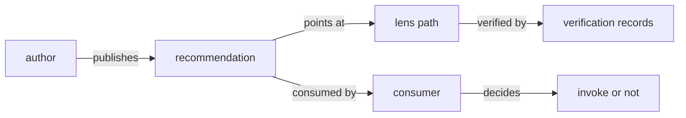

# Publish a recommendation

A `dev.idiolect.recommendation` is a community-published opinion
that a particular lens path is appropriate under specific
applicability conditions. It is the unit consumers query before
choosing a translation: a lens that nobody recommends is just
code; a lens that a community recommends under conditions a
consumer satisfies is a routing decision.

The shape is:

```text
issuingCommunity : at-uri        # the community publishing
conditions       : [Condition]   # postfix applicability tree
preconditions    : [Condition]   # additional assumptions
lensPath         : [at-uri]      # one or more chained lenses
caveats          : [Caveat]      # structured failure modes
requiredVerifications : [LensProperty]
occurredAt       : datetime
```

`conditions` and `preconditions` are postfix-operator trees over
the combinator set defined inside
[`dev.idiolect.recommendation`](../reference/lexicons/recommendation.md).

## Author the record

Construct the typed record directly:

```rust
use idiolect_records::{Recommendation, AtUri, Datetime};
// Plus the inline def types: Condition, Caveat, LensProperty.

let rec = Recommendation {
    issuing_community: AtUri::parse(
        "at://did:plc:tutorial.dev/dev.idiolect.community/canonical",
    )?,
    conditions: vec![/* condition variants */],
    preconditions: vec![],
    lens_path: vec![AtUri::parse(
        "at://did:plc:idiolect.dev/dev.panproto.schema.lens/example",
    )?],
    caveats: vec![],
    required_verifications: vec![/* lens-property variants */],
    annotations: None,
    caveats_text: None,
    occurred_at: Datetime::parse("2026-04-19T00:00:00.000Z").unwrap(),
};
```

Every required field is type-checked at construction. Optional
fields are `Option<...>`. Open-enum slugs round-trip through
their `*Vocab` siblings as covered in
[Open enums and vocabularies](../concepts/open-enums.md).

The exact field names and the inline `Condition` /
`Caveat` / `LensProperty` shapes are in
`crates/idiolect-records/src/generated/dev/idiolect/recommendation.rs`.
Consult the generated source for the present field set.

## Get an authenticated session

You need an OAuth session for the DID you want to publish under.
The OAuth dance itself is `atrium-oauth-client`'s job; the
resulting session is stored via an
[`idiolect_oauth::OAuthTokenStore`](../guide/oauth.md):

```rust
use idiolect_oauth::{FilesystemOAuthTokenStore, OAuthTokenStore};

let store = FilesystemOAuthTokenStore::open("./sessions/")?;
let session = store.load(my_did).await?
    .ok_or_else(|| anyhow::anyhow!("no session for {my_did}"))?;
```

Driving the dance and refreshing on expiry is the application's
responsibility; the crate ships `OAuthSession::is_expired` and
`OAuthSession::needs_refresh(now, threshold)` for the timing
decision.

## Sign and publish

With a session in hand, construct a `SigningPdsWriter` paired
with a `DpopProver` and wrap it in `RecordPublisher`. The DPoP
prover needs the session's private key; converting the JWK
stored in `OAuthSession.dpop_private_key_jwk` to a PKCS8 PEM
suitable for `P256DpopProver::from_pkcs8_pem` is the caller's
responsibility (e.g. via the `josekit` or `jsonwebtoken` crate).
The shape of the publish call:

```rust
use idiolect_lens::{
    P256DpopProver, RecordPublisher, ReqwestPdsClient, SigningPdsWriter,
};

let client = ReqwestPdsClient::with_service_url(&session.pds_url);
let prover = P256DpopProver::from_pkcs8_pem(&pkcs8_pem)?; // converted from JWK
let writer = SigningPdsWriter::new(
    client,
    session.access_jwt.clone(),
    prover,
    session.dpop_nonce.clone(),
);
let publisher = RecordPublisher::new(writer, session.did.clone());

let resp = publisher.create(&rec).await?;
println!("published: {}", resp.uri);
```

The exact field set on `OAuthSession` and the `SigningPdsWriter`
constructor are in `crates/idiolect-oauth/src/session.rs` and
`crates/idiolect-lens/src/signing_writer.rs`; consult the source
for the present surface. The `pds-reqwest` and `dpop-p256`
features on `idiolect-lens` enable the writer + prover.

## Verify it round-trips

```bash
idiolect fetch "$RECOMMENDATION_URI" | jq .
```

If the record decodes and the `issuingCommunity` resolves to a
community you control, the loop is closed:



The community has expressed an opinion. The lens has
machine-checkable verifications attached. A consumer querying
the orchestrator can fetch both, evaluate the conditions, and
decide whether to invoke.

## Planned functionality

The CLI does not currently expose the publishing path. Two
related subcommands are planned but not shipped at v0.8.0:

- An `idiolect oauth login --handle <HANDLE>` subcommand that
  runs the OAuth dance and stores the session via the
  configured `OAuthTokenStore`. Today the dance is driven via
  `atrium-oauth-client` programmatically.
- An `idiolect publish <kind> --record <path>` subcommand that
  loads a JSON file and publishes it under the active session.
  Today publishing goes through `RecordPublisher::create` from
  Rust.

That is the full loop. Where to go next:

- [Run the orchestrator HTTP API](../guide/orchestrator.md)
  shows how the consumer side of that flow is served.
- [Author a community vocabulary](../guide/vocabulary.md) covers
  the open-enum extension story.
- The [Concepts](../concepts/index.md) section explains why this
  loop is shaped the way it is.
