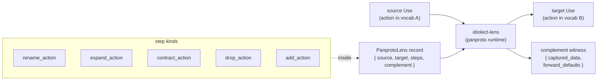

# Vocabulary lenses

Translations between ThUse vocabularies. Each lens takes a Use instance
whose `action` resolves against the **source** vocabulary and produces a
Use whose `action` resolves against the **target** vocabulary, plus a
**complement** witness recording what the translation could not carry
through automatically.

## Overview

The lens is itself a record — a `dev.panproto.schema.lens` on ATProto,
authored by whichever community wants to propose the bridge. Publishing
a lens does not force anyone to adopt it; consumers pick which lens to
apply based on whose community they trust.

## Architecture

## Anatomy

A vocabulary lens has three parts:

1. **`source` / `target`** — AT-URIs of the two vocabulary records.
2. **`steps`** — the concrete translation. Steps include:
   - `rename_action: { from, to }` — identity mapping under a new name.
   - `expand_action: { from, to, default }` — one source action splits
     into several target actions; the `default` chooses one when the
     source alone doesn't disambiguate.
   - `contract_action: { from, to }` — several source actions collapse
     into one target action; information is lost and the complement
     captures which source action the Use had.
   - `drop_action: { from }` — no target counterpart; the source
     action's data is captured in the complement.
   - `add_action: { name }` — target-only action; forward translation
     requires a default, captured in the complement's `forward_defaults`.
3. **`complement`** — the structured witness of what the forward
   translation did not carry through. Two kinds of entries:
   - `captured_data` — data present in the source but not in the target
     shape (e.g. the specific source action when multiple collapse into
     one).
   - `forward_defaults` — target elements with no source counterpart;
     a default is required for forward translation to produce a
     well-formed target Use.

## Authoring

Copy an existing lens (e.g. `action-v1-to-granular-v1.yaml`) and edit in
place. The `id` must be unique within the authoring DID's repo; `source`
and `target` must resolve to published vocabulary records.

When in doubt, **err toward capturing rather than silently defaulting**.
A complement with ten entries is better than a lens that quietly picks
one interpretation out of ten.

## Applying

`idiolect-lens` compiles the lens via panproto and applies it to a Use
instance. The result is `(translated_use, complement_witness)` — callers
pass the complement to whichever policy engine decides what to do when
data is missing or ambiguous.

## Examples shipped here

- `action-v1-to-granular-v1.yaml` — reference action vocab to a
  hypothetical more-granular vocabulary that splits `train_model` into
  `pre_train` / `fine_tune` / `rlhf`. Demonstrates expansion,
  target-only actions, and identity passes in one lens.

## Related

- [`idiolect-lens`](../../crates/idiolect-lens) — runtime that resolves
  and applies these records.
- [`morphisms/idiolect`](../../morphisms/idiolect) — companion
  theory-level morphisms (structural inclusions between theories).
