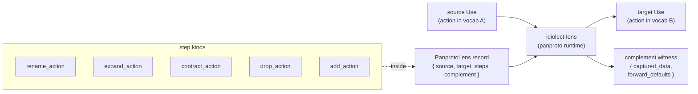

# Vocabulary lenses

These files define translations between ThUse vocabularies. Each lens takes
a Use instance whose `action` resolves against the source vocabulary and
produces a Use whose `action` resolves against the target vocabulary. A
complement records the information that the translation does not carry into
the target.

## Overview

A vocabulary lens is a `dev.panproto.schema.lens` record on ATProto. A
community may publish a bridge without making it canonical for other
communities; consumers select lenses according to their own trust policy.

## Architecture

```mermaid
flowchart LR
    SRC["source Use<br/>(action in vocab A)"]
    LENS["PanprotoLens record<br/>{ source, target, steps, complement }"]
    RT["idiolect-lens<br/>(panproto runtime)"]
    TGT["target Use<br/>(action in vocab B)"]
    COMP["complement witness<br/>{ captured_data,<br/>forward_defaults }"]

    SRC --> RT
    LENS --> RT
    RT --> TGT
    RT --> COMP

    subgraph steps["step kinds"]
        S1["rename_action"]
        S2["expand_action"]
        S3["contract_action"]
        S4["drop_action"]
        S5["add_action"]
    end
    steps -.inside.-> LENS
```

## Anatomy

A vocabulary lens has three parts:

1. **`source` / `target`:** AT-URIs of the two vocabulary records.
2. **`steps`:** the concrete translation. Steps include:
   - `rename_action: { from, to }`: identity mapping under a new name.
   - `expand_action: { from, to, default }`: one source action splits
     into several target actions. The `default` chooses one when the
     source alone doesn't disambiguate.
   - `contract_action: { from, to }`: several source actions collapse
     into one target action. Information is lost, and the complement
     captures which source action the Use had.
   - `drop_action: { from }`: no target counterpart. The source
     action's data is captured in the complement.
   - `add_action: { name }`: target-only action. Forward translation
     requires a default, captured in the complement's `forward_defaults`.
3. **`complement`:** the structured witness of what the forward
   translation did not carry through. Two kinds of entries:
   - `captured_data`: data present in the source but not in the target
     shape (e.g. the specific source action when multiple collapse into
     one).
   - `forward_defaults`: target elements with no source counterpart.
     A default is required for forward translation to produce a
     well-formed target Use.

## Authoring

Copy an existing lens (e.g. `action-v1-to-granular-v1.yaml`) and edit in
place. The `id` must be unique within the authoring DID's repo, and
`source` and `target` must resolve to published vocabulary records.

Capture an unresolved choice instead of silently choosing a default. A
larger complement preserves the information needed to revisit that choice;
an implicit default does not.

## Applying

`idiolect-lens` compiles the lens via panproto and applies it to a Use
instance. The result is `(translated_use, complement_witness)`. Callers pass
the complement to the policy engine that handles missing or ambiguous data.

## Example

- `action-v1-to-granular-v1.yaml`: reference action vocabulary to a
  hypothetical finer-grained vocabulary that splits `train_model` into
  `pre_train` / `fine_tune` / `rlhf`. The file combines expansion,
  target-only actions, and identity steps.

## Related

- [`idiolect-lens`](../../crates/idiolect-lens): runtime that resolves
  and applies these records.
- [`morphisms/idiolect`](../../morphisms/idiolect): companion
  theory-level morphisms (structural inclusions between theories).
