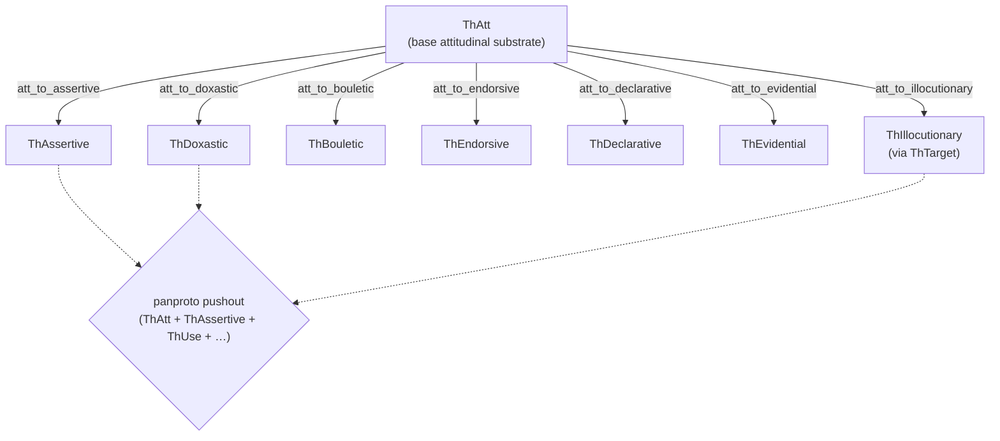

# Morphisms

Inter-theory functors for the attitudinal substrate. Each file defines a
morphism from one theory to another — most commonly the inclusion
`ThAtt ↪ ThX` when `ThX` extends `ThAtt` — with explicit sort and
operation mappings.

## Overview

Morphisms are what panproto uses to turn a composition
(`ThAtt + ThAssertive + ThUse`) into a single pushout diagram. They are
also what you use to *translate* a record from one theory to another,
which is how the framework reasons about compatibility between
alternative attitudinal frameworks.

## Architecture

## What's here

- `att_to_assertive.yaml` — inclusion for the assertive stance.
- `att_to_doxastic.yaml` — inclusion for the doxastic stance.
- `att_to_bouletic.yaml` — inclusion for the bouletic stance.
- `att_to_endorsive.yaml` — inclusion for the endorsive stance.
- `att_to_declarative.yaml` — inclusion for the declarative stance.
- `att_to_evidential.yaml` — inclusion for the evidential grounding
  layer.
- `att_to_illocutionary.yaml` — inclusion for the speech-act layer
  (via ThTarget).

## Morphisms vs lenses

**Morphisms** live here; they describe relationships between *theories*.
**Lenses** live under `lenses/vocab/`; they are concrete translations
between *instances* of theories — for example, between two community
vocabularies that both implement ThUse but declare different action
hierarchies.

A morphism is typically a structural inclusion with an identity sort
map. A lens is a data transformation that may drop or expand fields,
with a typed complement capturing what the forward translation cannot
carry through.

## Related

- [`lenses/vocab`](../../lenses/vocab) — instance-level translations.
- [`idiolect-lens`](../../crates/idiolect-lens) — runtime for applying
  lenses.
