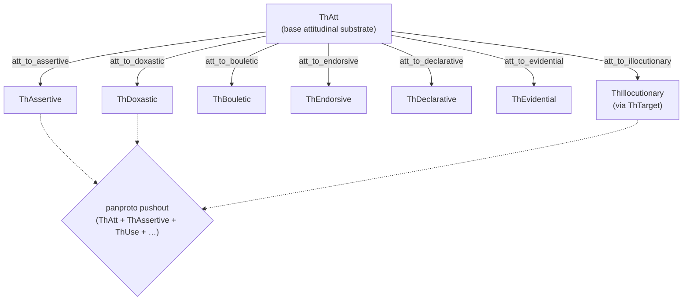

# Morphisms

These files tell Panproto how Idiolect's semantic theories share a common
attitudinal structure.

## What it does

Most files are inclusions of the form `ThAtt ↪ ThX`, where `ThX` extends
`ThAtt`. Each one explicitly maps the shared sorts and operations so Panproto
can construct and compare composed theories.

| Input | Work performed | Output |
| --- | --- | --- |
| Base theory and extending theory | Maps corresponding sorts and operations | Checked inter-theory functor |
| Several theories plus their morphisms | Computes the requested pushout composition | One composed theory used to interpret records |
| Record interpreted under one theory | Translates structure along the morphism | Corresponding instance in the target theory |

Use these files when changing the formal relationship among Idiolect theories.
They do not translate community data values; instance-level translations
belong under [`lenses/`](../../lenses).

Panproto uses morphisms to turn a composition
(`ThAtt + ThAssertive + ThUse`) into a single pushout diagram. Morphisms also
translate a record from one theory to another. Compatibility checks can thus
compare records built from different attitudinal theories.

## Architecture

```mermaid
flowchart TB
    ATT["ThAtt<br/>(base attitudinal substrate)"]
    ASSERT["ThAssertive"]
    DOX["ThDoxastic"]
    BOUL["ThBouletic"]
    END["ThEndorsive"]
    DECL["ThDeclarative"]
    EVID["ThEvidential"]
    ILL["ThIllocutionary<br/>(via ThTarget)"]

    ATT -->|att_to_assertive| ASSERT
    ATT -->|att_to_doxastic| DOX
    ATT -->|att_to_bouletic| BOUL
    ATT -->|att_to_endorsive| END
    ATT -->|att_to_declarative| DECL
    ATT -->|att_to_evidential| EVID
    ATT -->|att_to_illocutionary| ILL

    PUSH{"panproto pushout<br/>(ThAtt + ThAssertive + ThUse + …)"}
    ASSERT -.-> PUSH
    DOX -.-> PUSH
    ILL -.-> PUSH
```

## Files

- `att_to_assertive.yaml`: inclusion for the assertive stance.
- `att_to_doxastic.yaml`: inclusion for the doxastic stance.
- `att_to_bouletic.yaml`: inclusion for the bouletic stance.
- `att_to_endorsive.yaml`: inclusion for the endorsive stance.
- `att_to_declarative.yaml`: inclusion for the declarative stance.
- `att_to_evidential.yaml`: inclusion for the evidential grounding
  layer.
- `att_to_illocutionary.yaml`: inclusion for the speech-act layer
  (via ThTarget).

## Morphisms vs lenses

A morphism describes a relationship between theories. A lens under
`lenses/vocab/` translates instances of those theories, for instance two
community vocabularies that both implement ThUse but declare different
action hierarchies.

A morphism is typically a structural inclusion with an identity sort
map. A lens is a data transformation that may drop or expand fields,
with a typed complement capturing what the forward translation cannot
carry through.

## Related

- [`lenses/vocab`](../../lenses/vocab): instance-level translations.
- [`idiolect-lens`](../../crates/idiolect-lens): runtime for applying
  lenses.
