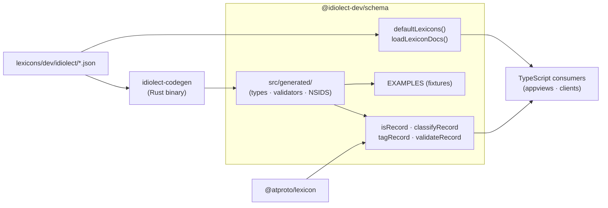

# @idiolect-dev/schema

TypeScript validators, record types, and NSID constants for the
`dev.idiolect.*` lexicon family.

## Overview

The TypeScript twin of [`idiolect-records`](../../crates/idiolect-records),
generated from the same lexicons under `lexicons/dev/idiolect/`. CI
rejects drift between the two packages. Three shipped surfaces:

- **Types** — `Encounter`, `Correction`, `Bounty`, … per record kind,
  plus shared types from `defs`.
- **NSID constants** — `NSIDS.encounter` → `"dev.idiolect.encounter"`,
  for switching on a record's collection at runtime.
- **Validators** — `validateRecord`, `isRecord`, `classifyRecord`,
  `tagRecord` for runtime structural checks and typed unions.

## Architecture



## Install

```sh
bun add @idiolect-dev/schema
# or
npm install @idiolect-dev/schema
```

## Usage

```ts
import {
  NSIDS,
  isRecord,
  classifyRecord,
  type Encounter,
  type AnyRecord,
} from "@idiolect-dev/schema";

// Narrow an unknown payload to a typed record.
const payload: unknown = await fetch(recordUrl).then(r => r.json());
if (isRecord(NSIDS.encounter, payload)) {
  const e: Encounter = payload;
  console.log(e.kind);
}

// Identify the nsid of an unknown record.
const nsid = classifyRecord(payload); // returns the matching nsid or null

// Wrap a strongly-typed record into a tagged AnyRecord for buffering.
import { tagRecord } from "@idiolect-dev/schema";
const tagged: AnyRecord = tagRecord(NSIDS.encounter, e);
```

## What ships

- Every record type (one per lexicon under `lexicons/dev/idiolect/`) plus
  shared types from `defs`.
- `NSIDS` — a typed constants object with every shipped nsid.
- `AnyRecord` — discriminated union keyed on `$nsid`.
- `isKind` / per-record `is<Kind>` type guards.
- `validateRecord(nsid, value)` — atproto-level structural validation via
  `@atproto/lexicon`.
- `classifyRecord(value)` — returns the matching nsid or `null`.
- `tagRecord(nsid, record)` — lift a typed record into the tagged union.
- `EXAMPLES` and per-record `*_EXAMPLE` constants — bundled minimally-valid
  fixtures from `lexicons/dev/idiolect/examples/`.
- `loadLexiconDocs()` / `defaultLexicons()` — re-exported lexicon JSON
  plus a `Lexicons` instance for consumers that extend the validator set.

## Design notes

- The generated TypeScript under `src/generated/` is emitted by
  [`idiolect-codegen`](../../crates/idiolect-codegen). CI runs
  `cargo run -p idiolect-codegen -- check` and fails the build if the
  committed output differs from what the current lexicons would produce.
  Hand-edits to `src/generated/` never merge.

## Related

- [`idiolect-records`](../../crates/idiolect-records) — Rust twin,
  generated from the same lexicons.
- [`idiolect-codegen`](../../crates/idiolect-codegen) — emits this package.
